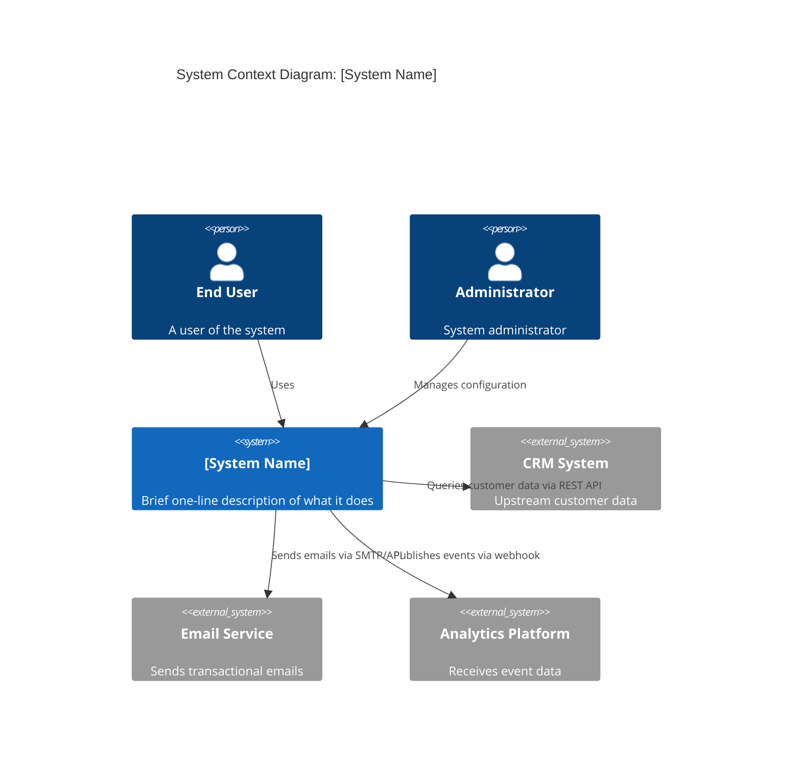
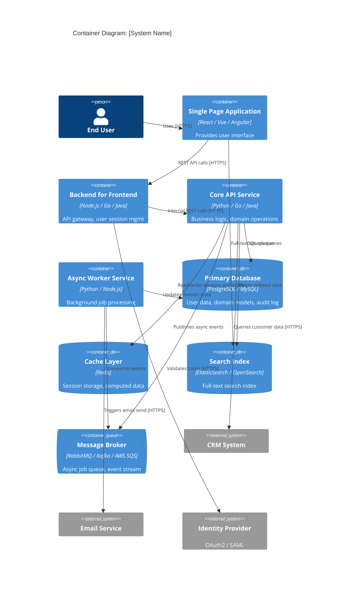
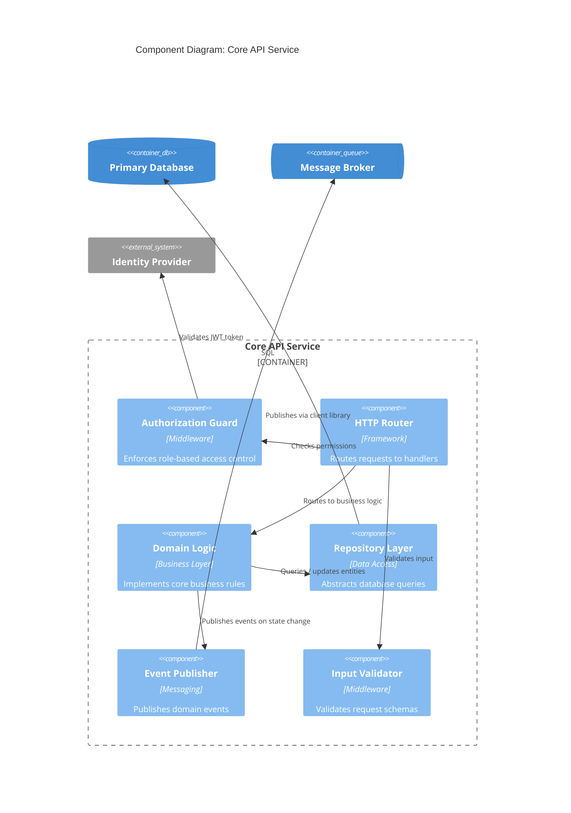

# C4 Model Architecture Diagram Template

**System Name:** [System Name Here]
**Author:** [Architect Name]
**Date Created:** [YYYY-MM-DD]
**Last Updated:** [YYYY-MM-DD]
**Version:** 1.0
**Status:** Draft | In Review | Approved
**Document ID:** [ARCH-C4-XXXX]

---

## Overview: The C4 Model

The C4 model is a hierarchical set of four diagrams that progressively zoom into the architecture of a software system. Each level serves a different audience and purpose:

- **Level 1 — System Context:** Zoomed out to show the system in context of users and external systems. Audience: everyone (business, architects, developers, operations).
- **Level 2 — Container:** Zoomed in to show high-level technology choices and responsibility boundaries. Audience: architects, senior developers, operations.
- **Level 3 — Component:** Zoomed in further to show the internal structure of a container (e.g., a microservice). Audience: developers, architects designing that container.
- **Level 4 — Code:** Class and method level. Only created when needed for complex domains. Audience: developers implementing the code.

This template focuses on Levels 1–3. Use this for any significant system architectural documentation.

---

## Level 1: System Context Diagram

**Purpose:** Show the system as a black box within its operational context. Identify external actors (users, systems) that interact with it.

### Diagram

### Level 1 Narrative

**What the system does:**
[System Name] is a [brief functional description]. It provides [list 3-4 core capabilities]. The system serves as a [central component | facilitator | aggregator] for [domain] operations.

**Primary users and actors:**
- **End Users:** [Description of who they are, what they do]
- **Administrators:** [Configuration, monitoring, user management]
- **Support team:** [Access to logs, user data for troubleshooting]

**Key external integrations:**
- **Upstream dependencies:** [List systems this system depends on, what data flows in]
- **Downstream consumers:** [List systems that consume output from this system]
- **External services:** [SaaS, payment processors, identity providers, etc.]

**Data flows in brief:**
- Inbound: [Describe main data sources and frequency]
- Outbound: [Describe main data sinks and frequency]
- Synchronous vs asynchronous: [Which integrations are real-time, which are batched]

---

## Level 2: Container Diagram

**Purpose:** Unbox the system to show the major containers (applications, services, data stores, message buses) and technology choices. Show synchronous and asynchronous communication.

### Diagram

### Level 2 Narrative

**Container responsibilities:**

- **Single Page Application (SPA):** Provides the user-facing interface. Handles client-side state management, UI rendering, form validation. Does not contain business logic.
- **Backend for Frontend (BFF):** API gateway pattern. Aggregates multiple backend services, implements user session management, performs authentication checks, adapts API contracts for frontend consumption.
- **Core API Service:** Implements domain business logic. Handles CRUD operations, enforces business rules, publishes domain events. Stateless to enable horizontal scaling.
- **Async Worker Service:** Consumes events from the queue and performs long-running operations (email, data sync, reporting). Retries failed operations with exponential backoff.
- **Primary Database:** Owns all persistent domain state. Uses ACID transactions for consistency. Includes audit logging for regulatory compliance.
- **Cache Layer:** Stores sessions, computed values, and frequently accessed data. Cache misses do not break functionality (cache-aside pattern).
- **Search Index:** Denormalised read model for full-text search. Updated asynchronously via queue. Rebuilt from primary database on corruption.
- **Message Broker:** Backbone of async communication. Decouples producer and consumer. Enables event-driven architecture and async job processing.

**Technology choices and rationale:**

| Container | Technology | Rationale |
|-----------|-----------|-----------|
| SPA | React | Large ecosystem, strong community, easy to find developers, mature tooling |
| BFF | Go / Node.js | Low memory footprint, concurrent request handling, rapid iteration |
| API | Python / Java | Readability, team expertise, rich framework ecosystem (Django/Spring) |
| Database | PostgreSQL | Open source, ACID compliance, JSON support, strong query language |
| Cache | Redis | Sub-millisecond latency, rich data structures, replication support |
| Queue | Kafka / RabbitMQ | Durable event log / reliable routing, consumer groups / priority queues |
| Search | Elasticsearch | Full-text search, aggregation support, horizontal scaling |

**Communication styles:**
- SPA ↔ BFF: Synchronous REST over HTTPS (request/response).
- BFF ↔ API: Synchronous REST over internal HTTP (no TLS overhead).
- API → Message Broker: Fire-and-forget async events (acknowledgement mode).
- Worker ← Message Broker: Polling with acknowledgement on successful processing.
- API ↔ External systems: HTTPS with timeout (3-5s) and circuit breaker.

---

## Level 3: Component Diagram (Core API Service)

**Purpose:** Zoom into a critical container to show internal components, their responsibilities, and interactions. Choose the container that has the most complex business logic.

### Diagram

### Level 3 Narrative

**Component responsibilities:**

- **HTTP Router:** Matches incoming HTTP requests to handler functions. Implements REST conventions (GET, POST, PUT, DELETE). No business logic; only routing.
- **Authorization Guard:** Middleware that runs on every request. Extracts JWT token from Authorization header, validates signature with identity provider, enforces role-based access control (RBAC). Returns 403 if permission denied.
- **Input Validator:** Middleware that validates request body against JSON schema. Ensures type safety and constraint compliance. Returns 400 with error details if validation fails.
- **Domain Logic:** Pure business logic isolated from HTTP and database layers. Accepts validated inputs, applies business rules, returns results. Testable without infrastructure.
- **Repository Layer:** Data access abstraction. Implements query methods (findById, findByCriteria) and mutation methods (save, delete). Handles transaction management and consistency.
- **Event Publisher:** Wraps message broker client. On successful domain state change, publishes structured events. Ensures exactly-once semantics via outbox pattern if needed.

**Design patterns applied:**

- **Layered architecture:** HTTP layer → validation → authorization → domain logic → data layer.
- **Dependency injection:** All external dependencies (DB, queue) injected into components for testability.
- **Repository pattern:** Database queries abstracted behind repository interface for swappability.
- **Domain events:** State changes trigger domain events that are consumed by other services asynchronously.

**Interaction flow (example: create order):**

1. Client sends POST /orders with JSON body.
2. Router matches to CreateOrderHandler.
3. Validator checks request schema (required fields, type constraints).
4. AuthorizationGuard extracts JWT, validates token with IdP, checks RBAC permissions.
5. Domain logic receives validated DTO, applies business rules (customer credit limit, inventory), constructs Order aggregate.
6. Repository persists Order to database within transaction.
7. EventPublisher publishes OrderCreated event to queue.
8. Response returned to client with 201 Created status.

---

## Key Architectural Decisions

| Decision | Rationale | Status |
|----------|-----------|--------|
| Event-driven async processing | Decouples services, enables scalability, improves resilience | Approved via ADR-001 |
| Database per service | Data ownership, independent scaling, loose coupling | Approved via ADR-002 |
| BFF pattern | Optimises API for different client types, reduces client complexity | Approved via ADR-003 |
| CQRS for reporting workloads | Separates read and write models, optimises query performance | Proposed, under review |

Reference: [Link to ADR repository]

---

## Quality Attributes Addressed

- **Performance:** API P99 latency < 200ms (measured at BFF, excluding network). Cache hit rate > 80% for hot data.
- **Scalability:** Stateless API and worker services enable horizontal scaling. Message queue decouples producers from consumers.
- **Reliability:** Circuit breakers on external calls prevent cascading failures. Async workers retry transient failures. Database replication provides failover.
- **Security:** All inter-service communication authenticated. User authentication via OAuth2. Data at rest encrypted. PII fields masked in logs.

---

## Known Constraints and Limitations

1. **Transaction boundaries:** Distributed transactions across multiple services are not ACID. Compensating transactions implemented for critical workflows.
2. **Consistency:** Eventual consistency for cross-service state changes. Strong consistency guaranteed only within a single service.
3. **Latency:** Asynchronous workers introduce latency (seconds to minutes). Not suitable for real-time user-facing operations.
4. **Operational complexity:** Distributed system requires mature observability, runbook documentation, and operational training.
5. **Vendor lock-in:** Cloud-managed services (if used) require migration planning for exit scenarios.

---

## Review Sign-Off

| Role | Name | Date | Signature |
|------|------|------|-----------|
| Solution Architect | | | |
| Enterprise Architect | | | |
| Technical Lead | | | |
| Security Architect | | | |

---

**Document Version Control**

| Version | Date | Author | Changes |
|---------|------|--------|---------|
| 1.0 | YYYY-MM-DD | [Name] | Initial draft |
| | | | |

