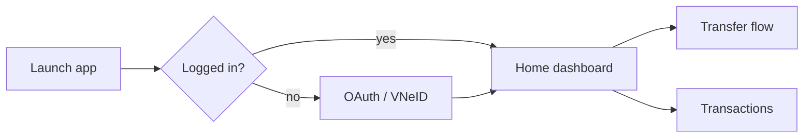
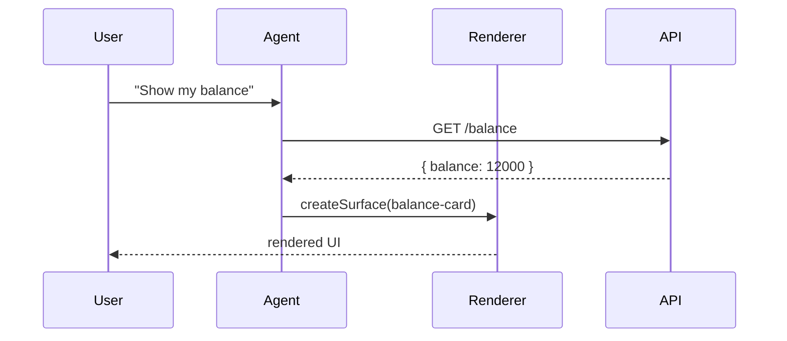
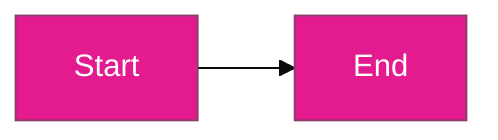

# Mermaid Integration

Mermaid is text-based diagramming — flowcharts, sequence diagrams, state machines, user journeys — rendered natively by GitHub, GitLab, Bitbucket, and most markdown engines. Mermaid is **not** a pixel-wireframe tool; pair it with one of the visual modes (Pencil, Figma, Excalidraw, tldraw, HTML-React) for actual screen mocks.

## Where Mermaid shines in BMAD

- **User flows** in `docs/ux/flows/*.mmd` — diagram the path a user takes across screens.
- **State diagrams** for form wizards or checkout-style flows.
- **Navigation trees** for information architecture.
- **Sequence diagrams** documenting agent/client/server interactions in A2UI designs.

## File conventions

| Artefact type    | Path                                    |
|------------------|-----------------------------------------|
| User flow        | `docs/ux/flows/<feature>-flow.mmd`      |
| State diagram    | `docs/ux/flows/<feature>-state.mmd`    |
| IA navigation    | `docs/ux/information-architecture.mmd`  |

You can also embed Mermaid directly in any markdown file with ` ```mermaid ` fenced blocks — handy for dropping a flow into the UI spec or into a user-journey document.

## Example — flowchart



## Example — sequence diagram for an A2UI round-trip



## Integration with DESIGN.md

When a Mermaid diagram needs styling (colours, fonts) that should match the design system, apply Mermaid's `themeVariables` using the actual hex values from `docs/ux/DESIGN.md` at the top of the file:



Replace hex values with the actual tokens from `docs/ux/DESIGN.md` — if you update the palette, update these too (or write a `scripts/apply-design-theme-to-mermaid.py` helper if your project has many diagrams).

## When Mermaid is the wrong choice

- **Pixel wireframes** — it's a diagram tool, not a UI tool.
- **Exploratory sketching** — Excalidraw / tldraw are faster for freeform.
- **High-fidelity state previews** — use HTML/React for visual state specs instead.
