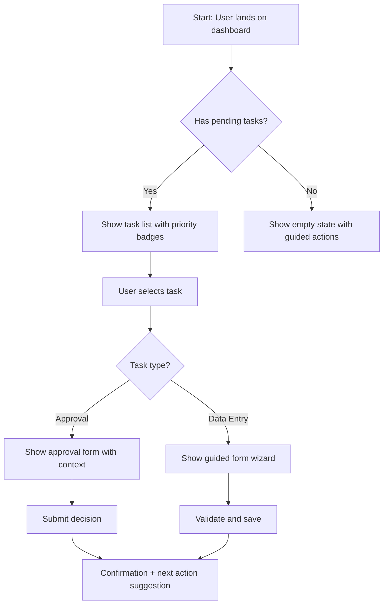

# Journey: [Persona] — [Goal/Task Name]

### Overview

| Stage       | Action | Touchpoint | Emotion | Pain Points | Opportunities |
| ----------- | ------ | ---------- | ------- | ----------- | ------------- |
| Awareness   |        |            | 😐      |             |               |
| Onboarding  |        |            |         |             |               |
| First Use   |        |            |         |             |               |
| Regular Use |        |            |         |             |               |
| Edge Case   |        |            |         |             |               |
| Recovery    |        |            |         |             |               |
```

For each journey, also create a **task flow diagram** using Mermaid:



**Output:** `docs/ux/user-journeys.md`

### 4. Information Architecture

Design how content and functionality are organized and connected. Good IA means users find what they need without thinking about where it lives.

**Deliverables:**

**Site Map / Navigation Structure:**

```markdown
