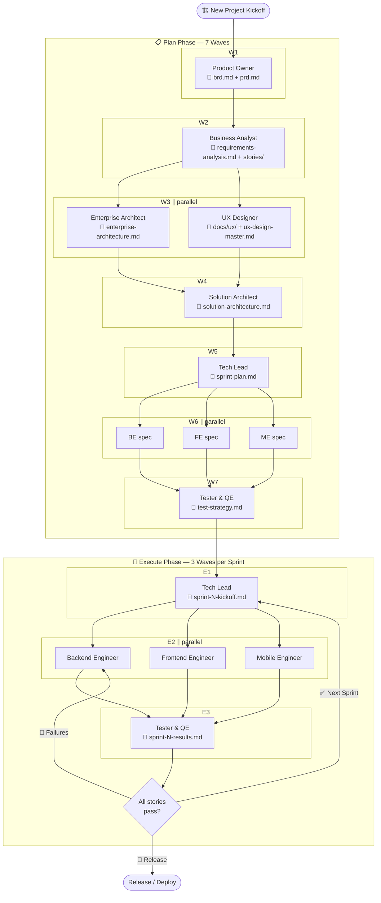
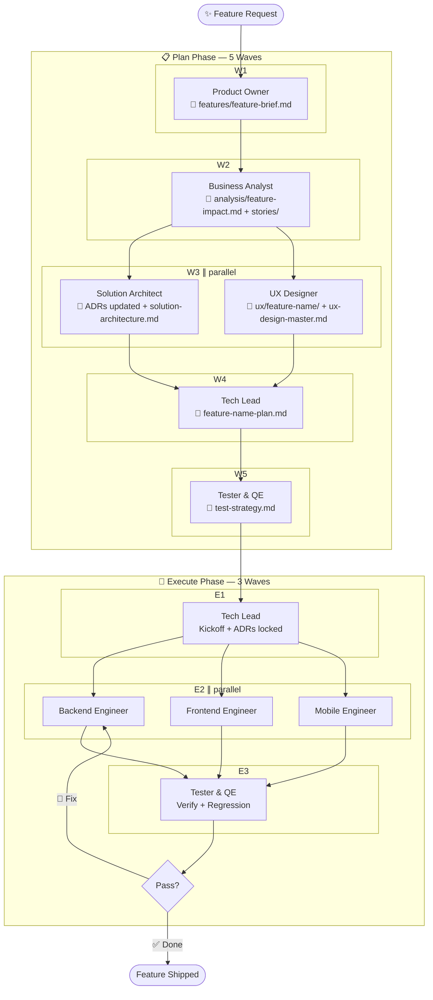
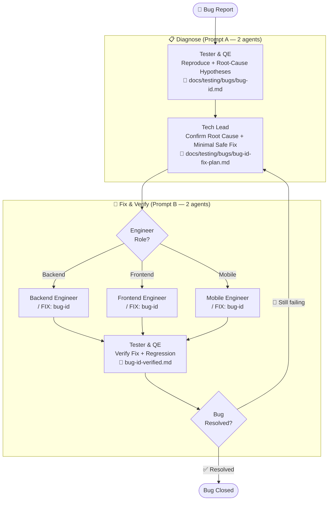
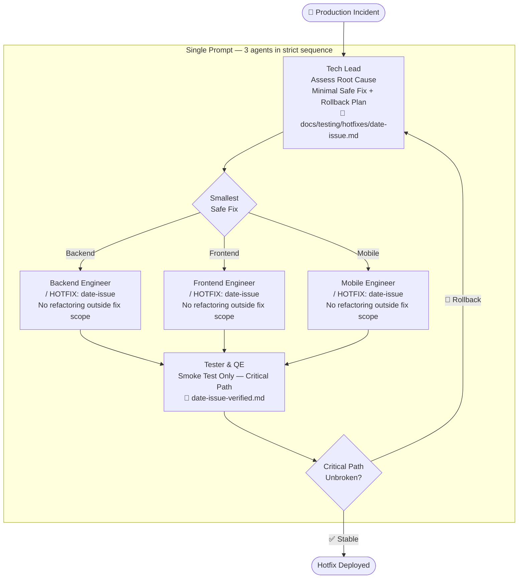
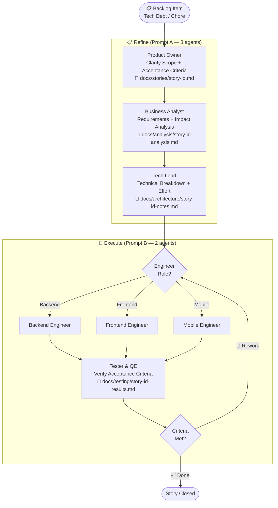

# BMAD SDLC Agents: Two-Layer Agent Architecture

**BMAD** (Breakthrough Method of Agile AI-Driven Development) is an enterprise methodology for delivering software through a cross-functional squad of 13 specialized AI agents (12 role-specific agents plus a `bmad` orchestrator). This repository implements the **two-layer architecture**: a global layer with reusable agent skills and shared resources, plus a project layer with context files checked into each project repo.

Install the global layer once across all tools, then scaffold `.bmad/` context files into each project. Agents dynamically load project-specific knowledge from `.bmad/` combined with shared resources, creating a cohesive, context-aware squad.

Every agent is held to the same four **Karpathy-derived engineering principles** — _Think before coding · Simplicity first · Surgical changes · Goal-driven execution_ — installed as tool-tailored rulebooks under [`shared/karpathy-principles/`](shared/karpathy-principles/README.md) and referenced inline at the top of every `SKILL.md` and `brainstorm.md`.

The squad also ships **A2UI v0.10 authoring support** for agent-driven UIs (chat canvases, in-product assistants, agentic workflow views). Product Owner, Enterprise Architect, Solution Architect, UX Designer, and InfoSec Architect each pick up A2UI-aware sections in their SKILL and brainstorm files, backed by a shared protocol reference ([`shared/a2ui-reference.md`](shared/a2ui-reference.md)), an ADR skeleton ([`shared/templates/adr-a2ui-adoption.md`](shared/templates/adr-a2ui-adoption.md)), and a per-surface spec template ([`shared/templates/a2ui-surface-spec.md`](shared/templates/a2ui-surface-spec.md)). A2UI is advisory/authoring — no agent emits live envelopes; production adoption requires an EA ADR.

**Design system as a first-class, cross-agent contract.** The UX Designer maintains `docs/ux/DESIGN.md` in the [**Google Stitch `DESIGN.md` format**](https://github.com/google-labs-code/design.md) (Apache 2.0, open-source spec) — machine-readable YAML front matter (tokens + components) plus human-readable markdown prose (rationale, usage rules, accessibility). On every invocation the UX Designer bootstraps this file if it's missing, reads and conforms to it if it exists, and extends it in place when a feature introduces a new token, component, or pattern. Frontend and Mobile engineers refuse to implement screens whose tokens/components aren't declared in `DESIGN.md` — they send the story back to UX to update the file first. The file is linted via `npx @google/design.md lint docs/ux/DESIGN.md`. A dedicated cross-tool command (`/ux-designer:design-system`) supports `create` / `audit` / `extend` / `validate` / `sync` / `render` workflows, auto-regenerates a browser-viewable HTML visualization at `docs/ux/DESIGN.html` (see [`scripts/render-design-md.py`](scripts/render-design-md.py) — stdlib-only Python, no dependencies) every time the markdown source changes, and ships to all 11 tools automatically through the installer.

**Cross-platform installer.** The install script exists in two equivalent forms: `scripts/install-global.sh` (bash — macOS / Linux / WSL / Git Bash) and `scripts/install-global.ps1` (PowerShell 5.1+ or 7+ — Windows 11 native, no python3 dependency). Same for the project scaffolder: `scripts/scaffold-project.sh` and `scripts/scaffold-project.ps1`. Both cover every supported tool (Claude Code, Cowork, Codex CLI, Kiro, Cursor, Windsurf, Trae IDE, GitHub Copilot, Gemini CLI, OpenCode, Aider).

**Wireframe / UI tool selection.** UX Designer offers eleven wireframing modes — ASCII / Mermaid / Excalidraw / tldraw / Pencil / Figma / Penpot / HTML-React / Google Stitch / Miro / None — and asks the human which to use on first invocation. The prompt auto-detects connected MCP servers and marks each option as ✓ connected or "manual / external" so the human sees the effort trade-off at a glance. The choice is recorded once in `.bmad/ux-design-master.md` and reused thereafter. Per-tool integration guides ship under [`agents/ux-designer/references/`](agents/ux-designer/references/).

**Worktree close-out & multi-agent merge.** Every agent that writes code or artefacts works in an isolated git worktree (`../bmad-<role>-work`) on a dedicated branch. When done, the agent runs the canonical close-out protocol — request human review → merge to main → resolve concurrent conflicts cooperatively → clean up. When BE ∥ FE ∥ ME (or any parallel wave) run concurrently, the **first agent to merge succeeds cleanly; the second and third are responsible for the rebase + conflict resolution**, with cross-domain conflicts routed to the owning peer agent for review via `.bmad/signals/conflict-<my-role>-needs-<peer-role>-review` sentinels. Full protocol: [`shared/references/worktree-close-out.md`](shared/references/worktree-close-out.md).

**Conversational brainstorming.** Every agent's `brainstorm.md` sub-command runs as a conversation, not a questionnaire — **one question per turn, wait for the answer, then ask the next**. The agent walks a prioritised question bank, skips anything already on disk, stops after 3–7 turns when the next-step deliverable can be written, and consolidates the answers as a structured brief saved to `.bmad/brainstorms/<role>-<topic>.md`. Full protocol: [`shared/references/conversational-brainstorm.md`](shared/references/conversational-brainstorm.md).

---

## Agent Team

| Agent                    | Skill File                             | BMAD Phase     | Role                                                                                                    |
| ------------------------ | -------------------------------------- | -------------- | ------------------------------------------------------------------------------------------------------- |
| **BMAD Orchestrator**    | `agents/bmad/SKILL.md`                 | All Phases     | Routes work to the right sub-agent; entry point for squad prompts                                       |
| **Product Owner**        | `agents/product-owner/SKILL.md`        | Analysis       | Voice of the Business — BRD, high-level PRD, MVP scope (runs first)                                     |
| **Business Analyst**     | `agents/business-analyst/SKILL.md`     | Analysis       | Requirements analyst — deep-dives BRD/PRD, produces requirements analysis                               |
| **Enterprise Architect** | `agents/enterprise-architect/SKILL.md` | Solutioning    | High-level enterprise arch BEFORE SA — cloud infra, compliance, CI/CD                                   |
| **UX/UI Designer**       | `agents/ux-designer/SKILL.md`          | Solutioning    | Personas, journeys, wireframes, **`docs/ux/DESIGN.md` (Google Stitch format)**, a11y (parallel with EA) |
| **Solution Architect**   | `agents/solution-architect/SKILL.md`   | Solutioning    | Detailed solution design using EA + UX outputs — APIs, data models, ADRs                                |
| **InfoSec Architect**    | `agents/infosec-architect/SKILL.md`    | Solutioning    | Threat modelling, controls, privacy-by-design, supply-chain, IR readiness                               |
| **DevSecOps Engineer**   | `agents/devsecops-engineer/SKILL.md`   | All Phases     | Pipelines, IaC, SLOs, FinOps, reliability & recovery                                                    |
| **Tech Lead**            | `agents/tech-lead/SKILL.md`            | All Phases     | Orchestration, sprint planning, code review, risk, release readiness                                    |
| **Tester & QE**          | `agents/tester-qe/SKILL.md`            | All Phases     | Test strategy, quality gates, security testing, UI automation                                           |
| **Backend Engineer**     | `agents/backend-engineer/SKILL.md`     | Implementation | APIs, data layers, event-driven services, authN/Z, idempotency                                          |
| **Frontend Engineer**    | `agents/frontend-engineer/SKILL.md`    | Implementation | React/TypeScript, perf budgets, feature flags, i18n                                                     |
| **Mobile Engineer**      | `agents/mobile-engineer/SKILL.md`      | Implementation | iOS/Android, offline, app-size, crash reporting                                                         |

---

## Two-Layer Architecture

### Global Layer

**Install once.** Available in all projects.

- **`agents/`** – 13 specialized agent skills, each in its own folder
  - `<agent-name>/SKILL.md` – Core skill body (≤500 lines; loads on invocation). Opens with an `## Engineering Discipline` section that restates the Karpathy principles before any project-context loading.
  - `<agent-name>/brainstorm.md` – 5-phase clarification command (`/<agent>:brainstorm`) with the same principles as preamble.
  - `<agent-name>/references/` – Deep-dive guides, patterns, and worked examples (loaded on demand)
  - `<agent-name>/templates/` – Output templates for deliverables (loaded on demand)
  - `<agent-name>/sub-agents/` – Specialist helpers invoked via the Agent tool
- **`shared/`** – Company-wide context, references, and templates
  - `BMAD-SHARED-CONTEXT.md` – Organization context, principles, standards
  - `karpathy-principles/` – 10 tool-tailored rulebooks + index (`README.md`). Installed per tool by `install-global.sh`.
  - `a2ui-reference.md` – Protocol reference for agent-driven UIs (A2UI v0.10). Installed per tool by `install-global.sh`.
  - `references/technology-radar.md` – Technology choices, maturity tiers
  - `templates/` – ADR, story, test strategy, handoff log templates + `adr-a2ui-adoption.md` and `a2ui-surface-spec.md` (agent-specific BRD/PRD/requirements templates live in `agents/<agent>/templates/`)
- **`hooks/`** – Session-hook settings + scripts for Claude Code / Kiro, plus the Yolo autonomous harness
- **`rules/`** – Per-tool rules fragments (Cursor / Windsurf / Trae / Copilot / Gemini / OpenCode / Aider) generated from agent content

### Project Layer

**Copy per project.** Checked into each project's git repo.

- **`.bmad/`** – Project-specific context files
  - `PROJECT-CONTEXT.md` – Project vision, goals, stakeholders, timeline
  - `tech-stack.md` – Technologies, versions, dependencies, build setup
  - `team-conventions.md` – Code style, naming, patterns, architecture rules
  - `domain-glossary.md` – Business domain terms, concepts, entities
  - `handoff-log.md` – Record of handoffs between agents/humans
  - `ux-design-master.md` – Design tool choice (ASCII/Pencil/Figma), master file reference, page index (created by UX Designer on first run)
  - `signals/` – Sentinel files for inter-agent coordination

- **`docs/`** – Project documentation
  - `architecture/` – System design, decision records, diagrams
  - `stories/` – User stories, epics, acceptance criteria
  - `testing/` – Test plans, test cases, coverage goals
  - `ux/` – Personas, journeys, wireframes, design specs

### Agent Context Loading Order

When an agent runs, it loads context in this order (later overrides earlier):

1. `shared/BMAD-SHARED-CONTEXT.md` (baseline)
2. `.bmad/PROJECT-CONTEXT.md` (project goals, stakeholders)
3. `.bmad/tech-stack.md` (technology choices)
4. `.bmad/team-conventions.md` (project rules and standards)
5. `.bmad/ux-design-master.md` (design tool + master file reference, if exists)
6. User prompt (immediate task)

This creates project-aware agents that respect global conventions while adapting to project specifics.

### 📂 Progressive Disclosure (Three-Level Loading)

Each agent skill uses a three-level loading strategy to keep context windows lean:

| Level                   | What                                                      | When loaded                                                                   |
| ----------------------- | --------------------------------------------------------- | ----------------------------------------------------------------------------- |
| **1 — Metadata**        | YAML frontmatter (`name`, `description`, `allowed-tools`) | Always — used by the tool for skill discovery                                 |
| **2 — Skill body**      | `SKILL.md` (≤500 lines)                                   | On invocation — quick mode detection, responsibilities, completion protocol   |
| **3 — Reference files** | `references/*.md` and `templates/*.md`                    | On demand — agent reads the relevant file only when working on that task area |

This means a Tech Lead doing code review loads `templates/code-review-checklist.md` without also loading the risk assessment or debt registry templates. Agents are instructed to `Read` the appropriate reference file before starting each deliverable.

---

## Agent Intelligence

Each agent skill embeds three layers of autonomous intelligence that eliminate manual overhead and keep sessions focused.

### ⚡ Quick Mode Detection

Before loading any project context, every agent runs a 2-second binary check to determine its operating mode:

| Signal File                                    | Mode                                                    |
| ---------------------------------------------- | ------------------------------------------------------- |
| `docs/architecture/sprint-N-kickoff.md` exists | 🔨 **Execute Mode** — sprint implementation in progress |
| `docs/testing/bugs/*-fix-plan.md` exists       | 🔨 **Execute Mode** — bug fix in progress               |
| `docs/testing/hotfixes/*.md` exists            | 🔨 **Execute Mode** — hotfix in progress                |
| None of the above                              | 📋 **Plan Mode** — creating or refining artifacts       |

**Why it matters:** Execute Mode agents skip `docs/prd.md` and the full planning artifact tree — loading only 2–3 targeted files (tech-stack, conventions, kickoff doc). This prevents context overload and dramatically speeds up sprint execution.

### 🔍 Autonomous Task Detection

After loading project context, each agent scans `.bmad/handoffs/` and `docs/` to determine its current task without explicit instructions. Each agent follows a priority table covering all work types it can handle — for example:

- **Tech Lead** checks for hotfix docs → bug fix plans → sprint kickoffs → sprint plans → PRD, in that priority order, always handling the most urgent work type first
- **Backend / Frontend / Mobile Engineers** scan for fix plans → sprint kickoffs → feature plans, selecting whichever is active
- **Tester-QE** distinguishes "diagnose bug" (no fix-plan yet) from "verify fix" (fix-plan exists and fix applied)

Each agent announces what it detected and what it will do — or reports `Blocked: [what's missing]` if prerequisites haven't been met, and names which agent to invoke first.

### 🚀 Implementation Kickoff Suggestions

Every agent's Completion Protocol includes a `🚀` line in the review summary pointing to the next agent in the chain:

| Agent                 | 🚀 Suggests                                                                                 |
| --------------------- | ------------------------------------------------------------------------------------------- |
| Product Owner         | `/business-analyst` — deep requirements analysis of your BRD + PRD                          |
| Business Analyst      | `/enterprise-architect` ∥ `/ux-designer` in parallel — both read your requirements analysis |
| Enterprise Architect  | `/solution-architect` (after UX is also done)                                               |
| UX Designer           | `/solution-architect` (after EA is also done)                                               |
| Solution Architect    | `/tech-lead` — sprint plan from your solution architecture                                  |
| Tech Lead (Plan Mode) | Execute Prompt B (squad) or individual engineer commands                                    |
| Backend Engineer      | `/frontend-engineer` then `/tester-qe`                                                      |
| Frontend Engineer     | `/mobile-engineer` (if in scope) or `/tester-qe`                                            |
| Mobile Engineer       | `/tester-qe` — full sprint testing                                                          |
| Tester-QE (all pass)  | `/tech-lead` — release sign-off or next sprint kickoff                                      |
| Tester-QE (failures)  | Return to the failing engineer for fixes                                                    |

You never need to remember the agent sequence — each agent hands you off to the next one.

### 🎯 EA vs. SA — Which Architect Owns This Decision?

EA and SA both do architecture, but at different layers and scopes. The rule of thumb: **EA sets the guardrails; SA designs within them.** If a decision applies across systems, teams, or release trains, it's EA. If it affects only one solution, one service, or one API, it's SA.

**Two-axis heuristic:**

- **Scope axis** — EA = cross-system / enterprise-wide. SA = within one solution / system.
- **Layer axis** — EA = infrastructure, platform, governance, operations. SA = application, components, contracts, code-adjacent.

**Decision matrix (pick the right agent by topic):**

| Topic                                                            | EA  | SA  | InfoSec  | DevSecOps |
| ---------------------------------------------------------------- | :-: | :-: | :------: | :-------: |
| Cloud provider / region strategy                                 | ✅  |     |          |           |
| Multi-environment topology (dev / staging / prod / DR parity)    | ✅  |     |          |           |
| Compute platform (K8s distro vs. serverless vs. hybrid)          | ✅  |     |          |           |
| Disaster recovery strategy / RTO / RPO                           | ✅  |     |          |           |
| Compliance posture (SOC2 / GDPR / HIPAA / PCI)                   | ✅  |     | ✅ coord |           |
| Enterprise observability stack choice                            | ✅  |     |          |           |
| CI/CD pipeline template (org-wide)                               | ✅  |     |          |  ✅ impl  |
| FinOps tagging + budget envelope                                 | ✅  |     |          |           |
| Shared platform services (identity, API gateway, mesh, bus)      | ✅  |     |          |           |
| Cross-system integration contract ("Order → SAP")                | ✅  |     |          |           |
| Technology radar governance (Adopt / Trial / Assess / Hold)      | ✅  |     |          |           |
| A2UI adoption, version pin, catalog governance                   | ✅  |     |          |           |
| Service decomposition within a solution                          |     | ✅  |          |           |
| API contracts (OpenAPI / AsyncAPI) for a solution                |     | ✅  |          |           |
| Data model / schema / indexes for a service                      |     | ✅  |          |           |
| Database choice (per service, from EA-approved catalog)          |     | ✅  |          |           |
| Application framework (NestJS / FastAPI / Spring Boot)           |     | ✅  |          |           |
| Solution-level integration patterns (saga / CQRS / outbox)       |     | ✅  |          |           |
| Per-service auth flow (OAuth/OIDC) within EA's identity platform |     | ✅  | ✅ coord |           |
| Solution-level ADRs                                              |     | ✅  |          |           |
| C4 Component / Code-level diagrams                               |     | ✅  |          |           |
| A2UI per-surface spec (surfaceId, tree, action contracts)        |     | ✅  |          |           |
| Threat models, controls catalogue, encryption choices            |     |     |    ✅    |           |
| Secret-rotation cadence, threat-modeling methodology             |     |     |    ✅    |           |
| Terraform / Helm / GitHub Actions YAML                           |     |     |          |    ✅     |
| Provisioning runbooks, log-shipper wiring                        |     |     |          |    ✅     |

**Quick triage — start here when unsure:**

| If the decision...                                                         | Invoke                                          |
| -------------------------------------------------------------------------- | ----------------------------------------------- |
| Applies to the whole estate or multiple solutions                          | **Enterprise Architect**                        |
| Sets a standard others must follow (pipeline, stack, platform, compliance) | **Enterprise Architect**                        |
| Lives inside one solution and its services                                 | **Solution Architect**                          |
| Is an API, data model, or service-boundary choice                          | **Solution Architect**                          |
| Introduces a new technology to the organisation                            | **EA first** (radar update) → then SA adopts it |
| Is about _how to defend_ a system (threats, controls, crypto)              | **InfoSec Architect**                           |
| Is about _how to operate_ a system (IaC, pipelines, runbooks)              | **DevSecOps Engineer**                          |

**Invocation order for a new project:**
`PO → BA → EA ∥ UX (parallel) → SA → Tech Lead → engineers → Tester-QE`

EA runs **before** SA because SA's component-level choices depend on EA's platform and governance decisions. If you invoke SA before EA exists, SA will block with "Requires enterprise-architecture.md" in its Autonomous Task Detection.

Full scope-boundary tables with overlap-zone coordination rules live inline in each agent's `SKILL.md` under the **🚧 Scope Boundary** section.

### 📏 Agent Rules (Inline Guardrails)

Every agent embeds a `## Agent Rules` section with non-negotiable guardrails across four categories:

| Category                     | What It Covers                                                                     | Example                                                                                |
| ---------------------------- | ---------------------------------------------------------------------------------- | -------------------------------------------------------------------------------------- |
| **Security & Compliance**    | Data handling, secrets management, PII protection, auth patterns, audit trails     | BE: "Parameterized queries only — zero tolerance for SQL injection"                    |
| **Code Quality & Standards** | Testing requirements, documentation, naming, error handling, coverage              | TQE: "Every test must reference the story ID and acceptance criterion it validates"    |
| **Workflow & Process**       | Approval gates, scope control, deviation protocols, rollback procedures            | TL: "ADR lock is irreversible per sprint — scope changes require a new ADR"            |
| **Architecture Governance**  | ADR enforcement, tech radar compliance, API contract alignment, service boundaries | SA: "All technologies must be on the technology radar — unlisted tech requires an ADR" |

Rules are role-specific — engineers get secure coding rules, architects get governance rules, testers get coverage rules, etc. Every agent verifies its outputs against its rules before completing the Completion Protocol.

### ⚡ Parallel Execution Waves

Agents are organized into **waves** — all agents in the same wave run simultaneously with no inter-dependencies. The orchestrator (human, squad prompt, or parent agent) spawns a wave, waits for all agents to complete, then spawns the next wave.

**New Project — Plan Phase:**

| Wave | Agents                                              | Depends On                                            |
| ---- | --------------------------------------------------- | ----------------------------------------------------- |
| W1   | Product Owner                                       | —                                                     |
| W2   | Business Analyst                                    | PO → `docs/brd.md` + `docs/prd.md`                    |
| W3   | Enterprise Architect ∥ UX Designer                  | BA → `docs/analysis/requirements-analysis.md`         |
| W4   | Solution Architect                                  | EA → `enterprise-architecture.md` AND UX → `docs/ux/` |
| W5   | Tech Lead                                           | SA → `solution-architecture.md`                       |
| W6   | Backend Eng ∥ Frontend Eng ∥ Mobile Eng (spec only) | TL → `sprint-plan.md`                                 |
| W7   | Tester & QE (strategy only)                         | All three specs from W6                               |

**Sprint Execution:**

| Wave | Agents                                  | Depends On                               |
| ---- | --------------------------------------- | ---------------------------------------- |
| E1   | Tech Lead (kickoff)                     | Plan approval or previous sprint results |
| E2   | Backend Eng ∥ Frontend Eng ∥ Mobile Eng | TL → `sprint-N-kickoff.md`               |
| E3   | Tester & QE                             | All three engineers from E2              |

**Feature — Plan Phase:**

| Wave | Agents                             | Depends On                                    |
| ---- | ---------------------------------- | --------------------------------------------- |
| W1   | Product Owner                      | —                                             |
| W2   | Business Analyst (impact analysis) | PO → `docs/features/[feature-name]-brief.md`  |
| W3   | Enterprise Architect ∥ UX Designer | BA → `docs/analysis/[feature-name]-impact.md` |
| W4   | Solution Architect                 | EA + UX (both must complete)                  |
| W5   | Tech Lead                          | SA → updated `solution-architecture.md`       |
| W6   | Tester & QE                        | TL → `[feature]-plan.md`                      |

**How to spawn parallel waves:** In Claude Code, use the `Agent` tool to launch multiple sub-agents in a single message. In Cursor/Windsurf/Trae, open parallel composer/Builder windows. The key rule: **never start the next wave until ALL agents in the current wave have printed their ✅ summary.** Each agent knows its topology — if it finishes before a parallel peer, it reports completion and notes which peer to wait for.

### 🤖 Autonomous Orchestration (Claude Code)

In **Claude Code**, the Tech Lead acts as a fully autonomous orchestrator — spawning engineers, monitoring their progress, and triggering TQE with zero human intervention. This is powered by Claude Code's native **`Agent` tool** (sub-agent spawning) combined with a lightweight **sentinel file protocol** on the shared file system.

> **⚠️ TL must be the main thread.** Claude Code's `Agent` tool can only be called from the **main session thread** — subagents cannot spawn other subagents. To make TL the root orchestrator, start your session with:
>
> ```bash
> claude --agent tech-lead
> ```

#### Path A — Subagent Orchestration (Stable)

**How it works:**

| Step | What TL Does                                   | Mechanism                       |
| ---- | ---------------------------------------------- | ------------------------------- |
| 1    | Produces `sprint-N-kickoff.md`                 | Normal artifact                 |
| 2    | Clears stale signals, creates `.bmad/signals/` | `bash` tool                     |
| 3    | Spawns BE ∥ FE ∥ ME simultaneously             | `Agent` tool (3 parallel calls) |
| 4    | Waits for all three to finish                  | Polls `.bmad/signals/E2-*-done` |
| 5    | Writes `E3-tqe-invoke` sentinel                | `bash` tool                     |
| 6    | Spawns TQE                                     | `Agent` tool                    |

**Sentinel files** (written to `.bmad/signals/`):

| File            | Written By        | Means                                    |
| --------------- | ----------------- | ---------------------------------------- |
| `E2-be-done`    | Backend Engineer  | BE implementation complete               |
| `E2-fe-done`    | Frontend Engineer | FE implementation complete               |
| `E2-me-done`    | Mobile Engineer   | ME implementation complete               |
| `E3-tqe-invoke` | Tech Lead         | All E2 done; TQE may proceed immediately |

**TQE fast-path:** When TQE detects `.bmad/signals/E3-tqe-invoke`, it skips its E2 completion check (Step 0 in its Autonomous Task Detection) and proceeds directly to testing — no re-verification of engineer outputs needed.

#### Path B — Agent Teams (Experimental)

For full peer-to-peer coordination between BE, FE, and ME (e.g. resolving cross-service dependencies in real time), enable Agent Teams:

```bash
export CLAUDE_CODE_EXPERIMENTAL_AGENT_TEAMS=1
claude --agent tech-lead
```

TL becomes the **team lead**; BE/FE/ME become **teammates** with a shared task list and mailbox. Engineers can message each other directly — without routing through TL. The sentinel file protocol still applies as the E2→E3 completion gate. Requires Claude Code v2.1.32+.

**Other AI tools:** Kiro, Codex CLI, Cursor, Windsurf, and Trae IDE do not support sub-agent spawning. In those environments the wave structure is **human-orchestrated** — the `🚀` suggestion lines in each agent's Completion Protocol guide you to spawn the next wave manually. The sentinel files still work the same way; you just write them yourself (or check for them) rather than having TL do it automatically.

### 🤖 Autonomous Orchestration (Claude Code)

In Claude Code, Tech Lead can fully orchestrate the sprint execution pipeline without any manual intervention.

> **⚠️ Critical prerequisite:** The Agent tool can only be used from the **main thread**. Sub-agents cannot spawn further sub-agents. You must start the session with `claude --agent tech-lead` so Tech Lead IS the main thread.

**Two modes are available:**

#### Path A — Subagent Mode (Stable, recommended)

Launch with: `claude --agent tech-lead`

| Step                      | What Happens                                                                                                                   |
| ------------------------- | ------------------------------------------------------------------------------------------------------------------------------ |
| A — Spawn engineers       | TL uses Agent tool to launch BE ∥ FE ∥ ME in parallel, all reading `sprint-N-kickoff.md`                                       |
| B — Monitor ready signals | TL polls `.bmad/signals/` for `E2-[role]-ready` files written by engineers                                                     |
| C — Worktree code review  | For each ready signal: `git worktree add` → run TL Code Review Checklist → `git worktree remove` → write done or rework signal |
| D — Converge              | When all three `E2-[role]-done` signals exist → TL invokes TQE via Agent tool                                                  |

#### Path B — Agent Teams Mode (Experimental)

Launch with: `CLAUDE_CODE_EXPERIMENTAL_AGENT_TEAMS=1 claude --agent tech-lead`

Requires Claude Code v2.1.32+. Enables peer-to-peer messaging between BE/FE/ME for interface coordination. The sentinel file protocol is identical to Path A.

#### Sentinel File Protocol

All inter-agent coordination uses files in `.bmad/signals/`. No direct agent-to-agent messaging is required.

**Planning phase sentinels (written by each agent, triggers the next):**

| File                         | Written By           | Meaning                                                                      |
| ---------------------------- | -------------------- | ---------------------------------------------------------------------------- |
| `.bmad/signals/po-done`      | Product Owner        | BRD + PRD complete; BA can proceed                                           |
| `.bmad/signals/ba-done`      | Business Analyst     | Requirements analysis complete; EA + UX can proceed in parallel              |
| `.bmad/signals/ea-done`      | Enterprise Architect | Enterprise architecture complete (converges with `ux-done` before SA starts) |
| `.bmad/signals/ux-done`      | UX Designer          | UX specs complete (converges with `ea-done` before SA starts)                |
| `.bmad/signals/sa-done`      | Solution Architect   | Detailed solution architecture complete; TL can proceed                      |
| `.bmad/signals/tl-plan-done` | Tech Lead            | Sprint kickoff complete; engineers can proceed                               |

**Execution phase sentinels (two-phase TL verification protocol):**

| File                         | Written By         | Meaning                                                                 |
| ---------------------------- | ------------------ | ----------------------------------------------------------------------- |
| `.bmad/signals/E2-be-ready`  | Backend Engineer   | Implementation complete, awaiting TL code review. Content = branch name |
| `.bmad/signals/E2-fe-ready`  | Frontend Engineer  | Implementation complete, awaiting TL code review. Content = branch name |
| `.bmad/signals/E2-me-ready`  | Mobile Engineer    | Implementation complete, awaiting TL code review. Content = branch name |
| `.bmad/signals/E2-be-done`   | **Tech Lead only** | TL has reviewed BE branch via worktree and approved                     |
| `.bmad/signals/E2-fe-done`   | **Tech Lead only** | TL has reviewed FE branch via worktree and approved                     |
| `.bmad/signals/E2-me-done`   | **Tech Lead only** | TL has reviewed ME branch via worktree and approved                     |
| `.bmad/signals/E2-be-rework` | **Tech Lead only** | BE review failed; content = path to review notes in `docs/reviews/`     |
| `.bmad/signals/E2-fe-rework` | **Tech Lead only** | FE review failed; content = path to review notes in `docs/reviews/`     |
| `.bmad/signals/E2-me-rework` | **Tech Lead only** | ME review failed; content = path to review notes in `docs/reviews/`     |

> **Engineers never write `E2-*-done`.** The done signal is the Tech Lead's approval stamp — it is only created after a real code review via git worktree. Claiming completion without verification is dishonesty, not efficiency.

**Autonomous mode sentinel:**

| File                            | Written By                             | Meaning                                                                            |
| ------------------------------- | -------------------------------------- | ---------------------------------------------------------------------------------- |
| `.bmad/signals/autonomous-mode` | `scripts/yolo.sh` / `scripts/yolo.ps1` | All planning agents skip the human-review wait step and auto-invoke the next agent |

Enable with: `bash scripts/yolo.sh on` (Linux/macOS) or `.\scripts\yolo.ps1 on` (Windows)

### 🛠️ Tool Capability Matrix

Agent behaviour is not identical across AI coding tools — and the gap has narrowed considerably as each tool has shipped multi-agent, hooks, and rules support over the last year. This matrix is a pragmatic cross-section as of the latest release; rate cells conservatively and verify against your tool's current docs before committing a workflow.

Legend: ✅ first-class · 🟡 works but with caveats · ❌ not currently supported.

| Capability                                                                        | Claude Code                            | Cowork                             | Cursor                                        | Windsurf                                       | Trae IDE                                         | GitHub Copilot                                         | Codex CLI                         | Gemini CLI                                                            | Kiro                                      | OpenCode                                 | Aider                                    |
| --------------------------------------------------------------------------------- | -------------------------------------- | ---------------------------------- | --------------------------------------------- | ---------------------------------------------- | ------------------------------------------------ | ------------------------------------------------------ | --------------------------------- | --------------------------------------------------------------------- | ----------------------------------------- | ---------------------------------------- | ---------------------------------------- |
| **Init file / rules entry**                                                       | `CLAUDE.md`                            | `~/.skills/` + `.bmad/`            | `.cursor/rules/*.mdc`                         | `.windsurf/rules/*.md` (+ `.windsurfrules`)    | `.trae/rules/*.md` (+ `user_rules.md`)           | `.github/copilot-instructions.md`                      | `AGENTS.md`                       | `GEMINI.md`                                                           | `AGENTS.md` + `.kiro/steering/`           | `AGENTS.md`                              | `.aider.conventions.md`                  |
| **Agent/skill container**                                                         | `~/.claude/skills/` (folder-per-skill) | `~/.skills/skills/`                | Rules only                                    | Rules only                                     | `~/.trae/rules/` (+ `~/.trae/skills/` refs)      | Rules only                                             | `~/.codex/skills/`                | `~/.gemini/skills/` (skills) + `~/.gemini/agents/` (native subagents) | `~/.kiro/skills/`                         | `~/.opencode/instructions.md`            | conventions file                         |
| **Typical model(s)**                                                              | Claude Opus / Sonnet / Haiku           | Claude Opus / Sonnet               | User-selected (Claude, GPT, Gemini, …)        | User-selected                                  | User-selected (Claude, GPT, Gemini, DeepSeek, …) | GPT-family + Claude option                             | GPT-5 / o-series                  | Gemini 2.5 Pro / Flash                                                | Claude via Bedrock                        | User-selected                            | User-selected (architect + editor split) |
| **Subagent spawning**                                                             | ✅ Agent tool                          | ✅ Agent tool                      | 🟡 Background agents / Tasks                  | 🟡 Cascade sub-flows                           | ❌ (single-session; routing-advisor model)       | 🟡 Coding Agent (PR-scale)                             | 🟡 via Responses API              | ✅ Native subagents (markdown-defined) with isolated context          | ✅ Agent tool                             | 🟡 runner-level                          | ❌ (single-session)                      |
| **Parallel E2 engineers** (BE ∥ FE ∥ ME)                                          | ✅ True parallel                       | ✅ True parallel                   | 🟡 Multiple background agents                 | 🟡 Parallel Cascade sessions                   | 🟡 Multiple Trae windows                         | 🟡 Multiple Coding Agent PRs                           | 🟡 limited parallelism            | 🟡 Sequential subagent calls (isolated context, not parallel)         | ✅ True parallel                          | 🟡 manual                                | ❌ Sequential                            |
| **Session hooks** (Pre/Post/Stop)                                                 | ✅ Full                                | ✅ Full                            | ❌                                            | ❌                                             | ❌                                               | ❌                                                     | 🟡 (some CLI hooks)               | 🟡 (extension hooks)                                                  | ✅ Full                                   | 🟡 limited                               | ❌                                       |
| **Slash / invocation syntax**                                                     | `/agent-name`                          | `/skill-name`                      | `@agent` rules + Composer                     | `@agent` mentions in Cascade                   | `@agent` rules + Builder                         | `@workspace` / Agent Mode                              | `/agent-name`                     | `@<subagent-name>` + `/agents` manager                                | `@agent-name`                             | `@agent-name`                            | `/ask`, `/architect`, `/run`             |
| **Yolo / autonomous harness**                                                     | ✅ Full                                | ✅ Scheduled tasks + auto-run      | 🟡 Background agents                          | 🟡 Cascade autopilot                           | 🟡 Builder autopilot                             | 🟡 Coding Agent (GitHub-hosted)                        | 🟡 --dangerously-auto             | 🟡 --yolo flag                                                        | ✅ Full                                   | 🟡                                       | 🟡 --auto-commit                         |
| **Sentinel-file protocol**                                                        | ✅ Reliable                            | ✅ Reliable                        | 🟡 Works; requires explicit rule              | 🟡 Works; requires explicit rule               | 🟡 Works; requires explicit rule                 | 🟡 Inconsistent outside Agent Mode                     | 🟡 Usually reliable post GPT-5    | 🟡 Improved on 2.5-Pro                                                | ✅ Reliable                               | 🟡                                       | 🟡                                       |
| **Protocol-step compliance**                                                      | ✅ High                                | ✅ High                            | 🟡 Good inside Composer                       | 🟡 Good inside Cascade                         | 🟡 Good inside Builder                           | 🟡 Good in Agent Mode                                  | 🟡 Medium–High (GPT-5)            | 🟡 High inside subagent context; medium in main session               | ✅ High                                   | 🟡 Medium                                | 🟡 Medium                                |
| **MCP client support**                                                            | ✅                                     | ✅                                 | ✅                                            | ✅                                             | ✅ (`~/.trae/mcp.json`)                          | ✅ (Agent Mode)                                        | ✅                                | ✅                                                                    | ✅                                        | ✅                                       | 🟡 via plugins                           |
| **Git worktree TL review**                                                        | ✅                                     | ✅                                 | ✅                                            | ✅                                             | ✅                                               | ✅                                                     | ✅                                | ✅                                                                    | ✅                                        | ✅                                       | ✅                                       |
| **Karpathy-principles auto-install path**                                         | `~/.claude/KARPATHY-PRINCIPLES.md`     | `~/.skills/KARPATHY-PRINCIPLES.md` | `~/.cursor/rules/001-karpathy-principles.mdc` | `~/.windsurf/rules/001-karpathy-principles.md` | `~/.trae/rules/001-karpathy-principles.md`       | `~/.github/copilot-instructions.md` (appended)         | `~/.codex/KARPATHY-PRINCIPLES.md` | `~/.gemini/KARPATHY-PRINCIPLES.md`                                    | `~/.kiro/steering/karpathy-principles.md` | `~/.opencode/instructions.md` (appended) | `~/.aider.conventions.md` (appended)     |
| **Agent-driven UI authoring (A2UI)** — reference deployed for PO/EA/SA/UX/InfoSec | `~/.claude/A2UI-REFERENCE.md`          | `~/.skills/A2UI-REFERENCE.md`      | `~/.cursor/rules/002-a2ui-reference.md`       | `~/.windsurf/rules/002-a2ui-reference.md`      | `~/.trae/rules/002-a2ui-reference.md`            | — (reference in-repo under `shared/a2ui-reference.md`) | `~/.codex/A2UI-REFERENCE.md`      | `~/.gemini/A2UI-REFERENCE.md`                                         | `~/.kiro/steering/a2ui-reference.md`      | `~/.opencode/A2UI-REFERENCE.md`          | `~/.aider/A2UI-REFERENCE.md`             |

**Practical impact by tool:**

- **Claude Code** — Reference implementation. Full BMAD pipeline: autonomous sentinel chaining, parallel engineers (BE ∥ FE ∥ ME), hooks, Yolo harness, plugins. Use this as the benchmark the other tools are measured against.
- **Cowork (Claude Desktop)** — The desktop/agentic surface with skills, scheduled tasks, and MCP. Strong for document-producing roles (PO/BA/UX/EA) and for long-running orchestration of the squad. Shares Claude Code's compliance profile.
- **Cursor** — Composer / Agent Mode + background agents cover multi-file changes and long-running work; rules system (`.cursor/rules/*.mdc`) is the right home for persistent BMAD guidance. No Claude-Code-style hooks, so harness features don't apply.
- **Windsurf** — Cascade is the agentic equivalent of Composer; planning mode works well for brainstorm.md prompts. Rules files at `.windsurf/rules/` are first-class. Use its autopilot rather than the Yolo harness.
- **Trae IDE (ByteDance)** — Rules-based paradigm similar to Cursor/Windsurf. `install-global.sh` deploys the 13 role bodies to `~/.trae/rules/<role>.md` (always-on guidelines), mirrors the framework seed to `~/.trae/rules/user_rules.md` for Trae versions that only auto-load that single file, and drops the per-command rules under `~/.trae/rules/bmad-commands/<agent>/<cmd>.md`. Reference files (templates/, references/) are copied to `~/.trae/skills/<role>/` so you can `Read` them from inside a session. Single-session like Windsurf — no native subagent spawning; use parallel Trae windows for Wave E2. MCP servers are configured at `~/.trae/mcp.json` (Settings → MCP & Agents).
- **GitHub Copilot** — Agent Mode (in IDE) is well-suited to individual agent roles; the asynchronous Coding Agent can run long-form work against a branch/PR. Uses `.github/copilot-instructions.md` and `.github/instructions/*.instructions.md`. Hooks/harness don't apply.
- **Codex CLI** — GPT-5 / o-series era. Protocol compliance is much better than on GPT-4o, but sentinel chaining and multi-branch logic still drift occasionally — verify explicitly. Parallelism is improving via the Responses API but is not yet at Claude-Code parity. Each agent's Completion Protocol keeps a `### 🔧 On Codex CLI / Gemini CLI` fallback for safety.
- **Gemini CLI** — Gemini 2.5 / 3 era. Now ships **native subagents** (markdown files at `.gemini/agents/*.md` or `~/.gemini/agents/*.md`) with isolated context windows, per-subagent tool allow-lists, and `@<name>` invocation. `install-global.sh` deploys all 13 BMAD roles as subagents alongside the existing skills/extensions, so you can write `@backend-engineer implement BE-001` and the main agent delegates with token-efficient context isolation. Subagents cannot call other subagents (recursion-protected), so the BMAD orchestrator role acts as a routing advisor and the main agent is responsible for chained delegation. Manage interactively with `/agents` inside the CLI. Sequential — not yet parallel — but a major step up from the old "no subagents" baseline.
- **Kiro (AWS)** — Spec-driven workflow with Skills, Steering, and Hooks — effectively a peer of Claude Code for BMAD. Only difference is `@agent-name` vs `/agent-name` invocation syntax.
- **OpenCode** — Open standards (`AGENTS.md`, MCP) make install straightforward; exact capability depends on the model/runner you pair it with.
- **Aider** — Architect+editor split is a natural fit for Karpathy-style "think before coding": use a strong model in `/architect` to produce the plan, a cheap model to apply edits. No subagents — drive the squad manually turn-by-turn.

> **Recommendation:** if you want the fully autonomous BMAD pipeline (sentinels, parallel engineers, hooks, Yolo), pick **Claude Code**, **Kiro**, or **Cowork**. For IDE-integrated workflows with agentic modes, pick **Cursor**, **Windsurf**, **Trae IDE**, or **GitHub Copilot**. For CLI-first teams, **Codex CLI** or **Gemini CLI** are solid — just budget for the occasional sentinel-verification step. **Aider** is excellent for disciplined single-threaded work where you want tight human control.

---

## Workflow Diagrams

Visual reference for all five work types. Each diagram shows the agent chain, key artifact outputs, and decision points.

### 🏗 New Project

Full 10-agent flow from business requirements through multi-sprint execution.



---

### ✨ Feature Request / Enhancement

PO defines feature scope, BA performs impact analysis, then SA and UX run in parallel (using existing EA enterprise architecture). No full EA wave needed since enterprise architecture is already established.



---

### 🐛 Bug Fix

Diagnosis before fix. Two diagnosis agents confirm root cause before any code changes.



---

### 🚨 Hotfix (Production Emergency)

Assess, fix, smoke test in a single session. No planning docs, no refactoring.



---

### 📋 Backlog Item / Tech Debt / Chore

Lightweight two-agent refinement then direct execution. No architecture review needed.



---

## Quick Start (3 Steps)

### Step 1: Install Global Layer

**macOS / Linux / WSL / Git Bash:**

```bash
bash scripts/install-global.sh
# Add --dry-run to preview without writing files
```

**Windows 11 (PowerShell 5.1+ or PowerShell 7+):**

```powershell
powershell -ExecutionPolicy Bypass -File .\scripts\install-global.ps1
# or, with -DryRun to preview
.\scripts\install-global.ps1 -DryRun
```

Copies all agent skills, subagents, commands, hooks, and shared resources to tool-specific global directories. Runs once per machine. The PowerShell version is feature-for-feature equivalent with the bash version — no python3 required (hook-settings merges use native PowerShell JSON cmdlets) and UTF-8 output is written without BOM to stay byte-compatible with the bash-generated files.

### Step 2: Scaffold New Project

**Bash:**

```bash
bash /path/to/bmad-sdlc-agents/scripts/scaffold-project.sh "My Project Name"
# Add --force to overwrite an existing .bmad/ directory
```

**PowerShell (Windows 11):**

```powershell
& "C:\path\to\bmad-sdlc-agents\scripts\scaffold-project.ps1" "My Project Name"
# -Force to overwrite an existing .bmad/ directory
```

Creates `.bmad/` context files, installs project-level agents, and generates a tool-specific instruction file (e.g. `CLAUDE.md`) that tells your AI tool to auto-load `.bmad/` at the start of every session.

### Step 3: Fill Project Context

Edit `.bmad/PROJECT-CONTEXT.md` and `.bmad/tech-stack.md` with your project details. The instruction file and all agents will pick these up automatically on the next session.

---

## Wiring Up Auto-Loading (.bmad/ → Your AI Tool)

Every AI coding tool reads a special instruction file at session start. Add the BMAD context block below to whichever file your tool uses. **`scaffold-project.sh` generates this automatically** — these snippets are here if you need to add it manually or update an existing file.

### Claude Code — `CLAUDE.md`

```markdown
## BMAD Project Context

At the start of every conversation, read these files to understand this project:

- `.bmad/PROJECT-CONTEXT.md` — vision, goals, stakeholders, constraints
- `.bmad/tech-stack.md` — technology stack, versions, dependencies
- `.bmad/team-conventions.md` — code style, naming conventions, patterns
- `.bmad/domain-glossary.md` — business domain terminology
- `.bmad/handoff-log.md` — recent agent decisions and handoffs

## Available BMAD Agents (slash commands)

| Command                 | Role                                                   |
| ----------------------- | ------------------------------------------------------ |
| `/product-owner`        | BRD, high-level PRD, MVP scope (first agent)           |
| `/business-analyst`     | Requirements analysis from BRD/PRD (second agent)      |
| `/enterprise-architect` | Enterprise arch — cloud infra, compliance, CI/CD       |
| `/ux-designer`          | Wireframes, design system, accessibility (parallel EA) |
| `/solution-architect`   | Detailed solution design — APIs, data models, ADRs     |
| `/tech-lead`            | Orchestration, sprint planning, code review, risk      |
| `/tester-qe`            | Test strategy, quality gates, UI automation            |
| `/backend-engineer`     | APIs, services, data layers                            |
| `/frontend-engineer`    | React/TypeScript, components, a11y                     |
| `/mobile-engineer`      | iOS/Android, native architecture                       |
```

### Cursor — `.cursor/rules/001-project-context.mdc`

```markdown
---
description: BMAD project context — load at the start of every conversation
alwaysApply: true
---

## BMAD Project Context

Read these files before responding to any request in this project:

- `.bmad/PROJECT-CONTEXT.md` — vision, goals, stakeholders, constraints
- `.bmad/tech-stack.md` — technology stack, versions, dependencies
- `.bmad/team-conventions.md` — code style, naming conventions, patterns
- `.bmad/domain-glossary.md` — business domain terminology
- `.bmad/handoff-log.md` — recent agent decisions and handoffs

Apply all conventions from `team-conventions.md` when writing or reviewing code.
```

### Windsurf — `.windsurfrules`

```markdown
## BMAD Project Context

At the start of every conversation, read these files:

- `.bmad/PROJECT-CONTEXT.md` — vision, goals, stakeholders, constraints
- `.bmad/tech-stack.md` — technology stack, versions, dependencies
- `.bmad/team-conventions.md` — code style, naming conventions, patterns
- `.bmad/domain-glossary.md` — business domain terminology
- `.bmad/handoff-log.md` — recent agent decisions and handoffs

Apply all conventions from `team-conventions.md` when writing or reviewing code.
```

### GitHub Copilot — `.github/copilot-instructions.md`

```markdown
## BMAD Project Context

This project uses the BMAD SDLC framework. At the start of each session, read:

- `.bmad/PROJECT-CONTEXT.md` — vision, goals, stakeholders, constraints
- `.bmad/tech-stack.md` — technology stack, versions, dependencies
- `.bmad/team-conventions.md` — code style, naming conventions, patterns
- `.bmad/domain-glossary.md` — business domain terminology
- `.bmad/handoff-log.md` — recent agent decisions and handoffs

Always apply the conventions in `team-conventions.md` when generating code.
```

### Gemini CLI — `~/.gemini/skills/` + `~/.gemini/agents/` + project `GEMINI.md`

Global skills install to `~/.gemini/skills/<agent-name>/SKILL.md` (same folder-per-skill convention as Claude Code), and 13 native subagents install to `~/.gemini/agents/<agent-name>.md` (invocable with `@<name>` and manageable via `/agents`). Project-level wiring uses a `GEMINI.md` at the project root:

```markdown
## BMAD Project Context

At the start of every conversation, read these files:

- `.bmad/PROJECT-CONTEXT.md` — vision, goals, stakeholders, constraints
- `.bmad/tech-stack.md` — technology stack, versions, dependencies
- `.bmad/team-conventions.md` — code style, naming conventions, patterns
- `.bmad/domain-glossary.md` — business domain terminology
- `.bmad/handoff-log.md` — recent agent decisions and handoffs

Apply all conventions from `team-conventions.md` when writing or reviewing code.
```

### Kiro (AWS) — `AGENTS.md` + `.kiro/steering/`

Kiro reads `AGENTS.md` at the project root automatically. It also reads `.kiro/steering/*.md` files. BMAD commands are installed as steering files with `inclusion: manual`, making them available as `/bmad-status`, `/handoff`, etc. in Kiro chat.

```markdown
## BMAD Project Context

At the start of every conversation, read these files:

- `.bmad/PROJECT-CONTEXT.md` — vision, goals, stakeholders, constraints
- `.bmad/tech-stack.md` — technology stack, versions, dependencies
- `.bmad/team-conventions.md` — code style, naming conventions, patterns
- `.bmad/domain-glossary.md` — business domain terminology
- `.bmad/handoff-log.md` — recent agent decisions and handoffs

Apply all conventions from `team-conventions.md` when writing or reviewing code.
```

### Codex CLI (OpenAI) — `AGENTS.md`

```markdown
## BMAD Project Context

At the start of every conversation, read these files:

- `.bmad/PROJECT-CONTEXT.md` — vision, goals, stakeholders, constraints
- `.bmad/tech-stack.md` — technology stack, versions, dependencies
- `.bmad/team-conventions.md` — code style, naming conventions, patterns
- `.bmad/domain-glossary.md` — business domain terminology
- `.bmad/handoff-log.md` — recent agent decisions and handoffs

## Available BMAD Agents (skills)

| Skill ($ invoke)        | Role                                                    |
| ----------------------- | ------------------------------------------------------- |
| `$product-owner`        | BRD, PRD, MVP scope (first agent)                       |
| `$business-analyst`     | Requirements analysis from BRD/PRD (second agent)       |
| `$enterprise-architect` | Enterprise arch — cloud infra, compliance, CI/CD (W3 ∥) |
| `$ux-designer`          | Wireframes, design system, accessibility (W3 ∥ EA)      |
| `$solution-architect`   | Detailed solution design — APIs, data models, ADRs      |
| `$tech-lead`            | Orchestration, code review, risk                        |
| `$tester-qe`            | Test strategy, quality gates                            |
| `$backend-engineer`     | APIs, services, data layers                             |
| `$frontend-engineer`    | React/TypeScript, components, a11y                      |
| `$mobile-engineer`      | iOS/Android, native architecture                        |

Apply all conventions from `team-conventions.md` when writing or reviewing code.
```

### OpenCode — `AGENTS.md`

```markdown
## BMAD Project Context

At the start of every conversation, read these files:

- `.bmad/PROJECT-CONTEXT.md` — vision, goals, stakeholders, constraints
- `.bmad/tech-stack.md` — technology stack, versions, dependencies
- `.bmad/team-conventions.md` — code style, naming conventions, patterns
- `.bmad/domain-glossary.md` — business domain terminology
- `.bmad/handoff-log.md` — recent agent decisions and handoffs

Apply all conventions from `team-conventions.md` when writing or reviewing code.
```

### Aider — `.aider.conventions.md`

```markdown
## BMAD Project Context

At the start of every conversation, read these files:

- `.bmad/PROJECT-CONTEXT.md` — vision, goals, stakeholders, constraints
- `.bmad/tech-stack.md` — technology stack, versions, dependencies
- `.bmad/team-conventions.md` — code style, naming conventions, patterns
- `.bmad/domain-glossary.md` — business domain terminology
- `.bmad/handoff-log.md` — recent agent decisions and handoffs

Apply all conventions from `team-conventions.md` when writing or reviewing code.
```

Then reference it in `.aider.conf.yml`:

```yaml
conventions-file: .aider.conventions.md
```

---

## Setup Guide by Tool

### Claude Code (Local CLI)

**Global Install (once)**

```bash
bash scripts/install-global.sh
# → Skills    → ~/.claude/skills/    (role knowledge bodies — progressive disclosure in main session)
# → Subagents → ~/.claude/agents/    (13 BMAD roles registered for the Task/Agent tool, isolated context)
# → Commands  → ~/.claude/commands/  (slash commands: /bmad-status, /new-story, etc.)
# → Hooks     → ~/.claude/hooks/     (PreToolUse / PostToolUse / Stop guards)
```

> **Skills vs. Subagents (Claude Code).** Claude Code treats these as two distinct primitives and BMAD deploys both:
>
> - **`~/.claude/skills/<role>/SKILL.md`** — the full, authoritative role body. Loaded inline in the main session via progressive disclosure when a slash command runs or the model decides the skill is relevant.
> - **`~/.claude/agents/<role>.md`** — a thin YAML-frontmatter pointer (`name`, `description`, `tools`, `model`) that registers the role as a callable subagent. This is what the `Task`/`Agent` tool looks up when Tech Lead spawns Backend Engineer, etc. The subagent runs in an **isolated context window** and, on completion, returns a summary to the main agent. Without these files you will see `Error: Agent type 'backend-engineer' not found`.
>
> The subagent `.md` points at the skill body (`~/.claude/skills/<role>/SKILL.md`) for its full workflow, so the two layers stay in sync.

**Project Install (per project, run from project root)**

```bash
bash /path/to/bmad-sdlc-agents/scripts/scaffold-project.sh "My Project"
# → .bmad/                 project context files (commit to git)
# → CLAUDE.md              auto-loads .bmad/ at session start
# → .claude/skills/        project-local copies of all agents
# → .claude/commands/      project-local slash commands
# → .claude/hooks/         project-level hook scripts
```

After scaffolding, open your project in Claude Code and use slash commands directly — all context is pre-loaded:

```
/business-analyst   /product-owner      /solution-architect
/enterprise-architect  /ux-designer     /tech-lead
/tester-qe          /backend-engineer   /frontend-engineer   /mobile-engineer
/bmad-status        /new-story          /new-adr
/handoff            /new-epic           /sprint-plan
/bmad-eval
```

---

### Codex CLI (OpenAI)

**Global Install (once)**

```bash
bash scripts/install-global.sh
# → Skills → ~/.codex/skills/<agent>/SKILL.md  (invoke: $business-analyst, etc.)
# → Prompts → ~/.codex/prompts/                (slash commands: /bmad-status, /handoff, etc.)
```

**Project Install (per project, run from project root)**

```bash
bash /path/to/bmad-sdlc-agents/scripts/scaffold-project.sh "My Project"
# → .bmad/                 project context files (commit to git)
# → AGENTS.md              auto-loads .bmad/ at session start
# → .codex/skills/         project-local copies of all agent skills
# → .codex/prompts/        project-local slash commands
```

After scaffolding, open your project in Codex CLI and invoke agents with `$` prefix, commands with `/`:

```
$business-analyst   $product-owner      $solution-architect
$enterprise-architect  $ux-designer     $tech-lead
$tester-qe          $backend-engineer   $frontend-engineer   $mobile-engineer
/bmad-status        /new-story          /new-adr
/handoff            /new-epic           /sprint-plan
/bmad-eval
```

---

### Kiro (AWS)

**Global Install (once)**

```bash
bash scripts/install-global.sh
# → Skills → ~/.kiro/skills/<agent>/SKILL.md    (activate by description match)
# → Steering → ~/.kiro/steering/                (auto/manual inclusion files)
# → Commands → ~/.kiro/steering/ (inclusion: manual → /bmad-status, /handoff, etc.)
```

**Project Install (per project, run from project root)**

```bash
bash /path/to/bmad-sdlc-agents/scripts/scaffold-project.sh "My Project"
# → .bmad/                  project context files (commit to git)
# → AGENTS.md               auto-loaded by Kiro at session start
# → .kiro/skills/           project-local agent skills
# → .kiro/steering/         project-local steering + slash commands
```

After scaffolding, open your project in Kiro. Skills activate by description match. Commands are available as slash commands:

```
/bmad-status        /new-story          /new-adr
/handoff            /new-epic           /sprint-plan
/bmad-eval
```

---

### Cowork (Claude Desktop)

**Global Install (once)**

```bash
bash scripts/install-global.sh
# → Agents → ~/.skills/skills/  (auto-discoverable by description)
```

**Project Install (per project, run from project root)**

```bash
bash /path/to/bmad-sdlc-agents/scripts/scaffold-project.sh "My Project"
# → .bmad/      project context files (commit to git)
# → CLAUDE.md   auto-loads .bmad/ at session start
```

Agents detect `.bmad/` automatically. No additional config needed.

---

### Cursor

**Global Install (once)**

```bash
bash scripts/install-global.sh
# → Agents + global rules → ~/.cursor/rules/
```

**Project Install (per project, run from project root)**

```bash
bash /path/to/bmad-sdlc-agents/scripts/scaffold-project.sh "My Project"
# → .bmad/                                    project context files (commit to git)
# → .cursor/rules/001-project-context.mdc     auto-loads .bmad/ (alwaysApply: true)
# → .cursor/rules/002-tech-stack.mdc          code generation rules
```

Address agents by role in your prompt: "Acting as the Solution Architect, …"

---

### Windsurf

**Global Install (once)**

```bash
bash scripts/install-global.sh
# → Agents + global rules → ~/.windsurf/rules/
```

**Project Install (per project, run from project root)**

```bash
bash /path/to/bmad-sdlc-agents/scripts/scaffold-project.sh "My Project"
# → .bmad/           project context files (commit to git)
# → .windsurfrules   auto-loads .bmad/ at session start
```

Address agents by role in your prompt: "Acting as the Backend Engineer, …"

---

### Trae IDE (ByteDance)

Trae's rules system is the closest analogue to Cursor/Windsurf: markdown files in `~/.trae/rules/` (user scope) and `.trae/rules/` (project scope) are auto-loaded by the AI as always-on guidelines. BMAD installs every role body as its own rule file so you can address any agent by role.

**Global Install (once)**

```bash
bash scripts/install-global.sh
# → ~/.trae/rules/<role>.md                       13 agent bodies + shared context (one per role)
# → ~/.trae/rules/000-bmad-framework.md           Framework overview (roster + phases + artifacts)
# → ~/.trae/rules/user_rules.md                   Mirror of the framework (for Trae versions
#                                                  that only auto-load user_rules.md)
# → ~/.trae/rules/001-karpathy-principles.md      Engineering-discipline rulebook
# → ~/.trae/rules/002-a2ui-reference.md           Agent-driven UI reference (PO/EA/SA/UX/InfoSec)
# → ~/.trae/rules/bmad-commands/<agent>/<cmd>.md  Per-agent commands as rules
# → ~/.trae/skills/<role>/                        references/ + templates/ copied alongside
# → ~/.trae/BMAD-SHARED-CONTEXT.md                Fallback shared context
```

**Project Install (per project, run from project root)**

```bash
bash /path/to/bmad-sdlc-agents/scripts/scaffold-project.sh "My Project"
# → .bmad/                project context files (commit to git)
# → .trae/rules/          project-scope rules (generated if your scaffold targets Trae)
```

**Invoking agents:**

- Address agents by role in your prompt: _"Acting as the Backend Engineer, implement BE-001…"_
- Or reference a command file directly: _"Run the `backend-engineer:implement-story` rule on story BE-001."_
- The 13 role rule files stay resident across every Trae session, so the agent always knows which role it's playing.

**MCP servers:** edit `~/.trae/mcp.json` (or use Settings → MCP & Agents) to connect MCP servers such as Playwright, GitHub, Linear, etc. Trae supports both stdio and SSE transports.

> **Single-session caveat.** Trae is single-session like Windsurf — there is no native subagent spawning. For Wave E2 (BE ∥ FE ∥ ME parallelism) open multiple Trae windows and let Tech Lead coordinate via `.bmad/signals/` sentinel files.

---

### GitHub Copilot

**Global Install (once)**

```bash
bash scripts/install-global.sh
# → Agents → ~/.github/copilot-instructions.md
```

**Project Install (per project, run from project root)**

```bash
bash /path/to/bmad-sdlc-agents/scripts/scaffold-project.sh "My Project"
# → .bmad/                               project context files (commit to git)
# → .github/copilot-instructions.md      auto-loads .bmad/ at session start
```

Address agents by role: "Acting as the Product Owner, …"

---

### Gemini CLI

Gemini CLI now has **native subagent support** (markdown-defined agents under `.gemini/agents/*.md` with isolated context windows and `@<name>` invocation). BMAD installs both surfaces so you can choose per task:

- **Subagents** (`~/.gemini/agents/*.md`) — invoked with `@backend-engineer …`, isolated context, per-role tool allow-list, token-efficient.
- **Extensions / skills** (`~/.gemini/extensions/bmad-*/`) — invoked with `/bmad-<agent>:<cmd>` slash commands, share the main session's context.

**Global Install (once)**

```bash
bash scripts/install-global.sh
# → ~/.gemini/agents/<agent>.md              (13 native subagents — NEW)
# → ~/.gemini/extensions/bmad-<agent>/       (one extension per role)
#     ├── gemini-extension.json
#     ├── GEMINI.md                          @-imports the skills below
#     └── skills/<cmd>/SKILL.md              /bmad-<agent>:<cmd> slash commands
# → ~/.gemini/KARPATHY-PRINCIPLES.md         engineering-discipline reference
```

Register extensions after first install:

```bash
for ext in ~/.gemini/extensions/bmad-*/; do gemini extensions install "$ext"; done
```

**Project Install (per project, run from project root)**

```bash
bash /path/to/bmad-sdlc-agents/scripts/scaffold-project.sh "My Project"
# → .bmad/       project context files (commit to git)
# → GEMINI.md    auto-loads .bmad/ at session start
# → .gemini/agents/  (optional) project-local subagents that override ~/.gemini/agents
```

**Invoking agents:**

```text
# Native subagent — isolated context, auto-delegatable
@backend-engineer implement story BE-001

# Explicit subagent for a clarifying phase
@product-owner draft BRD for the new billing flow

# Slash-command skill (shares main session context)
/bmad-tech-lead:code-review

# Manage subagents interactively
/agents
```

**Subagent notes:**

- Each subagent runs in its own context window — the main session stays lean.
- Subagents cannot call other subagents. The BMAD orchestrator subagent (`@bmad`) gives routing advice; the main agent is responsible for chaining delegations (Wave 1 → Wave 2 → …).
- Tool access is per-subagent (see `tools:` in each `.md` file). Engineers get write + shell; analysts get read + web + MCP.
- The four Karpathy principles are embedded in every subagent body and cross-referenced to `~/.gemini/KARPATHY-PRINCIPLES.md`.

---

### OpenCode

**Global Install (once)**

```bash
bash scripts/install-global.sh
# → Agents + global rules → ~/.opencode/instructions.md
```

**Project Install (per project, run from project root)**

```bash
bash /path/to/bmad-sdlc-agents/scripts/scaffold-project.sh "My Project"
# → .bmad/      project context files (commit to git)
# → AGENTS.md   auto-loads .bmad/ at session start
```

Address agents by role: "Acting as the Tech Lead, …"

---

### Aider

**Global Install (once)**

```bash
bash scripts/install-global.sh
# → Agents + global conventions → ~/.aider.conventions.md
```

**Project Install (per project, run from project root)**

```bash
bash /path/to/bmad-sdlc-agents/scripts/scaffold-project.sh "My Project"
# → .bmad/                    project context files (commit to git)
# → .aider.conventions.md     auto-loads .bmad/ at session start
```

Reference in `.aider.conf.yml`:

```yaml
conventions-file: .aider.conventions.md
```

---

## Tool Install Paths Reference

| Tool           | Global Path                         | Project Path                      |
| -------------- | ----------------------------------- | --------------------------------- |
| Claude Code    | `~/.claude/skills/`                 | `.claude/skills/`                 |
| Cowork         | `~/.skills/skills/`                 | `.bmad/` (auto-detected)          |
| Cursor         | `~/.cursor/rules/`                  | `.cursor/rules/`                  |
| Windsurf       | `~/.windsurf/rules/`                | `.windsurfrules`                  |
| Trae IDE       | `~/.trae/rules/`                    | `.trae/rules/`                    |
| GitHub Copilot | `~/.github/copilot-instructions.md` | `.github/copilot-instructions.md` |
| Gemini CLI     | `~/.gemini/skills/`                 | `GEMINI.md`                       |
| OpenCode       | `~/.opencode/instructions.md`       | `AGENTS.md`                       |
| Aider          | `~/.aider.conventions.md`           | `.aider.conf.yml`                 |

---

## Project Scaffold Files

After running `scaffold-project.sh`, the `.bmad/` directory contains:

| File                  | When to Fill In               | Purpose                                                                          |
| --------------------- | ----------------------------- | -------------------------------------------------------------------------------- |
| `PROJECT-CONTEXT.md`  | Before first sprint           | Project vision, goals, stakeholders, constraints, timeline                       |
| `tech-stack.md`       | Before architecture decisions | Languages, frameworks, databases, cloud platform, CI/CD                          |
| `team-conventions.md` | Before first code review      | Code style, naming conventions, architecture patterns, PR process                |
| `domain-glossary.md`  | During analysis phase         | Business domain terminology, entities, relationships                             |
| `handoff-log.md`      | Ongoing                       | Record of work handed off between agents or to humans                            |
| `ux-design-master.md` | After first UX Designer run   | Design tool choice (ASCII / Pencil / Figma), master file path/ID, and page index |
| `signals/`            | Automatically by agents       | Sentinel files for inter-agent coordination and autonomous mode                  |

**Tip:** Fill `PROJECT-CONTEXT.md` and `tech-stack.md` first. Other files populate based on these.

---

## Sample Prompts

> **After running `install-global.sh` and `scaffold-project.sh`**, agents are already installed in your tool and `.bmad/` is already in your project. Just use the slash command — no need to reference any file paths.

> **⚠ Avoiding Skill Conflicts (Claude Code):** If you have other plugins installed (e.g. superpowers, general planners), always invoke BMAD agents via their **explicit slash command** (`/business-analyst`, `/solution-architect`, etc.). Never use prose-only prompts like "Acting as the Business Analyst…" in Claude Code — without the slash command, another installed skill may intercept the request. The `CLAUDE.md` generated by `scaffold-project.sh` also instructs Claude to prefer BMAD over other skills for this project.

### Using a Single Agent (Claude Code)

**Product Owner — create BRD and PRD:**

```
/product-owner Review .bmad/PROJECT-CONTEXT.md. Elicit business requirements,
define MVP scope, and create the BRD and PRD for this project.
```

**Business Analyst — requirements analysis:**

```
/business-analyst Read docs/brd.md and docs/prd.md. Perform deep requirements
analysis: stakeholder analysis, gap analysis, business rules, use cases, and
user stories with Given-When-Then acceptance criteria.
```

**Enterprise Architect — infrastructure design:**

```
/enterprise-architect Read docs/analysis/requirements-analysis.md. Define
cloud infrastructure, compliance controls, CI/CD pipeline, and observability.
Save to docs/architecture/enterprise-architecture.md.
```

**UX Designer — wireframes and design system:**

```
/ux-designer Read docs/analysis/requirements-analysis.md and docs/ux/.
Select wireframe mode when prompted, then create wireframes and a design system.
```

**Solution Architect — detailed solution design:**

```
/solution-architect Read docs/architecture/enterprise-architecture.md and docs/ux/.
Propose a solution architecture with service boundaries, API contracts, and data models.
Record every architectural decision as an ADR in docs/architecture/adr/.
```

**Backend Engineer — implementation:**

```
/backend-engineer Read docs/architecture/sprint-1-kickoff.md and docs/architecture/solution-architecture.md.
Implement all backend stories assigned to you. Follow .bmad/tech-stack.md conventions.
```

**QE test strategy:**

```
/tester-qe Read docs/analysis/requirements-analysis.md, docs/stories/, and docs/architecture/.
Propose a comprehensive test strategy with test types, coverage goals, and security testing.
```

### Using a Single Agent (Codex CLI)

Invoke agents with the `$` prefix. Codex matches skills by name:

```
$product-owner Review .bmad/PROJECT-CONTEXT.md. Create the BRD and PRD for this project.
```

```
$business-analyst Read docs/brd.md and docs/prd.md. Perform deep requirements analysis
and produce docs/analysis/requirements-analysis.md.
```

```
$solution-architect Read docs/architecture/enterprise-architecture.md and docs/ux/.
Propose solution architecture with service boundaries, API contracts, and data models.
```

```
$ux-designer Read docs/analysis/requirements-analysis.md. Select wireframe mode
when prompted, then create wireframes and a design system. Save to docs/ux/.
```

### Using a Single Agent (Kiro)

Kiro skills activate by description match. Just describe the task — Kiro selects the matching BMAD agent automatically. You can also use slash commands for BMAD operations:

```
As product owner, review .bmad/PROJECT-CONTEXT.md. Elicit business requirements
and create the BRD and PRD for this project.
```

```
As business analyst, read docs/brd.md and docs/prd.md. Perform deep requirements
analysis and produce docs/analysis/requirements-analysis.md.
```

```
As solution architect, read docs/architecture/enterprise-architecture.md and docs/ux/.
Propose system architecture with service boundaries, API contracts, and data models.
```

```
/bmad-status
```

### Using a Single Agent (Cursor / Windsurf / Trae / Copilot / Gemini / OpenCode / Aider)

Agents are already loaded via your global rules file. Just address the agent by role in your prompt — the tool has all agent definitions in context:

> **Gemini CLI users:** you can also invoke any role as a native subagent, e.g. `@product-owner review .bmad/PROJECT-CONTEXT.md …`, which runs the role in an isolated context window.

```
Acting as the Product Owner, review .bmad/PROJECT-CONTEXT.md. Elicit business requirements
and create the BRD (docs/brd.md) and PRD (docs/prd.md) for this project.
```

```
Acting as the Business Analyst, read docs/brd.md and docs/prd.md. Perform deep
requirements analysis and produce docs/analysis/requirements-analysis.md.
```

```
Acting as the Solution Architect, read docs/architecture/enterprise-architecture.md
and docs/ux/. Propose system architecture with service boundaries, API contracts,
and data models. Use .bmad/tech-stack.md.
```

### Squad Mode: All Agents Together

See the **Squad Prompt** section below to run all 13 agents in a single session.

---

## Squad Prompt

Use this mega-prompt to coordinate all agents. **Agents and project context are pre-loaded** — no file paths needed.

> **⚠ Critical — Claude Code users:** Do NOT paste the squad prompt as a single block of text. That triggers skill-matching on the whole message, and any other installed planning/analysis plugin (e.g. superpowers) will intercept it. Each agent must be invoked in its own turn with an explicit slash command.
>
> Also: if you have a plugin with `PostToolUse` or `Stop` hooks that inject follow-up instructions (e.g. the thedotmack superpowers plugin), those hooks fire _below_ the skill layer and override BMAD regardless of what slash command you use. **Disable any non-BMAD planning plugins before running a BMAD session** (Claude Code → Settings → Plugins).

### Claude Code — One Agent Per Turn

Run each agent in a **separate** Claude Code message starting with its slash command.
Each agent's skill automatically pauses after completing its work and asks for your review.
Reply `refine: [feedback]` to iterate with the same agent, or `next` to advance.

---

#### 🗂 Phase 1 — Plan (Turns 1–10)

**Turn 1 — Product Owner:**

```
/product-owner
Review .bmad/PROJECT-CONTEXT.md. Elicit business requirements from stakeholders.
Create the BRD capturing business goals, constraints, regulatory requirements, and data classification.
Translate BRD into a PRD with features, user personas, MVP scope, and success criteria.
Save BRD to docs/brd.md and PRD to docs/prd.md.
[Your project description here]
```

**Turn 2 — Business Analyst:**

```
/business-analyst
Read docs/brd.md and docs/prd.md.
Perform deep requirements analysis: stakeholder analysis, gap analysis, business rules documentation,
feasibility assessment, use cases, and user stories with Given-When-Then acceptance criteria.
Save to docs/analysis/requirements-analysis.md. Save stories to docs/stories/.
```

**Turn 3 — Enterprise Architect:**

```
/enterprise-architect
Read docs/analysis/requirements-analysis.md.
Define enterprise architecture: cloud infrastructure topology, multi-environment deployment,
compliance controls, disaster recovery, CI/CD pipeline, and observability.
Save to docs/architecture/enterprise-architecture.md.
```

**Turn 4 — UX Designer:**

```
/ux-designer
Read docs/analysis/requirements-analysis.md and docs/brd.md.
Select wireframe mode (ASCII / Pencil / Figma) — you will be prompted to choose.
Create personas, user journeys, information architecture, wireframes, and a design system.
Save to docs/ux/ and record design tool choice in .bmad/ux-design-master.md.
```

**Turn 5 — Solution Architect:**

```
/solution-architect
Read docs/architecture/enterprise-architecture.md and docs/ux/.
Design detailed solution architecture within EA boundaries: service decomposition,
API contracts, data models, ADRs, integration patterns, and technology justification.
Save to docs/architecture/solution-architecture.md and ADRs to docs/architecture/adr/.
```

**Turn 6 — Tech Lead (sequencing):**

```
/tech-lead
Review all planning artifacts:
- docs/brd.md, docs/prd.md, docs/analysis/requirements-analysis.md
- docs/architecture/ (enterprise-architecture.md, solution-architecture.md, all ADRs)
- docs/stories/, docs/ux/

Sequence stories into sprint batches. Identify:
1. Which stories each engineer must implement first (dependencies)
2. Any missing specs or unresolved ADRs that would block implementation
3. Acceptance criteria gaps needing clarification before coding starts
Save sprint plan to docs/architecture/sprint-plan.md.
```

**Turn 7 — Backend Engineer (spec):**

```
/backend-engineer
Read docs/architecture/sprint-plan.md, docs/architecture/solution-architecture.md, and docs/architecture/adr/.
Write the backend implementation spec:
- API endpoint contracts (routes, request/response schemas)
- Data access layer patterns and repository interfaces
- Event/message contracts if applicable
Save to docs/architecture/backend-implementation-spec.md.
Do NOT write application code yet — output spec only.
```

**Turn 8 — Frontend Engineer (spec):**

```
/frontend-engineer
Read docs/ux/ (wireframes and design system from .bmad/ux-design-master.md if Pencil/Figma), docs/architecture/sprint-plan.md, and docs/architecture/backend-implementation-spec.md.
Write the frontend implementation spec:
- Component tree and responsibility breakdown
- State management approach
- API contract consumption patterns
- Accessibility and responsive requirements
Save to docs/architecture/frontend-implementation-spec.md.
Do NOT write application code yet — output spec only.
```

**Turn 9 — Mobile Engineer (spec):**

```
/mobile-engineer
Read docs/ux/ and docs/architecture/sprint-plan.md.
Write the mobile implementation spec:
- Native vs. cross-platform decision with rationale
- Screen-to-component mapping
- Device constraints and offline handling strategy
Save to docs/architecture/mobile-implementation-spec.md.
Do NOT write application code yet — output spec only.
```

**Turn 10 — Tester & QE (strategy):**

```
/tester-qe
Read all planning artifacts (docs/stories/, docs/architecture/, docs/ux/).
Write a test strategy covering unit, integration, e2e, security, and performance.
Define quality gates and acceptance criteria per story.
Save to docs/testing/test-strategy.md.
Do NOT write test code yet — output strategy only.
```

**After each turn — log the handoff:**

```
/handoff
```

**Gate before Phase 2 — confirm all planning artifacts exist:**

```
/bmad-status
```

> All 8 artifact paths must show ✅ before starting Phase 2.

---

#### ⚙️ Phase 2 — Execute (Turns 11–15)

> **Prerequisite:** `/bmad-status` shows ✅ on all 8 paths. ADRs are now locked.

**Turn 11 — Tech Lead (execution kickoff):**

```
/tech-lead
Read docs/architecture/sprint-plan.md. Extract Sprint 1 stories.
Produce a kickoff doc listing each story with its assigned engineer role
(backend / frontend / mobile). Declare all ADRs locked.
Save to docs/architecture/sprint-1-kickoff.md.
```

**Turn 12 — Backend Engineer (implement):**

```
/backend-engineer
Read docs/architecture/sprint-1-kickoff.md — find all stories assigned to backend.
Read docs/architecture/backend-implementation-spec.md for API contracts and patterns.
Stack: .bmad/tech-stack.md  |  Style: .bmad/team-conventions.md

For each assigned story:
1. Implement API endpoints per the spec
2. Write data access layer code
3. Add inline documentation
4. Note any unavoidable spec deviations: // DEVIATION: [reason]
```

**Turn 13 — Frontend Engineer (implement):**

```
/frontend-engineer
Read docs/architecture/sprint-1-kickoff.md — find all stories assigned to frontend.
Read docs/architecture/frontend-implementation-spec.md for component tree and state.
Read docs/ux/ for wireframes and design system (locked — do not redesign).
Stack: .bmad/tech-stack.md  |  Style: .bmad/team-conventions.md

For each assigned story:
1. Build components per the frontend spec
2. Wire up state management and API calls
3. Apply accessibility and responsive rules from docs/ux/
```

**Turn 14 — Mobile Engineer (implement):**

```
/mobile-engineer
Read docs/architecture/sprint-1-kickoff.md — find all stories assigned to mobile.
Read docs/architecture/mobile-implementation-spec.md for screen mapping and constraints.
Stack: .bmad/tech-stack.md  |  Style: .bmad/team-conventions.md

For each assigned story:
1. Implement screens per the mobile spec
2. Apply device constraint handling
3. Wire up API calls per the backend contracts
```

**Turn 15 — Tester & QE (write and run tests):**

```
/tester-qe
Read docs/architecture/sprint-1-kickoff.md for the full Sprint 1 story list.
Read docs/testing/test-strategy.md for quality gates and acceptance criteria.

For each story:
1. Write unit tests per the quality gates
2. Write integration tests for API contracts
3. Flag any acceptance criteria from docs/stories/ that are NOT met
4. Save test results to docs/testing/sprint-1-results.md
```

**Log Phase 1 → Phase 2 handoffs:**

```
/handoff tl be
/handoff tl fe
/handoff tl me
```

**Final status check:**

```
/bmad-status
```

---

#### 🔁 Sprint Continuation (Sprint N+1, N+2, …)

> After Tester-QE completes Sprint N and you type `next` to accept. Replace `N` throughout.

**Step 1 — Close out the sprint:**

```
/bmad-eval
```

**Step 2 — Tech Lead: review + kick off Sprint N+1:**

```
/tech-lead
Sprint N is complete. Read docs/testing/sprint-N-results.md.
Identify unmet acceptance criteria and carry-over stories.
Read docs/architecture/sprint-plan.md — extract Sprint N+1 stories.
List each story with its assigned engineer role. Lock any new ADRs.
Save to docs/architecture/sprint-N+1-kickoff.md.
```

**Step 3 — Backend Engineer:**

```
/backend-engineer
Read docs/architecture/sprint-N+1-kickoff.md — find all stories assigned to backend.
Read docs/architecture/backend-implementation-spec.md for patterns.
Stack: .bmad/tech-stack.md  |  Style: .bmad/team-conventions.md
Implement assigned stories. Mark deviations: // DEVIATION: [reason]
```

**Step 4 — Frontend Engineer:**

```
/frontend-engineer
Read docs/architecture/sprint-N+1-kickoff.md — find all stories assigned to frontend.
Read docs/architecture/frontend-implementation-spec.md + docs/ux/.
Stack: .bmad/tech-stack.md  |  Style: .bmad/team-conventions.md
Build UI components and wire up API calls. Mark deviations: // DEVIATION: [reason]
```

**Step 5 — Mobile Engineer:**

```
/mobile-engineer
Read docs/architecture/sprint-N+1-kickoff.md — find all stories assigned to mobile.
Read docs/architecture/mobile-implementation-spec.md.
Stack: .bmad/tech-stack.md  |  Style: .bmad/team-conventions.md
Write screens and wire up API calls. Mark deviations: // DEVIATION: [reason]
```

**Step 6 — Tester-QE:**

```
/tester-qe
Read docs/architecture/sprint-N+1-kickoff.md for the full story list.
Read docs/testing/test-strategy.md for quality gates.
Write and run tests. Flag unmet criteria.
Save results to docs/testing/sprint-N+1-results.md.
```

---

### Codex CLI — One Agent Per Turn

Same two-phase pattern as Claude Code. Use `$` prefix for skills, `/` for commands.
The review gate is built into each agent's skill — no need to add it to the prompt.

#### 🗂 Phase 1 — Plan

Follow the Claude Code Phase 1 turns exactly, replacing `/` with `$` for each skill invocation:

```
$business-analyst    $product-owner       $solution-architect
$ux-designer         $enterprise-architect $tech-lead
$backend-engineer    $frontend-engineer   $mobile-engineer    $tester-qe
```

The task description for each turn is identical to the Claude Code section above.
After each turn: `/handoff`. After Turn 10: `/bmad-status`.

#### ⚙️ Phase 2 — Execute

Follow the Claude Code Phase 2 turns exactly, replacing `/` with `$`:

```
$tech-lead  (kickoff)  →  $backend-engineer  →  $frontend-engineer
$mobile-engineer  →  $tester-qe
```

#### 🔁 Sprint Continuation (Sprint N+1, N+2, …)

Follow the Claude Code Sprint Continuation steps exactly, replacing `/` with `$`:

```
$bmad-eval                  # close out Sprint N
$tech-lead                  # review results + kick off Sprint N+1
$backend-engineer           # implement Sprint N+1 backend stories
$frontend-engineer          # implement Sprint N+1 frontend stories
$mobile-engineer            # implement Sprint N+1 mobile screens
$tester-qe                  # test Sprint N+1, save sprint-N+1-results.md
```

Use the same task descriptions from the Claude Code Sprint Continuation section above,
replacing `/` with `$` in all skill invocations.

### Kiro — Description-Driven

Kiro activates skills by description match. Prefix each turn with the agent's role.
The review gate is built into each agent's skill.

#### 🗂 Phase 1 — Plan

**Turn 1 — Product Owner:**

```
As product owner, review .bmad/PROJECT-CONTEXT.md. Elicit business requirements.
Create the BRD (business goals, constraints, regulatory requirements, data classification)
and PRD (features, personas, MVP scope, success criteria, epics).
Save to docs/brd.md and docs/prd.md.
[Your project description here]
```

**Turn 2 — Business Analyst:**

```
As business analyst, read docs/brd.md and docs/prd.md.
Perform deep requirements analysis: stakeholder analysis, gap analysis, business rules,
feasibility, use cases, and user stories with Given-When-Then acceptance criteria.
Save to docs/analysis/requirements-analysis.md and docs/stories/.
```

**Turn 3 — Enterprise Architect:**

```
As enterprise architect, read docs/analysis/requirements-analysis.md.
Define enterprise architecture: cloud infrastructure, multi-environment deployment,
compliance controls, DR strategy, CI/CD pipeline, and observability.
Save to docs/architecture/enterprise-architecture.md.
```

**Turn 4 — UX Designer:**

```
As UX designer, read docs/analysis/requirements-analysis.md.
Select wireframe mode when prompted (ASCII / Pencil / Figma).
Create personas, user journeys, information architecture, wireframes, and design system.
Record tool choice in .bmad/ux-design-master.md. Save to docs/ux/.
```

**Turn 5 — Solution Architect:**

```
As solution architect, read docs/architecture/enterprise-architecture.md and docs/ux/.
Design detailed solution within EA boundaries: service decomposition, API contracts,
data models, ADRs, and integration patterns.
Save to docs/architecture/solution-architecture.md and docs/architecture/adr/.
```

**Turn 6 — Tech Lead (sequencing):**

```
As tech lead, review all planning artifacts in docs/. Sequence stories into sprint batches.
Identify dependencies and missing specs. Save to docs/architecture/sprint-plan.md.
```

**Turn 7 — Backend Engineer (spec):**

```
As backend engineer, read sprint-plan.md and all ADRs. Write the backend implementation
spec: API contracts, data access patterns, event contracts.
Save to docs/architecture/backend-implementation-spec.md. No code yet.
```

**Turn 8 — Frontend Engineer (spec):**

```
As frontend engineer, read docs/ux/, sprint-plan.md, and backend-implementation-spec.md.
Write the frontend implementation spec: component tree, state management, API consumption.
Save to docs/architecture/frontend-implementation-spec.md. No code yet.
```

**Turn 9 — Mobile Engineer (spec):**

```
As mobile engineer, read docs/ux/ and sprint-plan.md. Write the mobile implementation spec:
platform decision, screen mapping, device constraints.
Save to docs/architecture/mobile-implementation-spec.md. No code yet.
```

**Turn 10 — Tester & QE (strategy):**

```
As tester and QE engineer, read all planning artifacts. Write a test strategy: unit,
integration, e2e, security, performance quality gates, acceptance criteria per story.
Save to docs/testing/test-strategy.md. No test code yet.
```

Use `/bmad-status` after Turn 10. Use `/handoff` between turns.

#### ⚙️ Phase 2 — Execute

> Start only after `/bmad-status` confirms all 8 artifact paths are ✅.

**Turn 11 — Tech Lead (kickoff):**

```
As tech lead, planning is approved. Read docs/architecture/sprint-plan.md.
Extract Sprint 1 stories. Produce a kickoff doc listing each story with its assigned
engineer role (backend / frontend / mobile). Declare all ADRs locked.
Save to docs/architecture/sprint-1-kickoff.md.
```

**Turn 12 — Backend Engineer (implement):**

```
As backend engineer, read docs/architecture/sprint-1-kickoff.md — find all stories
assigned to backend. Read docs/architecture/backend-implementation-spec.md for API
contracts and patterns. Follow .bmad/tech-stack.md and .bmad/team-conventions.md.
Implement each assigned story. Mark deviations: // DEVIATION: [reason]
```

**Turn 13 — Frontend Engineer (implement):**

```
As frontend engineer, read docs/architecture/sprint-1-kickoff.md — find all stories
assigned to frontend. Read docs/architecture/frontend-implementation-spec.md for
component tree and state. Read docs/ux/ for wireframes (locked — do not redesign).
Follow .bmad/tech-stack.md and .bmad/team-conventions.md.
Build UI components and wire up API calls. Mark deviations: // DEVIATION: [reason]
```

**Turn 14 — Mobile Engineer (implement):**

```
As mobile engineer, read docs/architecture/sprint-1-kickoff.md — find all stories
assigned to mobile. Read docs/architecture/mobile-implementation-spec.md for screen
mapping and constraints. Follow .bmad/tech-stack.md and .bmad/team-conventions.md.
Write mobile screens and wire up API calls. Mark deviations: // DEVIATION: [reason]
```

**Turn 15 — Tester & QE (write and run tests):**

```
As tester and QE engineer, read docs/architecture/sprint-1-kickoff.md for the full
Sprint 1 story list. Read docs/testing/test-strategy.md for quality gates.
Write and run unit + integration tests for every Sprint 1 story.
Flag unmet acceptance criteria. Save results to docs/testing/sprint-1-results.md.
```

#### 🔁 Sprint Continuation (Sprint N+1, N+2, …)

> After Tester-QE accepts Sprint N and you type `next`. Replace `N` throughout.

**Close out Sprint N:**

```
As the BMAD eval collector, run /bmad-eval to log Sprint N metrics.
```

**Tech Lead — Sprint N+1 Kickoff:**

```
As tech lead, Sprint N is complete. Read docs/testing/sprint-N-results.md for
carry-overs. Read docs/architecture/sprint-plan.md — extract Sprint N+1 stories.
List each story with its assigned engineer role. Lock any new ADRs.
Save to docs/architecture/sprint-N+1-kickoff.md.
```

**Backend Engineer — Sprint N+1:**

```
As backend engineer, read docs/architecture/sprint-N+1-kickoff.md — find all stories
assigned to backend. Read docs/architecture/backend-implementation-spec.md for patterns.
Follow .bmad/tech-stack.md. Implement assigned stories. Mark deviations: // DEVIATION: [reason]
```

**Frontend Engineer — Sprint N+1:**

```
As frontend engineer, read docs/architecture/sprint-N+1-kickoff.md — find all stories
assigned to frontend. Read docs/architecture/frontend-implementation-spec.md + docs/ux/.
Build UI components and wire up API calls. Mark deviations: // DEVIATION: [reason]
```

**Mobile Engineer — Sprint N+1:**

```
As mobile engineer, read docs/architecture/sprint-N+1-kickoff.md — find all stories
assigned to mobile. Read docs/architecture/mobile-implementation-spec.md.
Write screens and wire up API calls. Mark deviations: // DEVIATION: [reason]
```

**Tester & QE — Sprint N+1:**

```
As tester and QE engineer, read docs/architecture/sprint-N+1-kickoff.md for the full
story list. Read docs/testing/test-strategy.md for quality gates.
Write and run tests. Flag unmet criteria. Save to docs/testing/sprint-N+1-results.md.
```

### Cursor / Windsurf / Trae / Copilot / Gemini / OpenCode / Aider

All agent skills are loaded from your global rules file. Select the prompt set that matches your work type below. Each agent follows its built-in Completion Protocol — it prints a `✅` review summary and waits. Reply `next` to advance or `refine: [feedback]` to iterate.

> **Claude Code / Codex / Kiro users:** Run each agent block as a separate turn using its `/slash-command` (or `$` / description prefix) instead of pasting the whole prompt at once.

**Key design principle:** Prompt A (Plan) saves all artifacts to known file paths. Prompt B (Execute) tells each agent to **read those files directly** — no manual copy-paste between prompts. The Tech Lead's kickoff doc is the bridge: it reads the plan, assigns stories per engineer, and saves a kickoff file that every execution agent reads.

---

#### 🏗 New Project

Use when starting a project from scratch. Full 13-agent planning → multi-sprint execution.

**Prompt A — Plan (13 agents, no code):**

```
# BMAD Squad: New Project Plan

You are a squad of 13 specialized AI agents organized into parallel execution waves.
All agent skills are loaded. The project context is in .bmad/ — read it before starting.
OUTPUT ONLY DOCUMENTATION — do NOT write any application code yet.

Each agent must follow its built-in Completion Protocol: run the quality gate, save
outputs, print the ✅ review summary, and wait for my reply.
Agents in the same wave run in PARALLEL — spawn them together.
Only advance to the next wave when ALL agents in the current wave reply 'next'.

---

## Wave 1 — Product Owner
Review .bmad/PROJECT-CONTEXT.md. Elicit business requirements from stakeholders.
Create the BRD (business goals, constraints, regulatory requirements, data classification)
and the PRD (features, user personas, MVP scope, success criteria, epics).
Save BRD to docs/brd.md and PRD to docs/prd.md.
[Describe the project goal here]

## Wave 2 — Business Analyst
Read docs/brd.md and docs/prd.md.
Perform deep requirements analysis: stakeholder analysis, gap analysis, business rules,
feasibility, use cases, and user stories with Given-When-Then acceptance criteria.
Save to docs/analysis/requirements-analysis.md. Save stories to docs/stories/.

## Wave 3 ∥ — Enterprise Architect + UX Designer (parallel)
**Spawn both agents simultaneously — both read docs/analysis/requirements-analysis.md independently.**

### Enterprise Architect
Read docs/analysis/requirements-analysis.md.
Define enterprise architecture: cloud infrastructure topology, multi-environment deployment,
compliance controls, disaster recovery, CI/CD pipeline, and observability.
Save to docs/architecture/enterprise-architecture.md.

### UX Designer
Read docs/analysis/requirements-analysis.md.
Select wireframe mode when prompted (ASCII / Pencil / Figma — Pencil is default if connected).
Create personas, user journeys, information architecture, wireframes, and a design system.
Record design tool choice in .bmad/ux-design-master.md. Save design artifacts to docs/ux/.

## Wave 4 — Solution Architect
**Wait for BOTH Enterprise Architect and UX Designer to complete.**
Read docs/architecture/enterprise-architecture.md and docs/ux/ (design system, wireframes).
Design the detailed technical solution within EA boundaries: service decomposition,
API contracts, data models, ADRs, and integration patterns.
Save to docs/architecture/solution-architecture.md and ADRs to docs/architecture/adr/.

## Wave 5 — Tech Lead (sequencing)
**Wait for Solution Architect to complete.**
Review all planning artifacts (brd.md, prd.md, requirements-analysis.md, enterprise-architecture.md,
solution-architecture.md, all ADRs, docs/stories/, docs/ux/).
Sequence stories into sprint batches. Identify dependencies and spec gaps.
Save to docs/architecture/sprint-plan.md.

## Wave 6 ∥ — Backend + Frontend + Mobile Engineer (parallel, spec only — no code)
**Spawn all three agents simultaneously — they read sprint-plan.md independently.**

### Backend Engineer
Read sprint-plan.md and all ADRs. Write backend implementation spec: API contracts,
data access patterns, event contracts. Save to docs/architecture/backend-implementation-spec.md.

### Frontend Engineer
Read docs/ux/, sprint-plan.md, backend-implementation-spec.md. Write frontend spec:
component tree, state management, API consumption. Save to docs/architecture/frontend-implementation-spec.md.

### Mobile Engineer
Read docs/ux/ and sprint-plan.md. Write mobile spec: platform decision, screen mapping,
device constraints. Save to docs/architecture/mobile-implementation-spec.md.

## Wave 7 — Tester & QE (strategy only — no test code)
**Wait for ALL three engineer specs to complete.**
Read all planning artifacts. Write a test strategy: unit, integration, e2e, security,
performance quality gates, acceptance criteria per story. Save to docs/testing/test-strategy.md.
```

> ✅ Before Prompt B: run `/bmad-status` — all 8 artifact paths must be present.

**Prompt B — Execute (Sprint 1):**

```
# BMAD Squad: Sprint 1 Implementation

All planning is approved. All ADRs are locked — do NOT reopen architectural decisions.
Each agent must follow its built-in Completion Protocol: print the ✅ review summary
and wait for my reply. Agents in the same wave run in PARALLEL.
Only advance to the next wave when ALL agents in the current wave complete.

## Wave E1 — Tech Lead (execution kickoff)
Read docs/architecture/sprint-plan.md. Extract Sprint 1 stories. Produce a kickoff doc
listing each story with its assigned engineer role (backend / frontend / mobile).
Declare all ADRs locked. Save to docs/architecture/sprint-1-kickoff.md.

## Wave E2 ∥ — Backend + Frontend + Mobile Engineer (parallel)
**Spawn all three agents simultaneously — they read the kickoff doc independently.**

### Backend Engineer
Read docs/architecture/sprint-1-kickoff.md — find all stories assigned to backend.
Read docs/architecture/backend-implementation-spec.md for API contracts and patterns.
Stack: .bmad/tech-stack.md  |  Style: .bmad/team-conventions.md
Implement each assigned story. Mark deviations: // DEVIATION: [reason]

### Frontend Engineer
Read docs/architecture/sprint-1-kickoff.md — find all stories assigned to frontend.
Read docs/architecture/frontend-implementation-spec.md for component tree and state.
Read docs/ux/ for wireframes and design system.
Stack: .bmad/tech-stack.md  |  Style: .bmad/team-conventions.md
Build UI components and wire up API calls. Mark deviations: // DEVIATION: [reason]

### Mobile Engineer
Read docs/architecture/sprint-1-kickoff.md — find all stories assigned to mobile.
Read docs/architecture/mobile-implementation-spec.md for screen mapping and constraints.
Stack: .bmad/tech-stack.md  |  Style: .bmad/team-conventions.md
Write mobile screens and wire up API calls. Mark deviations: // DEVIATION: [reason]

## Wave E3 — Tester & QE
**Wait for ALL three engineers to complete before starting.**
Read docs/architecture/sprint-1-kickoff.md for the full Sprint 1 story list.
Read docs/testing/test-strategy.md for quality gates and acceptance criteria.
Write and run unit + integration tests for every Sprint 1 story.
Flag any unmet acceptance criteria. Save results to docs/testing/sprint-1-results.md.
```

**Prompt C — Sprint N+1 Continuation:**

> After Tester-QE accepts Sprint N and you type `next`. Replace `N` throughout.

```
# BMAD Squad: Sprint N+1 Implementation

Sprint N is complete. ADRs remain locked.
Each agent must follow its built-in Completion Protocol: print the ✅ review summary
and wait for my reply. Agents in the same wave run in PARALLEL.

## Wave E1 — Tech Lead — Sprint N+1 Kickoff
Read docs/testing/sprint-N-results.md for carry-overs and unmet criteria.
Read docs/architecture/sprint-plan.md — extract Sprint N+1 stories.
List each story with its assigned engineer role. Lock any new ADRs.
Save to docs/architecture/sprint-N+1-kickoff.md.

## Wave E2 ∥ — Backend + Frontend + Mobile Engineer (parallel)
**Spawn all three simultaneously after Tech Lead completes.**

### Backend Engineer
Read docs/architecture/sprint-N+1-kickoff.md — find all stories assigned to backend.
Read docs/architecture/backend-implementation-spec.md for patterns.
Stack: .bmad/tech-stack.md  |  Style: .bmad/team-conventions.md
Implement assigned stories. Mark deviations: // DEVIATION: [reason]

### Frontend Engineer
Read docs/architecture/sprint-N+1-kickoff.md — find all stories assigned to frontend.
Read docs/architecture/frontend-implementation-spec.md + docs/ux/.
Build UI components and wire up API calls. Mark deviations: // DEVIATION: [reason]

### Mobile Engineer
Read docs/architecture/sprint-N+1-kickoff.md — find all stories assigned to mobile.
Read docs/architecture/mobile-implementation-spec.md.
Write screens and wire up API calls. Mark deviations: // DEVIATION: [reason]

## Wave E3 — Tester & QE
**Wait for ALL three engineers to complete.**
Read docs/architecture/sprint-N+1-kickoff.md for the full story list.
Read docs/testing/test-strategy.md for quality gates.
Write and run tests. Flag unmet criteria. Save to docs/testing/sprint-N+1-results.md.
```

> 💡 Run `/bmad-eval` first to log Sprint N metrics before starting Prompt C.

---

#### ✨ Feature Request / Enhancement

Use when adding a new capability to an existing project. Enterprise architecture is already defined, so PO defines the feature brief, BA performs impact analysis, then SA and UX run in parallel. Full EA wave is not needed unless the feature requires major infrastructure changes.

**Prompt A — Plan (5 agents, no code):**

```
# BMAD Squad: Feature Plan

You are a squad of specialized AI agents organized into parallel execution waves.
All agent skills are loaded. Read .bmad/PROJECT-CONTEXT.md and existing docs/ first.
OUTPUT ONLY DOCUMENTATION — do NOT write any code yet.

Each agent must follow its built-in Completion Protocol: run the quality gate, save
outputs, print the ✅ review summary, and wait for my reply.
Agents in the same wave run in PARALLEL — spawn them together.

Feature: [describe the feature or paste the request here]

---

## Wave 1 — Product Owner
Read docs/brd.md and docs/prd.md to understand existing business requirements and scope.
Define the feature brief: business case, user value, success criteria, and constraints.
Write new epics/stories at the title + MoSCoW level. Save feature brief to
docs/features/[feature-name]-brief.md and update docs/prd.md with the new epic.

## Wave 2 — Business Analyst (impact analysis)
Read docs/features/[feature-name]-brief.md and existing docs/analysis/ and docs/stories/.
Analyze:
- Stakeholder impact — who is affected and what are their concerns
- Affected systems and services — what existing functionality changes
- Data flow changes — new data paths, storage, or processing
- Regulatory/compliance implications
- Risks, constraints, and dependencies on external systems
- Success metrics for the feature
Write detailed user stories with Given-When-Then acceptance criteria.
Save impact analysis to docs/analysis/[feature-name]-impact.md. Save stories to docs/stories/[feature-name]/.

## Wave 3 ∥ — Solution Architect + UX Designer (parallel)
**Spawn both agents simultaneously — both read PO's feature brief and BA's impact analysis independently.**
[Skip UX if no UI impact. Skip SA if no architecture changes needed.]

### Solution Architect
Read docs/features/[feature-name]-brief.md, docs/analysis/[feature-name]-impact.md, and docs/architecture/.
Assess architectural impact: new endpoints, data model changes, service boundary
changes, third-party integrations. Create or update ADRs in docs/architecture/adr/.
Update docs/architecture/solution-architecture.md if needed.

### UX Designer
Read docs/features/[feature-name]-brief.md, docs/analysis/[feature-name]-impact.md, and docs/ux/.
Open the master design file from .bmad/ux-design-master.md. Add a new page/frame for this feature.
Design wireframes and user flows for new or updated screens. Save specs to docs/ux/[feature-name]/.

## Wave 4 — Tech Lead
**Wait for BOTH Solution Architect and UX Designer (W3) to complete.**
Read docs/stories/[feature-name]/, all updated ADRs, and docs/ux/[feature-name]/ if
present. Break down stories by engineer role (backend / frontend / mobile). Estimate
effort. Identify dependencies. Save the feature execution plan to
docs/architecture/[feature-name]-plan.md — this file must list every story with its
assigned engineer role, referenced spec, and any ADRs to follow.

## Wave 5 — Tester & QE
Read docs/stories/[feature-name]/ and the acceptance criteria within each story.
Write test cases: unit, integration, regression impact on existing features.
Update docs/testing/test-strategy.md with the feature's test section.
```

**Prompt B — Execute:**

```
# BMAD Squad: Feature Implementation

Feature planning is approved. ADRs are locked for this feature.
Each agent must follow its built-in Completion Protocol: print the ✅ review summary
and wait for my reply. Agents in the same wave run in PARALLEL.

## Wave E1 — Tech Lead — Kickoff
Scan docs/architecture/ for the most recent *-plan.md file (created by Prompt A).
Read it. Confirm story assignments per engineer. Lock all feature ADRs.
Print the full assignment summary including the feature name and plan path so all
subsequent agents know exactly which files to read.

## Wave E2 ∥ — Backend + Frontend + Mobile Engineer (parallel)
**Spawn all three simultaneously after Tech Lead completes.**

### Backend Engineer
Read the feature plan identified by Tech Lead — find all stories assigned to backend.
Read docs/architecture/solution-architecture.md and any referenced ADRs for API
contracts and data model changes.
Stack: .bmad/tech-stack.md  |  Style: .bmad/team-conventions.md
Implement each assigned story. Mark deviations: // DEVIATION: [reason]

### Frontend Engineer
Read the feature plan identified by Tech Lead — find all stories assigned to frontend.
Read the feature's UX folder in docs/ux/ for wireframes and interaction specs.
Read docs/architecture/solution-architecture.md for API contracts.
Stack: .bmad/tech-stack.md  |  Style: .bmad/team-conventions.md
Build feature UI. Mark deviations: // DEVIATION: [reason]

### Mobile Engineer
Read the feature plan identified by Tech Lead — find all stories assigned to mobile.
Read docs/architecture/mobile-implementation-spec.md and any referenced ADRs.
Stack: .bmad/tech-stack.md  |  Style: .bmad/team-conventions.md
Write feature mobile screens. Mark deviations: // DEVIATION: [reason]

## Wave E3 — Tester & QE
**Wait for ALL three engineers to complete.**
Read the feature plan identified by Tech Lead for the complete story list.
Read the feature's story folder in docs/stories/ for acceptance criteria per story.
Read docs/testing/test-strategy.md for quality gates and regression scope.
Write and run tests. Verify all acceptance criteria. Flag regressions.
Save results to docs/testing/ with the feature name prefix.
```

> In a continuing session the agents will find the correct files automatically. If starting
> a new session, tell the Tech Lead which feature plan to read (e.g. `docs/architecture/payment-retry-plan.md`).

---

#### 🐛 Bug Fix

Use when investigating and resolving a reported defect. Starts with diagnosis before any fix code.

**Prompt A — Diagnose (2 agents):**

```
# BMAD Squad: Bug Diagnosis

Two agents will investigate this bug. Each must follow its built-in Completion
Protocol: print the ✅ review summary and wait for my reply before the next agent.

Bug report: [paste bug description, error message, or ticket here]

---

## Agent 1 — Tester & QE
Reproduce the bug using the report above and the codebase. Document:
- Exact reproduction steps
- Actual vs expected behavior
- Affected user stories or features (cross-ref docs/stories/)
- Root-cause hypotheses (at least 2)
- Regression risk: what else could be affected
Choose a short bug-id slug (e.g. auth-timeout, cart-double-charge).
Save bug report to docs/testing/bugs/[bug-id].md.

## Agent 2 — Tech Lead
Read the bug report saved by Tester-QE — scan docs/testing/bugs/ for the most recent
.md file created in this session. Also read the relevant source files.
Confirm the root cause. Define the minimal safe fix: which files change, what changes,
what must NOT change. Identify the engineer role needed (backend / frontend / mobile).
Assess regression scope. Save fix plan to docs/testing/bugs/[bug-id]-fix-plan.md.
```

**Prompt B — Fix & Verify:**

```
# BMAD Squad: Bug Fix Implementation

Root cause confirmed. Fix plan is approved.
Each agent must follow its built-in Completion Protocol: print the ✅ review summary
and wait for my reply. Only proceed when I reply 'next'.

## [Backend / Frontend / Mobile] Engineer
Scan docs/testing/bugs/ for the most recent *-fix-plan.md file.
Read the fix plan. Apply the targeted fix only — no unrelated refactoring.
Mark every changed line: // FIX: [bug-id]

## Tester & QE
Read the bug report from docs/testing/bugs/ (the .md file without -fix-plan suffix).
Re-run the reproduction steps — confirm the bug is fixed.
Run regression tests for all areas identified in the fix plan.
Save verification results to docs/testing/bugs/[bug-id]-verified.md.
```

> In a continuing session the agents will find the correct files automatically. If starting
> a new session, replace `[bug-id]` with the slug from Prompt A (e.g. `auth-timeout`).

---

#### 🚨 Hotfix (Production Emergency)

Use when a critical production issue needs the fastest possible resolution. Assess, fix, smoke test in one session — no planning docs.

**Single Prompt — Assess, Fix, Verify:**

```
# BMAD Squad: Production Hotfix

PRODUCTION EMERGENCY. Three agents work in strict sequence.
Each agent must follow its built-in Completion Protocol: print the ✅ review summary
and wait for my reply. Only proceed when I reply 'next'.

Issue: [describe production symptoms, error logs, or incident report here]

---

## Agent 1 — Tech Lead
Read the issue above and relevant source files. Identify root cause. Define the
smallest safe fix (no refactoring, no scope creep). Confirm rollback plan.
Identify the engineer role needed (backend / frontend / mobile).
Save assessment to docs/testing/hotfixes/[date]-[issue].md.

## Agent 2 — [Backend / Frontend / Mobile] Engineer
Read the most recent assessment in docs/testing/hotfixes/.
Implement the fix exactly as scoped.
Mark every changed line: // HOTFIX: [date]-[issue]
Do NOT refactor, rename, or clean up anything outside the fix scope.

## Agent 3 — Tester & QE
Read the assessment in docs/testing/hotfixes/ and the engineer's changes.
Smoke test only — verify the critical path is unbroken.
Confirm the production symptom is resolved.
Save results to docs/testing/hotfixes/[date]-[issue]-verified.md.
```

---

#### 📋 Backlog Item / Tech Debt / Chore

Use for known stories already in the backlog, dependency upgrades, refactors, or maintenance tasks that don't need full architecture review.

**Prompt A — Refine (3 agents, no code):**

```
# BMAD Squad: Backlog Refinement

Three agents will refine and plan this work item. Each must follow its built-in
Completion Protocol: print the ✅ review summary and wait for my reply.

Work item: [paste story, tech debt description, or chore here]

---

## Agent 1 — Product Owner
Read the work item and docs/prd.md. Choose a short story-id slug (e.g. upgrade-redis,
refactor-auth-middleware). Clarify scope: write or refine the story with unambiguous
acceptance criteria and explicit out-of-scope boundaries.
Save refined story to docs/stories/[story-id].md.

## Agent 2 — Business Analyst (requirements clarification)
Read the refined story saved by Product Owner — scan docs/stories/ for the most recent
.md file. Analyze requirements clarity, stakeholder impact, risks, and dependencies.
Verify acceptance criteria are unambiguous. Flag any regulatory implications.
Save to docs/analysis/[story-id]-analysis.md.

## Agent 3 — Tech Lead
Read the refined story saved by the Product Owner and the analysis saved by BA —
scan docs/stories/ and docs/analysis/ for the most recent files. Also read relevant source files.
Produce a technical breakdown: affected files, implementation approach, estimated
effort, dependencies, risks. Identify the engineer role needed (backend / frontend / mobile).
Flag any ADR implications. Save to docs/architecture/[story-id]-notes.md.
```

**Prompt B — Execute:**

```
# BMAD Squad: Backlog Item Implementation

Story is refined and technical breakdown is approved.
Each agent must follow its built-in Completion Protocol: print the ✅ review summary
and wait for my reply. Only proceed when I reply 'next'.

## [Backend / Frontend / Mobile] Engineer
Scan docs/architecture/ for the most recent *-notes.md file.
Read the tech notes and the linked story in docs/stories/.
Implement per the approach defined. Follow .bmad/tech-stack.md and
.bmad/team-conventions.md. Mark deviations: // DEVIATION: [reason]

## Tester & QE
Read the story file linked in the tech notes — find acceptance criteria.
Write and run targeted tests. Verify all criteria are met.
Save results to docs/testing/[story-id]-results.md.
```

> In a continuing session the agents will find the correct files automatically. If starting
> a new session, replace `[story-id]` with the slug from Prompt A (e.g. `upgrade-redis`).

---

## File Organization

```
bmad-sdlc-agents/
├── agents/                                 # Global: 13 agent skills (ordered by BMAD flow)
│   ├── bmad/                               # Orchestrator — routes work to the right sub-agent
│   │   └── SKILL.md
│   ├── product-owner/                      # W1 — BRD, PRD, epics, MVP scope
│   │   ├── SKILL.md                        # Core skill body (≤500 lines)
│   │   ├── brainstorm.md                   # /<agent>:brainstorm — 5-phase clarification flow
│   │   ├── implement-story.md              # (engineers) or role-specific command files
│   │   ├── references/                     # prioritisation-frameworks, quality-gate, scenarios
│   │   ├── templates/                      # brd, prd, epic, rice, handoff-memo, …
│   │   └── sub-agents/                     # Specialist helpers invoked via Agent tool
│   ├── business-analyst/                   # W2 — requirements, user stories, use cases
│   ├── enterprise-architect/               # W3 ∥ — cloud infra, compliance, CI/CD
│   ├── ux-designer/                        # W3 ∥ — wireframes (ASCII/Pencil/Figma), a11y
│   ├── solution-architect/                 # W4 — detailed solution design within EA boundaries
│   ├── infosec-architect/                  # W4 ∥ — threat modelling, controls, privacy, SBOM
│   ├── devsecops-engineer/                 # W4 ∥ — pipelines, IaC, SLOs, FinOps, reliability
│   ├── tech-lead/                          # W5 — sprint planning, code review, orchestration
│   ├── backend-engineer/                   # E2 ∥ — services, APIs, data, auth, events
│   ├── frontend-engineer/                  # E2 ∥ — web UI, perf budgets, flags, i18n
│   ├── mobile-engineer/                    # E2 ∥ — iOS/Android, offline, app-size, crash tools
│   └── tester-qe/                          # E3 — test plan, quality gates, shift-left
│
│   # Every agent folder carries the same internal layout:
│   #   SKILL.md (entry point, now opens with an "Engineering Discipline" /
│   #     Karpathy-principles section before Project Context Loading),
│   #   brainstorm.md (5-phase clarification command; preamble enforces the
│   #     same principles), references/, templates/, sub-agents/.
│
├── shared/                                 # Global: resources for all projects
│   ├── BMAD-SHARED-CONTEXT.md              # Four-phase cycle + handoff model
│   ├── karpathy-principles/                # Tool-tailored "discipline" rulebooks (NEW)
│   │   ├── README.md                       # Index + install recipes per tool
│   │   ├── claude-code.md                  # Canonical adaptation for Claude Code
│   │   ├── cowork.md                       # Desktop/file-creation framing
│   │   ├── codex-cli.md                    # CLI + destructive-command caution
│   │   ├── kiro.md                         # Has `inclusion: always` frontmatter
│   │   ├── cursor.mdc                      # Has `alwaysApply: true` frontmatter
│   │   ├── windsurf.md                     # Targets Cascade multi-file changesets
│   │   ├── copilot-instructions.md         # Ties to green-PR success criteria
│   │   ├── gemini-cli.md                   # Tool-call safety framing
│   │   ├── opencode.md                     # Near-canonical
│   │   └── aider.md                        # /add, /ask, /run, edit-block terminology
│   ├── references/
│   │   └── technology-radar.md
│   └── templates/
│       ├── adr-template.md
│       ├── story-template.md
│       ├── test-strategy-template.md
│       └── handoff-log-template.md
│       # Note: BRD, PRD, epic, requirements-analysis, and user-story templates
│       # live in their respective agents/product-owner/templates/ and
│       # agents/business-analyst/templates/ for agent-level progressive disclosure.
│
├── hooks/                                  # Session hooks (Claude Code / Kiro)
│   ├── global/
│   │   ├── settings.json                   # PreToolUse / PostToolUse / Stop bindings
│   │   └── scripts/                        # Executable hook scripts
│   ├── project/
│   │   ├── settings.json
│   │   └── scripts/
│   └── yolo-harness/                       # Autonomous orchestration harness
│       ├── settings.json
│       ├── settings-windows.json
│       └── hooks/
│
├── rules/                                  # Per-tool rules files generated from agents/
│   ├── README.md
│   ├── aider/                              # .aider.conventions.md fragments
│   ├── copilot/                            # copilot-instructions.md fragments
│   ├── cursor/                             # .cursor/rules/*.mdc
│   ├── gemini/                             # GEMINI.md fragments
│   │   ├── global/                         # User-level context fragments
│   │   ├── project/                        # Project-level context fragments
│   │   └── agents/                         # 13 native Gemini subagent definitions
│   │       ├── bmad.md                     #   @bmad — routing advisor
│   │       ├── product-owner.md            #   @product-owner — BRD / PRD / epics
│   │       ├── business-analyst.md         #   @business-analyst — stories + NFRs
│   │       ├── enterprise-architect.md     #   @enterprise-architect — EA boundaries
│   │       ├── ux-designer.md              #   @ux-designer — wireframes + a11y
│   │       ├── solution-architect.md       #   @solution-architect — APIs + ADRs
│   │       ├── infosec-architect.md        #   @infosec-architect — threat model + SBOM
│   │       ├── devsecops-engineer.md       #   @devsecops-engineer — pipelines + SLOs
│   │       ├── tech-lead.md                #   @tech-lead — kickoff + code review
│   │       ├── backend-engineer.md         #   @backend-engineer — services + APIs
│   │       ├── frontend-engineer.md        #   @frontend-engineer — web UI + perf
│   │       ├── mobile-engineer.md          #   @mobile-engineer — iOS/Android
│   │       └── tester-qe.md                #   @tester-qe — test plan + quality gates
│   ├── opencode/                           # AGENTS.md fragments
│   ├── windsurf/                           # .windsurf/rules/*.md
│   └── trae/                               # .trae/rules/*.md (framework seed)
│       └── global/
│           └── bmad-framework.md           # Deployed as user_rules.md + 000-bmad-framework.md
│
├── mcp-configs/                            # MCP server configuration files
│   └── global/
│       ├── pencil.json                     # Pencil desktop MCP (UX wireframing)
│       ├── figma.json                      # Figma MCP (UX wireframing)
│       ├── browser.json                    # Browser automation (Playwright / TQE)
│       ├── filesystem.json                 # Filesystem access
│       ├── github.json                     # GitHub integration
│       └── playwright.json                 # Playwright testing automation
│
├── eval/                                   # Agent-quality eval dashboard
│   └── bmad-agent-eval-dashboard.html
│
├── templates/                              # Top-level instruction-file templates
│                                           # (CLAUDE.md / GEMINI.md / AGENTS.md / …)
│
├── project-scaffold/                       # Template for new projects
│   ├── .bmad/
│   │   ├── PROJECT-CONTEXT.md
│   │   ├── tech-stack.md
│   │   ├── team-conventions.md
│   │   ├── domain-glossary.md
│   │   ├── handoff-log.md
│   │   ├── ux-design-master.md             # Created by UX Designer on first run
│   │   └── signals/                        # Sentinel files for inter-agent coordination
│   └── docs/
│       ├── brd.md                          # Business Requirements Document (PO)
│       ├── prd.md                          # Product Requirements Document (PO)
│       ├── features/                       # Feature briefs (PO, one per feature)
│       ├── epics/                          # Epic definitions (PO)
│       ├── stories/                        # User stories with GWT ACs (BA)
│       ├── analysis/                       # Requirements analysis, use cases, impact analyses (BA)
│       ├── architecture/                   # EA, SA, ADRs, sprint plans (EA + SA + TL)
│       ├── security/                       # Threat models, controls, SBOM (InfoSec)
│       ├── platform/                       # IaC, pipelines, runbooks, SLOs (DevSecOps)
│       ├── ux/                             # Personas, wireframes, design system (UX)
│       └── testing/                        # Test strategies, results, bug reports (TQE)
│
├── scripts/
│   ├── install-global.sh                   # Deploy agents/ + shared/ + karpathy-principles to all detected tools
│   ├── scaffold-project.sh                 # Create .bmad/ + project wiring files
│   ├── update.sh                           # Update global install + all projects
│   ├── clean-duplicate-hooks.py            # Dedup hooks after upgrades
│   ├── migrate-handoff-log.py              # Migrate legacy handoff logs
│   ├── yolo.sh                             # Yolo harness launcher (macOS/Linux)
│   └── yolo.ps1                            # Yolo harness launcher (Windows)
│
├── CLAUDE.md                               # Project-level auto-load for Claude Code
├── GEMINI.md                               # Project-level auto-load for Gemini CLI
├── gemini-extension.json                   # Gemini CLI extension manifest
├── FILES_CREATED.md                        # Changelog of generated files
└── NEW_FILES_SUMMARY.txt                   # Upgrade audit trail
```

> **Where the Karpathy principles live.** Three layers, all installed together by `scripts/install-global.sh`:
>
> 1. **`shared/karpathy-principles/`** — 10 tool-tailored rulebooks + index. Installed per tool (e.g. `~/.claude/KARPATHY-PRINCIPLES.md`, `~/.cursor/rules/001-karpathy-principles.mdc`, appended to `~/.aider.conventions.md`, etc.).
> 2. **`agents/*/SKILL.md`** — each of the 13 agent skills opens with an `## Engineering Discipline` section that restates the four principles before any project-context loading.
> 3. **`agents/*/brainstorm.md`** — the 5-phase clarification command carries the same principles as a preamble so brainstorming stays surgical, not performative.

---

## Design Tool Integration

BMAD supports **eleven** wireframing modes, selected once per project by the UX Designer on first invocation. The UX Designer **always asks the human** before doing any design work — and the question is presented with auto-detected MCP availability so the human can see the effort trade-off at a glance. The choice is recorded once in `.bmad/ux-design-master.md`; all subsequent invocations reuse the same tool and master file without re-prompting.

### Wireframe Modes

| Mode                          | When to choose                                                    | Master file                             | Integration ref                                                                                                              |
| ----------------------------- | ----------------------------------------------------------------- | --------------------------------------- | ---------------------------------------------------------------------------------------------------------------------------- |
| **A) ASCII / Text**           | No tool available, speed over fidelity, docs-heavy projects       | `docs/ux/wireframes/*.md`               | (built-in)                                                                                                                   |
| **B) Mermaid**                | User flows, state diagrams, IA — _not_ pixel mocks                | `docs/ux/flows/*.mmd`                   | [`agents/ux-designer/references/mermaid-integration.md`](agents/ux-designer/references/mermaid-integration.md)               |
| **C) Excalidraw**             | Hand-drawn / whiteboard feel; early exploration                   | `docs/ux/wireframes/master.excalidraw`  | [`agents/ux-designer/references/excalidraw-integration.md`](agents/ux-designer/references/excalidraw-integration.md)         |
| **D) tldraw**                 | Infinite-canvas with strong AI-agent integration                  | `docs/ux/wireframes/master.tldr`        | [`agents/ux-designer/references/tldraw-integration.md`](agents/ux-designer/references/tldraw-integration.md)                 |
| **E) Pencil**                 | Open-source desktop wireframing (Pencil MCP)                      | `docs/ux/wireframes/master.pencil`      | [`agents/ux-designer/references/pencil-mcp-integration.md`](agents/ux-designer/references/pencil-mcp-integration.md)         |
| **F) Figma**                  | Industry-standard collaborative design (Figma MCP)                | Figma file URL                          | [`agents/ux-designer/references/figma-mcp-integration.md`](agents/ux-designer/references/figma-mcp-integration.md)           |
| **G) Penpot**                 | Open-source Figma alternative; GDPR / on-prem                     | Penpot project URL                      | (manual export)                                                                                                              |
| **H) HTML / React prototype** | Highest fidelity; design-to-code handoff via shadcn/ui + Tailwind | `docs/ux/wireframes/<feature>/page.tsx` | [`agents/ux-designer/references/html-prototype-integration.md`](agents/ux-designer/references/html-prototype-integration.md) |
| **I) Google Stitch**          | AI-generated UIs driven by `docs/ux/DESIGN.md`                    | Stitch project URL                      | [`agents/ux-designer/references/stitch-integration.md`](agents/ux-designer/references/stitch-integration.md)                 |
| **J) Miro**                   | Flows, journey maps, affinity diagrams (not pixel mocks)          | Miro board URL                          | (pair with another mode for pixel work)                                                                                      |
| **K) None / defer**           | Skip the visual layer for now; text-only specs                    | n/a                                     | n/a                                                                                                                          |

The selection prompt highlights connected MCPs with `✓` and unconnected options as `manual / external`. Default if no answer is given: the first of `E → F → C → D → A` that has a connected MCP. If none, default to ASCII.

> **Master file principle:** ONE master file per project — never fork per feature. Every new feature/epic adds a new page to the same master. For tools where "master" is naturally a folder (HTML/React, Mermaid, ASCII), treat the folder as the master.

### Master File Principle

One master file per project — not one file per feature. Every feature or epic adds a **new page or frame** to the same file. This means the entire team can open one file to see all UX work, past and present.

`.bmad/ux-design-master.md` records:

- Design tool choice
- Path or file ID of the master file
- Page/frame naming convention and page index

### Read-Only Access for All Other Agents

Every non-UX agent (PO, BA, EA, SA, TL, BE, FE, ME, TQE) has **read-only** access to the design tool via MCP:

| Agent               | Can read                                                                                                                                              | Cannot modify                                                                                             |
| ------------------- | ----------------------------------------------------------------------------------------------------------------------------------------------------- | --------------------------------------------------------------------------------------------------------- |
| All 9 non-UX agents | `mcp__pencil__open_document`, `mcp__pencil__get_screenshot`, `mcp__pencil__batch_get`, `mcp__figma__get_figma_data`, + 9 other read-only Pencil tools | `mcp__pencil__batch_design`, `mcp__pencil__set_variables`, `mcp__pencil__replace_all_matching_properties` |

Agents load `.bmad/ux-design-master.md` in **Project Context Loading step 6** and use it to navigate directly to the relevant page/frame for their work area — e.g. the Frontend Engineer opens the master Pencil file and reads only the page for the current sprint feature.

> **Rule:** Only the UX Designer writes to the master design file. All other agents have read-only access and must never modify UX artifacts.

### MCP Configuration

Pencil and Figma MCP config files are included in `mcp-configs/global/`:

- `mcp-configs/global/pencil.json` — Pencil desktop MCP
- `mcp-configs/global/figma.json` — Figma MCP

Merge the config for your chosen design tool into your AI tool's MCP settings. See `mcp-configs/README.md` for merge instructions.

---

## Design System — `docs/ux/DESIGN.md` (Google Stitch Format)

The UX Designer maintains a **single, authoritative design system file** at `docs/ux/DESIGN.md` in the [**Google Stitch `DESIGN.md` format**](https://github.com/google-labs-code/design.md). It is the cross-agent contract that keeps UI/UX from drifting across features.

### Why the Stitch format

Stitch's `DESIGN.md` is an open-source (Apache 2.0) spec that combines:

- **YAML front matter** — machine-readable tokens (`colors`, `typography`, `spacing`, `rounded`, `components`) with `{path.to.token}` reference syntax. Any Stitch-aware agent (Claude Code, Cursor, Kiro, Windsurf, Trae, Gemini CLI, and Stitch itself) can consume the file and apply the exact brand values instead of guessing.
- **Markdown prose** — canonical sections in a fixed order (Overview → Colors → Typography → Layout → Elevation & Depth → Shapes → Components → Do's and Don'ts) giving humans the rationale, usage rules, and accessibility notes.
- **A linter** — `npx @google/design.md lint docs/ux/DESIGN.md` validates structure, catches `broken-ref` errors, flags `contrast-ratio` warnings (WCAG AA, 4.5:1), and surfaces orphaned tokens / missing sections.

### Lifecycle

1. **Bootstrap.** On its first invocation on a project, the UX Designer runs the **Design System Bootstrap** protocol — if `docs/ux/DESIGN.md` doesn't exist, it copies [`agents/ux-designer/templates/design-system-template.md`](agents/ux-designer/templates/design-system-template.md) (pre-conformed to the Stitch spec), patches the YAML with project-specific brand values from `.bmad/PROJECT-CONTEXT.md` + `docs/prd.md`, seeds the Changelog, and announces `🎨 Created docs/ux/DESIGN.md (Stitch DESIGN.md v<version>)`.
2. **Conform.** On every subsequent invocation (feature request, revision, audit), the agent reads the full file before sketching any screen and references tokens by `{path.to.token}` — never hex/px/ms literals.
3. **Extend in place.** A feature that needs a new token, component, or pattern **updates this file** — never forks into a per-feature copy. Additions go in the right YAML block (for tokens/components) or Do's and Don'ts section (for rules), with a version bump (patch = additive, minor = new pattern, major = breaking) and a Changelog row referencing the feature story / PRD ID.
4. **Resolve conflicts explicitly.** If a feature's need contradicts an existing entry, the agent stops and surfaces the conflict to the human — it never silently overrides.
5. **Validate.** Every edit ends with `npx @google/design.md lint docs/ux/DESIGN.md`. Zero `broken-ref` errors before handing off to engineering.

### Cross-agent contract

| Agent                          | Responsibility                                                                                                                                                                                                                                                             |
| ------------------------------ | -------------------------------------------------------------------------------------------------------------------------------------------------------------------------------------------------------------------------------------------------------------------------- |
| **UX Designer**                | Creates, reads, and extends `docs/ux/DESIGN.md`. Owns token/component/pattern decisions. Runs the linter before handoff.                                                                                                                                                   |
| **Frontend / Mobile Engineer** | Reads the file in full before writing a screen. **Refuses** to implement specs that reference tokens/components not declared in the YAML — sends the story back to UX Designer to update DESIGN.md first. Resolves tokens via `{path.to.token}` refs, never inline values. |
| **Tech Lead**                  | Verifies `docs/ux/DESIGN.md` version is current before opening the sprint kickoff; blocks stories whose UI spec cites undeclared tokens.                                                                                                                                   |
| **Tester & QE**                | Cross-checks implemented UI against the tokens in DESIGN.md during the quality gate.                                                                                                                                                                                       |

If a UI spec and `docs/ux/DESIGN.md` disagree, **the DESIGN.md wins.** Engineering sends the story back to UX.

### The `/ux-designer:design-system` command

A dedicated cross-tool command manages the file in every supported AI tool. It supports six modes via `$ARGUMENTS` (auto-detected if empty):

| Argument                | Action                                                                                                                                |
| ----------------------- | ------------------------------------------------------------------------------------------------------------------------------------- |
| `create`                | Bootstrap a new `docs/ux/DESIGN.md` from the Stitch-compliant template **and** regenerate `docs/ux/DESIGN.html`.                      |
| `audit`                 | Read the existing file, check Stitch spec compliance, list issues. Refreshes `docs/ux/DESIGN.html` so the audit reflects live tokens. |
| `extend <thing>`        | Add a new token / component / pattern, bump version, add Changelog row **and** regenerate `docs/ux/DESIGN.html`.                      |
| `validate`              | Run `npx @google/design.md lint docs/ux/DESIGN.md` and report.                                                                        |
| `sync`                  | Reconcile the file against the latest wireframes, UI spec, and PRD. Regenerates HTML after changes.                                   |
| `render` (alias `html`) | Regenerate `docs/ux/DESIGN.html` from the existing `docs/ux/DESIGN.md` — no markdown edits.                                           |
| _(empty)_               | Auto-detect: `create` if missing, `audit` if it exists.                                                                               |

The command ships to all 11 tools via the installer walker with zero per-tool configuration:

| Tool           | Invocation                                    | Destination                                                                 |
| -------------- | --------------------------------------------- | --------------------------------------------------------------------------- |
| Claude Code    | `/ux-designer:design-system`                  | `~/.claude/commands/ux-designer/design-system.md` (native YAML frontmatter) |
| Cowork         | `/ux-designer:design-system`                  | `~/.skills/commands/ux-designer/design-system.md`                           |
| Codex CLI      | `$ux-designer-design-system` (skill)          | `~/.codex/skills/ux-designer-design-system/SKILL.md` (flat)                 |
| Kiro           | `/ux-designer-design-system` (skill)          | `~/.kiro/skills/ux-designer-design-system/SKILL.md` (flat)                  |
| Cursor         | `/ux-designer:design-system`                  | `~/.cursor/commands/ux-designer/design-system.md` (adapted header)          |
| Windsurf       | prompt-triggered rule                         | `~/.windsurf/rules/bmad-commands/ux-designer/design-system.md`              |
| Trae IDE       | prompt-triggered rule                         | `~/.trae/rules/bmad-commands/ux-designer/design-system.md`                  |
| GitHub Copilot | `/ux-designer:design-system`                  | `~/.github/bmad-commands/ux-designer/design-system.md`                      |
| Gemini CLI     | `/bmad-ux-designer:design-system`             | `~/.gemini/extensions/bmad-ux-designer/skills/design-system/SKILL.md`       |
| OpenCode       | `/ux-designer:design-system`                  | `~/.opencode/commands/ux-designer/design-system.md`                         |
| Aider          | "Workflow: ux-designer:design-system" section | appended to `~/.aider.conventions.md`                                       |

### Browser-viewable HTML visualization (`docs/ux/DESIGN.html`)

Alongside the markdown source, the UX Designer maintains a **self-contained HTML visualization** at `docs/ux/DESIGN.html` that renders the design system in a browser. The file **always stays in lockstep with `DESIGN.md`** — enforced at two layers:

1. **Claude Code / Kiro PostToolUse hook (automatic).** [`hooks/global/scripts/render-design-md.sh`](hooks/global/scripts/render-design-md.sh) is registered as a `Write|Edit|MultiEdit` PostToolUse hook in `hooks/global/settings.json`. Whenever any tool call writes to `docs/ux/DESIGN.md` — whether it's a UX Designer turn, a Frontend Engineer making a quick token tweak, or a manual human edit — the hook fires, detects the path, and auto-invokes the renderer. Zero agent coordination required. The hook no-ops silently on any other path and on hosts without python3.
2. **Agent-level completion rule (every tool).** The UX Designer SKILL.md opens with a non-negotiable `🔒 Non-negotiable: DESIGN.html stays in lockstep with DESIGN.md` section that applies to every invocation — `/ux-designer:design-system`, `/ux-designer:create-wireframe`, `/ux-designer:accessibility-audit`, and any plain address-by-role prompt. Before the agent prints its ✅ summary, it verifies that `DESIGN.html` mtime ≥ `DESIGN.md` mtime; if not, it regenerates. This covers Cursor / Windsurf / Trae / Gemini CLI / Aider / etc. where session-hook automation isn't available.

The command also regenerates the HTML explicitly on every `create` / `extend` / `sync` / `render` invocation. The HTML page uses a **dual-column layout** — fixed left sidebar + scrollable main — and contains:

- **Brand sidebar** — sticky left nav with the project's name, version, and a brand-gradient mark. Navigation is grouped into **Foundations** (Colors, Typography, Spacing, Radius, Shadows, Motion), **Components** (one jumpable link per component), **Patterns** (auto-extracted from `## Patterns` subheadings in the markdown body), and **Principles** (Design principles, Accessibility). A scroll-spy highlights the active section as you scroll.
- **Dark-mode toggle** — explicit button in the page header; persists choice to `localStorage` and respects system preference on first visit.
- **Page header** — project name, description, version, source path, generation timestamp.
- **Brand gradient hero** — if the YAML has a `gradients:` block, the first gradient is rendered as a full-width hero with the CSS gradient string shown inline. Otherwise, a gradient is synthesized from the first three palette colors.
- **Color palette, auto-grouped by scale** — the renderer detects `primary-50…primary-900` or nested `primary: {50: …}` patterns and emits them as cohesive ramps ("Brand — Primary", "Brand — Neutral", etc.), with flat non-scale tokens collected into a "Tokens" group. Each swatch card shows the chip, label, hex, click-to-copy token path, and WCAG AA grade vs. a detected background.
- **Typography specimens** — each `typography:` entry rendered at its declared font/size/weight/line-height with the pangram.
- **Spacing scale** — proportional bars for each `spacing:` value with token path and measurement.
- **Radius scale** — live corner previews for each `rounded:` token.
- **Shadows ramp** — four elevation levels (0–3) rendered as sample cards.
- **Motion tokens** — if the YAML has a `motion:` block, each easing/duration is shown as a card; otherwise a placeholder prompt to add the block.
- **Component gallery** — every `components:` entry renders with its declared tokens _applied_ (buttons render as buttons, inputs as inputs, cards as cards); variants appear inline as pills; a full props table shows raw reference (`{colors.primary-500}`) + resolved value (`#E31B8E`) side-by-side. Each component gets its own `<section id="{component-name}">` so the sidebar links jump directly to it.
- **Patterns** — each `### <name>` under a `## Patterns` markdown section is rendered as a standalone card with its own anchor id.
- **Accessibility contrast report** — auto-computed WCAG 2.2 ratios for every `backgroundColor`/`textColor` pair, with AAA / AA / AA-Large / Fail badges.
- **Design principles** — rendered prose from the §Do's and Don'ts section (Do / Don't bullets + Changelog table).

The renderer ships as [`scripts/render-design-md.py`](scripts/render-design-md.py) — stdlib-only Python (no PyYAML, no build step), works on Windows 11 / macOS / Linux with any Python 3.8+. Invoke directly:

```bash
# From project root (after install-global.*)
python3 ~/.bmad/scripts/render-design-md.py --input docs/ux/DESIGN.md
# or from the repo source
python3 /path/to/bmad-sdlc-agents/scripts/render-design-md.py --input docs/ux/DESIGN.md
```

Output summary: `✓ Rendered docs/ux/DESIGN.md -> docs/ux/DESIGN.html — 12 colors · 6 type tokens · 6 components`.

Commit `docs/ux/DESIGN.html` alongside `DESIGN.md` — GitHub/GitLab/Bitbucket all render HTML previews directly in the repo browser, so reviewers can jump straight to the visualization without a build step.

### Validator and exporters

Because the file conforms to the Stitch spec, downstream tools consume it directly:

```bash
# Lint — run after every edit; zero broken-ref errors required
npx @google/design.md lint docs/ux/DESIGN.md

# Export tokens to Tailwind
npx @google/design.md export tailwind docs/ux/DESIGN.md

# Print the spec (useful for prompt injection into other agents)
npx @google/design.md spec
```

The same `docs/ux/DESIGN.md` can be imported into [Google Stitch](https://stitch.withgoogle.com/) directly, which will generate Gemini-designed UIs from prompts that respect the file's tokens and constraints.

### Single file, not per-feature copies

One `docs/ux/DESIGN.md` per project — never fork it per feature. Every feature reads and appends to the same file. This is how the system stays coherent as the product grows.

---

## Worktree Close-out & Multi-Agent Merge

Every BMAD agent that writes code or artefacts works inside an **isolated git worktree** at `../bmad-<role>-work/` on a dedicated branch (`<role>/<sprint-or-feature>`). When the work is done, the agent runs the canonical close-out protocol — **request human review → merge to main → resolve concurrent conflicts cooperatively → clean up the worktree** — before handing off to the next agent.

The full protocol with bash recipes lives at [`shared/references/worktree-close-out.md`](shared/references/worktree-close-out.md). Every agent's SKILL.md links to it from a `## Worktree Close-out & Merge` section, and Step 7 of every Completion Protocol invokes it before the next-agent handoff.

### The four stages

| Stage                                                                     | What happens                                                                                                                                                                                           |
| ------------------------------------------------------------------------- | ------------------------------------------------------------------------------------------------------------------------------------------------------------------------------------------------------ |
| **1. Request human review**                                               | Print a structured summary — branch, diffstat, top files changed, commits, test status. Human replies `approve` (proceed), `refine: <notes>` (revise), or `defer` (leave the worktree open).           |
| **2. Merge to main**                                                      | On approve: refresh main, detect concurrent-merge state. If main is unchanged → fast-forward merge. If main has moved (a peer agent already merged) → rebase the role branch onto the latest main.     |
| **3. Conflict Resolution Protocol** _(only if rebase produces conflicts)_ | Categorise every conflicting file: **my-domain** (resolve solo), **their-domain or shared / cross-domain** (request peer-agent review), or **sequenced** (DB migrations, IaC — escalate to Tech Lead). |
| **4. Clean up**                                                           | `git worktree remove ../bmad-<role>-work`, `git branch -d <my-branch>`, print the cleanup summary.                                                                                                     |

### The multi-agent invariant

When BE ∥ FE ∥ ME (or any other parallel-agent wave) run concurrently, they each work in their own worktree. **The first agent to merge always succeeds cleanly. The second and third are responsible for the rebase + conflict resolution** — that is the cost of running concurrently.

If the second/third agent isn't confident in a resolution that touches another role's scope, they:

1. Write a sentinel `.bmad/signals/conflict-<my-role>-needs-<peer-role>-review` listing the conflicting files and the proposed resolution.
2. Request peer review — via the Agent tool on Claude Code / Kiro autonomous mode (spawn the peer for an inline read-only review), or via a human prompt elsewhere ("run /backend-engineer to review my proposed conflict resolution").
3. **Wait** for peer or human sign-off. Do not complete the merge until they confirm.

No agent ever silently overwrites another agent's work. The role file-scope quick-reference table in `worktree-close-out.md` (mapping every BMAD role to its owned write paths) is the source of truth for "is this conflict in my domain or theirs?".

### Cross-domain hotspots and how to handle them

| File pattern                                           | Resolver                                                                                       |
| ------------------------------------------------------ | ---------------------------------------------------------------------------------------------- |
| `package-lock.json`, `pnpm-lock.yaml`, `Cargo.lock`, … | Don't hand-merge — delete the conflicted lockfile, regenerate via the package manager, commit. |
| `package.json`, `pyproject.toml`, `Cargo.toml`         | Combine all dependency entries; take the higher version on conflicts; reinstall + test.        |
| `docs/api-specs/openapi.yaml`                          | Hand to Solution Architect — SA owns the API contract.                                         |
| `docs/ux/DESIGN.md`                                    | Hand to UX Designer — single-author by design.                                                 |
| Database migrations with conflicting numbers           | Sequenced — escalate to Tech Lead; never auto-resolve.                                         |
| Integration tests touching both halves                 | Run the full integration suite after merging; if red, re-open as a `refine:` request.          |

---

## Conversational Brainstorm Protocol

Every agent's `brainstorm.md` sub-command — `/business-analyst:brainstorm`, `/ux-designer:brainstorm`, `/solution-architect:brainstorm`, etc. — runs as a **conversation, not a questionnaire**. The single rule: **ask one question per turn, wait for the human's answer, then ask the next.** No wall-of-questions, no stacked clarifications, no surveys.

The full protocol lives at [`shared/references/conversational-brainstorm.md`](shared/references/conversational-brainstorm.md). All 13 brainstorm sub-commands reference it and follow the same 7-step flow.

### Why one at a time

- A 12-question questionnaire gets 12 shallow answers. A 12-turn conversation gets 12 useful ones.
- Each answer **reshapes the rest of the question pool** — a good first answer often makes three later questions redundant. Never display them in the first place.
- The human can stop the brainstorm cleanly at any turn. Mid-questionnaire is awkward; mid-conversation is fine.

### The 7-step flow

1. **Build the question bank silently** — the categorical lists in each brainstorm.md are a _prioritised pool_, not a checklist. Skip questions already answered by `.bmad/PROJECT-CONTEXT.md`, `docs/prd.md`, or prior artefacts.
2. **Ask the single most-impactful question** — the one whose answer most-unlocks the next-step deliverable. Lead with 2–3 concrete options + a recommended default for bounded questions; open-ended only when truly unbounded.
3. **Wait** for the answer. Do not pre-stack the next question.
4. **Capture and re-prioritise** after each answer — many answers eliminate or reshape later questions.
5. **Stop early** when the next-step deliverable can be written with what you have, or when the user signals they're done. **3–7 turns** is the target, not draining the bank.
6. **Consolidate** — Phase 2.5 of every brainstorm.md. Read the answers back as a structured brief showing captured answers, skipped-already-on-disk items, inferred defaults, open / unaddressed items, and tensions / contradictions. Save the brief to `.bmad/brainstorms/<role>-<topic>.md` so it's auditable. The brief drives the rest of the protocol — not the raw turn-by-turn transcript.
7. **Confirm and act** — the existing Phase 4 (Confirm Understanding) restates the brief as a one-paragraph plan-of-record; on `ok` the agent invokes the suggested next BMAD command.

### Tool integration

- **Claude Code / Cowork** — use the AskUserQuestion tool for every multi-choice question (Options A/B/C). It renders a tappable picker, eliminates parsing ambiguity, and shows the recommended default visually.
- **Codex CLI / Cursor / Windsurf / Trae / Gemini CLI / Aider** — plain-text Option A/B/C format; the agent waits for the human's reply in chat.
- **Kiro** — uses Kiro's built-in multi-choice picker when available.

The scaffolders (`scripts/scaffold-project.sh` and `scripts/scaffold-project.ps1`) create `.bmad/brainstorms/` alongside `.bmad/handoffs/` and `.bmad/signals/` so the directory exists from project init and brief-saving never fails on a fresh project.

### Anti-patterns the protocol rules out

- ❌ The wall-of-questions opener ("Before we start, I have a few questions: 1. … 2. … 3. … 4. …")
- ❌ Stacked clarifications ("Question N + a follow-up to Question N − 1 in the same message — pick one")
- ❌ Asking what's already on disk (always read context files first; ~30% of bank questions disappear)
- ❌ Confirming the obvious ("So you want a login screen?" after the user said "build a login screen")
- ❌ Performative consolidation — the consolidation step must surface tensions / inferred defaults / open items, not just paraphrase back

---

## Integration Guide

### How Agents Use Context

When you invoke an agent in any tool, it automatically:

1. **Detects** `.bmad/PROJECT-CONTEXT.md` in the current project
2. **Loads** its skill from `agents/<agent-name>/SKILL.md`
3. **Reads** `.bmad/tech-stack.md` and `.bmad/team-conventions.md` for project specifics
4. **Falls back** to `shared/BMAD-SHARED-CONTEXT.md` for company standards
5. **Applies** context to your prompt and generates project-aware responses

### Continuous Integration

The `scripts/update.sh` pulls the latest agent skills and shared resources, then:

- Rebuilds global tool directories
- Refreshes all project `.bmad/` symlinks
- Preserves project-specific overrides

### Version Control

- **Commit to git:** `.bmad/` directory (context files are project-specific)
- **Commit to git:** `docs/` directory (all artifacts)
- **Do not commit:** Global `~/.claude/`, `~/.codex/`, `~/.kiro/`, `~/.skills/`, `~/.cursor/`, etc. (manage with `install-global.sh`)
- **Do not commit:** Tool-specific config files unless project-managed

---

## Common Workflows

### Onboarding a New Team Member

```bash
# Clone project repo (includes .bmad/)
git clone <project-repo>

# Install global agents (once per machine)
bash /path/to/bmad-sdlc-agents/scripts/install-global.sh

# New team member can now:
# - Load agents in their favorite tool
# - Access project context from .bmad/
# - Collaborate with squad prompts
```

### Starting a New Project

```bash
# Scaffold the project
bash /path/to/bmad-sdlc-agents/scripts/scaffold-project.sh "New Platform"

# Add to your project repo
git add .bmad/ docs/ .claude/ .cursor/ # (as needed per tool)
git commit -m "Add BMAD project scaffold"

# Fill in context files
# Edit: .bmad/PROJECT-CONTEXT.md, .bmad/tech-stack.md
```

### Running Full Squad Analysis

Use the **Squad Prompt** section above as a session script. For Claude Code, run one agent per turn using its slash command. Do not paste the whole squad prompt as one message — invoke each agent explicitly.

### Continuing to the Next Sprint

After each sprint the Tester-QE agent prints a `✅` review summary and waits. Once you've reviewed and type `next`, here's how to continue:

**Claude Code / Codex CLI** — invoke each agent individually with the Sprint Continuation prompts from the Squad Prompt section. The sprint plan (produced by Tech Lead in Turn 6) already contains all sprint batches, so you only need to pull the next batch from it.

**Cursor / Windsurf / Trae / Kiro** — paste **Prompt C** (Sprint N+1 Continuation) from the Squad Prompt section, replacing `N` with the completed sprint number.

The key steps for every sprint boundary are the same regardless of tool:

1. Type `next` to accept the Tester-QE review (closes Sprint N)
2. Run `/bmad-eval` to log Sprint N productivity metrics
3. Invoke **Tech Lead** — read `sprint-N-results.md`, confirm carry-overs, produce `sprint-N+1-kickoff.md`
4. Invoke **Backend / Frontend / Mobile** engineers with Sprint N+1 story lists from the kickoff doc
5. Invoke **Tester-QE** — test Sprint N+1, save `sprint-N+1-results.md`
6. Repeat from step 1

> The sprint plan is written once (Turn 6) and covers all sprints. You never need to re-plan unless scope changes — in that case, re-invoke Tech Lead with a `// SCOPE CHANGE:` note.

### Updating Agents Across All Projects

```bash
# Pull latest agents and shared resources
bash /path/to/bmad-sdlc-agents/scripts/update.sh

# All projects instantly have access to updated agents
# Project context files are preserved
```

---

## Productivity Evaluation

BMAD includes a framework for measuring AI-assisted productivity gains, specifically designed for Enterprise Architect (EA) and Solution Architect (SA) roles.

### Three Dimensions × Nine Metrics

| Dimension    | Metrics                                                          | Weight |
| ------------ | ---------------------------------------------------------------- | ------ |
| **Speed**    | Time-to-First-Draft, Time-to-Approval, Iteration Turnaround      | 35%    |
| **Quality**  | First-Pass Review Rate, NFR Coverage Score, Arch Debt Introduced | 35%    |
| **Coverage** | Alternatives Evaluated, Risks Identified, Stakeholder Scenarios  | 30%    |

**Composite Score** = `0.35 × Speed + 0.35 × Quality + 0.30 × Coverage` (normalized 0–100)

### The `/bmad-eval` Command

Run `/bmad-eval` inside any BMAD project to auto-collect metrics from `.bmad/` artifacts, git history, and architecture docs. The command:

1. Scans artifact files for NFR sections, ADR options, risk mentions, and scenario counts
2. Measures revision history and time-to-commit from git
3. Asks the practitioner for manual inputs (time-to-artifact, first-pass rate)
4. Outputs a JSON record compatible with the evaluation dashboard

Records accumulate in `.bmad/eval/eval-log.jsonl` for longitudinal tracking.

### Interactive Dashboard

The dashboard ships as `eval/bmad-agent-eval-dashboard.html` in this repo. After install:

- **Per-project:** `.bmad/eval/bmad-agent-eval-dashboard.html` — scaffolded automatically by `scaffold-project.sh`
- **Global reference:** `~/.bmad/eval/bmad-agent-eval-dashboard.html` — copied by `install-global.sh`

It is a self-contained HTML file (Chart.js, no server required) that visualizes:

- KPI cards with baseline → assisted deltas
- Weekly composite trend (bar chart)
- Per-dimension breakdowns (speed, quality, coverage)
- EA vs SA radar comparison
- Two-sample t-test statistical significance table
- Sortable practitioner detail table

**Getting started:** Collect 4 weeks of baseline data (no AI), then 4+ weeks of AI-assisted data. Replace the sample `DATA` array in the dashboard with your real records from `/bmad-eval`.

---

## FAQ

**Q: Where do agents live?**
A: Source files live in `agents/` in this repo. After running `install-global.sh` they are deployed to your tool (e.g. `~/.claude/skills/` for Claude Code). You invoke them with a slash command (`/solution-architect`) or by addressing the agent by role — no file paths needed.

**Q: Where does project context live?**
A: In `.bmad/` (per project, checked into git). Each project has its own `.bmad/PROJECT-CONTEXT.md`, `tech-stack.md`, etc.

**Q: Do I need to install globally?**
A: Yes, once per machine. Then scaffold each project. Agents find `.bmad/` files automatically.

**Q: Can I customize agents per project?**
A: Yes. Copy an agent skill to `.claude/skills/` or `.cursor/rules/` and edit it for project-specific tweaks.

**Q: How do I version agents?**
A: Keep `agents/` in the BMAD repository. Use `scripts/update.sh` to refresh. Project context (`.bmad/`) versions with your project.

**Q: Can multiple teams use different tech stacks?**
A: Absolutely. Each project has its own `tech-stack.md`, so agents adapt to TypeScript, Python, Kotlin, etc.

**Q: Another plugin (e.g. superpowers) keeps taking over my BMAD session. How do I stop it?**
A: There are two layers to this conflict:

1. **Hook injection** — Plugins with `PostToolUse` or `Stop` hooks can inject follow-up instructions _after every tool call_, below the skill-matching layer. Even an explicit slash command like `/business-analyst` can be overridden this way. The only fix is to **disable the conflicting plugin** in Claude Code → Settings → Plugins before running a BMAD session. You can re-enable it afterward for non-BMAD projects.

2. **Skill-matching** — If you send a large prose prompt ("plan and design my project…"), Claude Code fuzzy-matches across all installed skills. A broad planning/analysis plugin wins because its triggers are wider. The fix is to **always start each message with the slash command** (`/business-analyst`, `/solution-architect`, etc.) — slash commands are explicit file lookups, not fuzzy matches, so they bypass skill competition.

**Q: Can I run BMAD alongside other plugins?**
A: Yes, but not in the same session. Disable broad planning plugins (superpowers, etc.) at the start of a BMAD session, do your BMAD work, then re-enable them. For per-project isolation, note that Claude Code doesn't support per-project plugin enable/disable today — it's global. The cleanest workflow is: keep BMAD enabled globally, disable competing plugins when doing structured BMAD sessions.

---

## Support & Contributing

For issues, enhancements, or new agents, open an issue in the BMAD repository.

To contribute an agent or template, see the contribution guidelines in `CONTRIBUTING.md`.

---

**Last updated:** 2026-04-05
**BMAD Version:** 2.4 (PO→BA→EA∥UX→SA→TL Flow + Responsibility Boundaries + Design Tool Integration + Read-Only Pencil/Figma MCP for All Agents)
