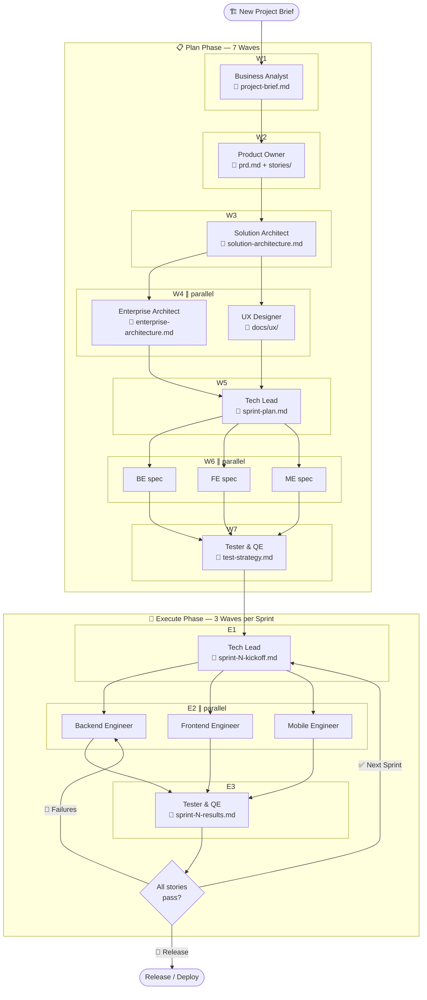
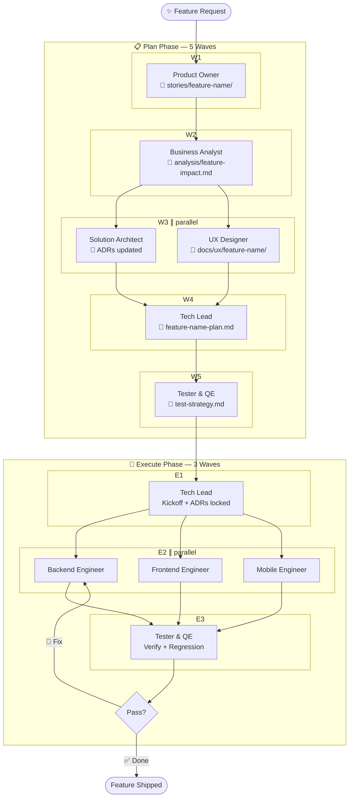

# BMAD SDLC Agents: Two-Layer Agent Architecture

**BMAD** (Breakthrough Method of Agile AI-Driven Development) is an enterprise methodology for delivering software through a cross-functional squad of 10 specialized AI agents. This repository implements the **two-layer architecture**: a global layer with reusable agent skills and shared resources, plus a project layer with context files checked into each project repo.

Install the global layer once across all tools, then scaffold `.bmad/` context files into each project. Agents dynamically load project-specific knowledge from `.bmad/` combined with shared resources, creating a cohesive, context-aware squad.

---

## Agent Team

| Agent                    | Skill File                             | BMAD Phase     | Role                                                                     |
| ------------------------ | -------------------------------------- | -------------- | ------------------------------------------------------------------------ |
| **Product Owner**        | `agents/product-owner/SKILL.md`        | Analysis       | Voice of the Business — BRD, high-level PRD, MVP scope (runs first)      |
| **Business Analyst**     | `agents/business-analyst/SKILL.md`     | Analysis       | Requirements analyst — deep-dives BRD/PRD, produces requirements analysis |
| **Enterprise Architect** | `agents/enterprise-architect/SKILL.md` | Solutioning    | High-level enterprise arch BEFORE SA — cloud infra, compliance, CI/CD    |
| **UX/UI Designer**       | `agents/ux-designer/SKILL.md`          | Solutioning    | Personas, journeys, wireframes, design system, a11y (parallel with EA)   |
| **Solution Architect**   | `agents/solution-architect/SKILL.md`   | Solutioning    | Detailed solution design using EA + UX outputs — APIs, data models, ADRs |
| **Tech Lead**            | `agents/tech-lead/SKILL.md`            | All Phases     | Orchestration, sprint planning, code review, risk, release readiness      |
| **Tester & QE**          | `agents/tester-qe/SKILL.md`            | All Phases     | Test strategy, quality gates, security testing, UI automation             |
| **Backend Engineer**     | `agents/backend-engineer/SKILL.md`     | Implementation | APIs, data layers, event-driven services                                  |
| **Frontend Engineer**    | `agents/frontend-engineer/SKILL.md`    | Implementation | React/TypeScript, state management, a11y                                  |
| **Mobile Engineer**      | `agents/mobile-engineer/SKILL.md`      | Implementation | iOS/Android, native APIs, mobile architecture                             |

---

## Two-Layer Architecture

### Global Layer

**Install once.** Available in all projects.

- **`agents/`** – 10 specialized agent skills, each in its own folder
  - `<agent-name>/SKILL.md` – Core skill body (≤500 lines; loads on invocation)
  - `<agent-name>/references/` – Deep-dive guides, patterns, and worked examples (loaded on demand)
  - `<agent-name>/templates/` – Output templates for deliverables (loaded on demand)
- **`shared/`** – Company-wide context, references, and templates
  - `BMAD-SHARED-CONTEXT.md` – Organization context, principles, standards
  - `references/technology-radar.md` – Technology choices, maturity tiers
  - `templates/` – PRD, ADR, story, test strategy, project brief, handoff log templates

### Project Layer

**Copy per project.** Checked into each project's git repo.

- **`.bmad/`** – Project-specific context files
  - `PROJECT-CONTEXT.md` – Project vision, goals, stakeholders, timeline
  - `tech-stack.md` – Technologies, versions, dependencies, build setup
  - `team-conventions.md` – Code style, naming, patterns, architecture rules
  - `domain-glossary.md` – Business domain terms, concepts, entities
  - `handoff-log.md` – Record of handoffs between agents/humans

- **`docs/`** – Project documentation
  - `architecture/` – System design, decision records, diagrams
  - `stories/` – User stories, epics, acceptance criteria
  - `testing/` – Test plans, test cases, coverage goals
  - `ux/` – Personas, journeys, wireframes, design specs

### Agent Context Loading Order

When an agent runs, it loads context in this order (later overrides earlier):

1. `shared/BMAD-SHARED-CONTEXT.md` (baseline)
2. `.bmad/PROJECT-CONTEXT.md` (project goals, stakeholders)
3. `.bmad/tech-stack.md` (technology choices)
4. `.bmad/team-conventions.md` (project rules and standards)
5. User prompt (immediate task)

This creates project-aware agents that respect global conventions while adapting to project specifics.

### 📂 Progressive Disclosure (Three-Level Loading)

Each agent skill uses a three-level loading strategy to keep context windows lean:

| Level | What | When loaded |
|---|---|---|
| **1 — Metadata** | YAML frontmatter (`name`, `description`, `allowed-tools`) | Always — used by the tool for skill discovery |
| **2 — Skill body** | `SKILL.md` (≤500 lines) | On invocation — quick mode detection, responsibilities, completion protocol |
| **3 — Reference files** | `references/*.md` and `templates/*.md` | On demand — agent reads the relevant file only when working on that task area |

This means a Tech Lead doing code review loads `templates/code-review-checklist.md` without also loading the risk assessment or debt registry templates. Agents are instructed to `Read` the appropriate reference file before starting each deliverable.

---

## Agent Intelligence

Each agent skill embeds three layers of autonomous intelligence that eliminate manual overhead and keep sessions focused.

### ⚡ Quick Mode Detection

Before loading any project context, every agent runs a 2-second binary check to determine its operating mode:

| Signal File                                    | Mode                                                    |
| ---------------------------------------------- | ------------------------------------------------------- |
| `docs/architecture/sprint-N-kickoff.md` exists | 🔨 **Execute Mode** — sprint implementation in progress |
| `docs/testing/bugs/*-fix-plan.md` exists       | 🔨 **Execute Mode** — bug fix in progress               |
| `docs/testing/hotfixes/*.md` exists            | 🔨 **Execute Mode** — hotfix in progress                |
| None of the above                              | 📋 **Plan Mode** — creating or refining artifacts       |

**Why it matters:** Execute Mode agents skip `docs/prd.md` and the full planning artifact tree — loading only 2–3 targeted files (tech-stack, conventions, kickoff doc). This prevents context overload and dramatically speeds up sprint execution.

### 🔍 Autonomous Task Detection

After loading project context, each agent scans `.bmad/handoffs/` and `docs/` to determine its current task without explicit instructions. Each agent follows a priority table covering all work types it can handle — for example:

- **Tech Lead** checks for hotfix docs → bug fix plans → sprint kickoffs → sprint plans → PRD, in that priority order, always handling the most urgent work type first
- **Backend / Frontend / Mobile Engineers** scan for fix plans → sprint kickoffs → feature plans, selecting whichever is active
- **Tester-QE** distinguishes "diagnose bug" (no fix-plan yet) from "verify fix" (fix-plan exists and fix applied)

Each agent announces what it detected and what it will do — or reports `Blocked: [what's missing]` if prerequisites haven't been met, and names which agent to invoke first.

### 🚀 Implementation Kickoff Suggestions

Every agent's Completion Protocol includes a `🚀` line in the review summary pointing to the next agent in the chain:

| Agent                 | 🚀 Suggests                                                                                          |
| --------------------- | ---------------------------------------------------------------------------------------------------- |
| Product Owner         | `/business-analyst` — deep requirements analysis of your BRD + PRD                                  |
| Business Analyst      | `/enterprise-architect` ∥ `/ux-designer` in parallel — both read your requirements analysis         |
| Enterprise Architect  | `/solution-architect` (after UX is also done)                                                        |
| UX Designer           | `/solution-architect` (after EA is also done)                                                        |
| Solution Architect    | `/tech-lead` — sprint plan from your solution architecture                                           |
| Tech Lead (Plan Mode) | Execute Prompt B (squad) or individual engineer commands                                             |
| Backend Engineer      | `/frontend-engineer` then `/tester-qe`                                                               |
| Frontend Engineer     | `/mobile-engineer` (if in scope) or `/tester-qe`                                                     |
| Mobile Engineer       | `/tester-qe` — full sprint testing                                                                   |
| Tester-QE (all pass)  | `/tech-lead` — release sign-off or next sprint kickoff                                               |
| Tester-QE (failures)  | Return to the failing engineer for fixes                                                              |

You never need to remember the agent sequence — each agent hands you off to the next one.

### 📏 Agent Rules (Inline Guardrails)

Every agent embeds a `## Agent Rules` section with non-negotiable guardrails across four categories:

| Category                     | What It Covers                                                                     | Example                                                                                |
| ---------------------------- | ---------------------------------------------------------------------------------- | -------------------------------------------------------------------------------------- |
| **Security & Compliance**    | Data handling, secrets management, PII protection, auth patterns, audit trails     | BE: "Parameterized queries only — zero tolerance for SQL injection"                    |
| **Code Quality & Standards** | Testing requirements, documentation, naming, error handling, coverage              | TQE: "Every test must reference the story ID and acceptance criterion it validates"    |
| **Workflow & Process**       | Approval gates, scope control, deviation protocols, rollback procedures            | TL: "ADR lock is irreversible per sprint — scope changes require a new ADR"            |
| **Architecture Governance**  | ADR enforcement, tech radar compliance, API contract alignment, service boundaries | SA: "All technologies must be on the technology radar — unlisted tech requires an ADR" |

Rules are role-specific — engineers get secure coding rules, architects get governance rules, testers get coverage rules, etc. Every agent verifies its outputs against its rules before completing the Completion Protocol.

### ⚡ Parallel Execution Waves

Agents are organized into **waves** — all agents in the same wave run simultaneously with no inter-dependencies. The orchestrator (human, squad prompt, or parent agent) spawns a wave, waits for all agents to complete, then spawns the next wave.

**New Project — Plan Phase:**

| Wave | Agents                                              | Depends On                                                    |
| ---- | --------------------------------------------------- | ------------------------------------------------------------- |
| W1   | Product Owner                                       | —                                                             |
| W2   | Business Analyst                                    | PO → `docs/brd.md` + `docs/prd.md`                           |
| W3   | Enterprise Architect ∥ UX Designer                  | BA → `docs/requirements/requirements-analysis.md`             |
| W4   | Solution Architect                                  | EA → `enterprise-architecture.md` AND UX → `docs/ux/`        |
| W5   | Tech Lead                                           | SA → `solution-architecture.md`                               |
| W6   | Backend Eng ∥ Frontend Eng ∥ Mobile Eng (spec only) | TL → `sprint-plan.md`                                         |
| W7   | Tester & QE (strategy only)                         | All three specs from W6                                       |

**Sprint Execution:**

| Wave | Agents                                  | Depends On                               |
| ---- | --------------------------------------- | ---------------------------------------- |
| E1   | Tech Lead (kickoff)                     | Plan approval or previous sprint results |
| E2   | Backend Eng ∥ Frontend Eng ∥ Mobile Eng | TL → `sprint-N-kickoff.md`               |
| E3   | Tester & QE                             | All three engineers from E2              |

**Feature — Plan Phase:**

| Wave | Agents                              | Depends On                                              |
| ---- | ----------------------------------- | ------------------------------------------------------- |
| W1   | Product Owner                       | —                                                       |
| W2   | Business Analyst (impact analysis)  | PO → `docs/features/[feature-name]-brief.md`            |
| W3   | Enterprise Architect ∥ UX Designer  | BA → `docs/analysis/[feature-name]-impact.md`           |
| W4   | Solution Architect                  | EA + UX (both must complete)                            |
| W5   | Tech Lead                           | SA → updated `solution-architecture.md`                 |
| W6   | Tester & QE                         | TL → `[feature]-plan.md`                                |

**How to spawn parallel waves:** In Claude Code, use the `Agent` tool to launch multiple sub-agents in a single message. In Cursor/Windsurf, open parallel composer windows. The key rule: **never start the next wave until ALL agents in the current wave have printed their ✅ summary.** Each agent knows its topology — if it finishes before a parallel peer, it reports completion and notes which peer to wait for.

### 🤖 Autonomous Orchestration (Claude Code)

In **Claude Code**, the Tech Lead acts as a fully autonomous orchestrator — spawning engineers, monitoring their progress, and triggering TQE with zero human intervention. This is powered by Claude Code's native **`Agent` tool** (sub-agent spawning) combined with a lightweight **sentinel file protocol** on the shared file system.

> **⚠️ TL must be the main thread.** Claude Code's `Agent` tool can only be called from the **main session thread** — subagents cannot spawn other subagents. To make TL the root orchestrator, start your session with:
> ```bash
> claude --agent tech-lead
> ```

#### Path A — Subagent Orchestration (Stable)

**How it works:**

| Step | What TL Does                                   | Mechanism                        |
| ---- | ---------------------------------------------- | -------------------------------- |
| 1    | Produces `sprint-N-kickoff.md`                 | Normal artifact                  |
| 2    | Clears stale signals, creates `.bmad/signals/` | `bash` tool                      |
| 3    | Spawns BE ∥ FE ∥ ME simultaneously             | `Agent` tool (3 parallel calls)  |
| 4    | Waits for all three to finish                  | Polls `.bmad/signals/E2-*-done`  |
| 5    | Writes `E3-tqe-invoke` sentinel                | `bash` tool                      |
| 6    | Spawns TQE                                     | `Agent` tool                     |

**Sentinel files** (written to `.bmad/signals/`):

| File            | Written By        | Means                                    |
| --------------- | ----------------- | ---------------------------------------- |
| `E2-be-done`    | Backend Engineer  | BE implementation complete               |
| `E2-fe-done`    | Frontend Engineer | FE implementation complete               |
| `E2-me-done`    | Mobile Engineer   | ME implementation complete               |
| `E3-tqe-invoke` | Tech Lead         | All E2 done; TQE may proceed immediately |

**TQE fast-path:** When TQE detects `.bmad/signals/E3-tqe-invoke`, it skips its E2 completion check (Step 0 in its Autonomous Task Detection) and proceeds directly to testing — no re-verification of engineer outputs needed.

#### Path B — Agent Teams (Experimental)

For full peer-to-peer coordination between BE, FE, and ME (e.g. resolving cross-service dependencies in real time), enable Agent Teams:

```bash
export CLAUDE_CODE_EXPERIMENTAL_AGENT_TEAMS=1
claude --agent tech-lead
```

TL becomes the **team lead**; BE/FE/ME become **teammates** with a shared task list and mailbox. Engineers can message each other directly — without routing through TL. The sentinel file protocol still applies as the E2→E3 completion gate. Requires Claude Code v2.1.32+.

**Other AI tools:** Kiro, Codex CLI, Cursor, and Windsurf do not support sub-agent spawning. In those environments the wave structure is **human-orchestrated** — the `🚀` suggestion lines in each agent's Completion Protocol guide you to spawn the next wave manually. The sentinel files still work the same way; you just write them yourself (or check for them) rather than having TL do it automatically.

### 🤖 Autonomous Orchestration (Claude Code)

In Claude Code, Tech Lead can fully orchestrate the sprint execution pipeline without any manual intervention.

> **⚠️ Critical prerequisite:** The Agent tool can only be used from the **main thread**. Sub-agents cannot spawn further sub-agents. You must start the session with `claude --agent tech-lead` so Tech Lead IS the main thread.

**Two modes are available:**

#### Path A — Subagent Mode (Stable, recommended)

Launch with: `claude --agent tech-lead`

| Step | What Happens |
|------|-------------|
| A — Spawn engineers | TL uses Agent tool to launch BE ∥ FE ∥ ME in parallel, all reading `sprint-N-kickoff.md` |
| B — Monitor ready signals | TL polls `.bmad/signals/` for `E2-[role]-ready` files written by engineers |
| C — Worktree code review | For each ready signal: `git worktree add` → run TL Code Review Checklist → `git worktree remove` → write done or rework signal |
| D — Converge | When all three `E2-[role]-done` signals exist → TL invokes TQE via Agent tool |

#### Path B — Agent Teams Mode (Experimental)

Launch with: `CLAUDE_CODE_EXPERIMENTAL_AGENT_TEAMS=1 claude --agent tech-lead`

Requires Claude Code v2.1.32+. Enables peer-to-peer messaging between BE/FE/ME for interface coordination. The sentinel file protocol is identical to Path A.

#### Sentinel File Protocol

All inter-agent coordination uses files in `.bmad/signals/`. No direct agent-to-agent messaging is required.

**Planning phase sentinels (written by each agent, triggers the next):**

| File | Written By | Meaning |
|------|-----------|---------|
| `.bmad/signals/po-done` | Product Owner | BRD + PRD complete; BA can proceed |
| `.bmad/signals/ba-done` | Business Analyst | Requirements analysis complete; EA + UX can proceed in parallel |
| `.bmad/signals/ea-done` | Enterprise Architect | Enterprise architecture complete (converges with `ux-done` before SA starts) |
| `.bmad/signals/ux-done` | UX Designer | UX specs complete (converges with `ea-done` before SA starts) |
| `.bmad/signals/sa-done` | Solution Architect | Detailed solution architecture complete; TL can proceed |
| `.bmad/signals/tl-plan-done` | Tech Lead | Sprint kickoff complete; engineers can proceed |

**Execution phase sentinels (two-phase TL verification protocol):**

| File | Written By | Meaning |
|------|-----------|---------|
| `.bmad/signals/E2-be-ready` | Backend Engineer | Implementation complete, awaiting TL code review. Content = branch name |
| `.bmad/signals/E2-fe-ready` | Frontend Engineer | Implementation complete, awaiting TL code review. Content = branch name |
| `.bmad/signals/E2-me-ready` | Mobile Engineer | Implementation complete, awaiting TL code review. Content = branch name |
| `.bmad/signals/E2-be-done` | **Tech Lead only** | TL has reviewed BE branch via worktree and approved |
| `.bmad/signals/E2-fe-done` | **Tech Lead only** | TL has reviewed FE branch via worktree and approved |
| `.bmad/signals/E2-me-done` | **Tech Lead only** | TL has reviewed ME branch via worktree and approved |
| `.bmad/signals/E2-be-rework` | **Tech Lead only** | BE review failed; content = path to review notes in `docs/reviews/` |
| `.bmad/signals/E2-fe-rework` | **Tech Lead only** | FE review failed; content = path to review notes in `docs/reviews/` |
| `.bmad/signals/E2-me-rework` | **Tech Lead only** | ME review failed; content = path to review notes in `docs/reviews/` |

> **Engineers never write `E2-*-done`.** The done signal is the Tech Lead's approval stamp — it is only created after a real code review via git worktree. Claiming completion without verification is dishonesty, not efficiency.

**Autonomous mode sentinel:**

| File | Written By | Meaning |
|------|-----------|---------|
| `.bmad/signals/autonomous-mode` | `scripts/yolo.sh` / `scripts/yolo.ps1` | All planning agents skip the human-review wait step and auto-invoke the next agent |

Enable with: `bash scripts/yolo.sh on` (Linux/macOS) or `.\scripts\yolo.ps1 on` (Windows)

### 🛠️ Tool Capability Matrix

Agent behaviour is not identical across all AI coding tools. This matrix shows what works where so you can set the right expectations for your team.

| Capability | Claude Code | Kiro | Codex CLI | Gemini CLI |
|---|---|---|---|---|
| **Init file** | `CLAUDE.md` | `.kiro/steering/` | `AGENTS.md` | `GEMINI.md` (project) |
| **Skills directory** | `~/.claude/skills/` | `~/.kiro/skills/` | `~/.codex/skills/` | `~/.gemini/skills/` |
| **Model** | Claude Sonnet / Opus | Claude (via Amazon Bedrock) | GPT-4o | Gemini 2.x |
| **Parallel subagent spawning** (Agent tool) | ✅ Full | ✅ Full | ❌ Not available | ❌ Not available |
| **Session hooks** (PreToolUse / PostToolUse / Stop) | ✅ Full | ✅ Full | ❌ Not available | ❌ Not available |
| **Yolo harness** | ✅ Full | ✅ Full | ❌ Not available | ❌ Not available |
| **Sentinel file protocol** | ✅ Reliable | ✅ Reliable | ⚠️ Partial — model may skip sentinel writes after ✅ block | ⚠️ Partial — inconsistent file-check compliance |
| **Autonomous sentinel chaining** | ✅ Reliable | ✅ Reliable | ⚠️ Unreliable | ⚠️ Unreliable |
| **Slash commands** | ✅ `/agent-name` | ✅ `@agent-name` | ✅ `/agent-name` | ⚠️ Varies by version |
| **Protocol step compliance** | ✅ High — follows multi-step protocols faithfully | ✅ High | ⚠️ Medium — tends to stop after ✅ summary; skips later steps | ⚠️ Medium — reformats output; compresses multi-branch logic |
| **Wave E2 parallelism** (BE ∥ FE ∥ ME) | ✅ True parallel | ✅ True parallel | ❌ Sequential only | ❌ Sequential only |
| **Git worktree TL review** | ✅ Full | ✅ Full | ✅ Full (tool-independent) | ✅ Full (tool-independent) |

**Practical impact by tool:**

- **Claude Code** — Full BMAD pipeline including autonomous chaining, parallel engineers, hooks, and Yolo harness. Recommended for the complete experience.
- **Kiro** — Equivalent to Claude Code in nearly all respects. Path A and B both available. Yolo harness works. Only minor differences in slash command syntax (`@` vs `/`).
- **Codex CLI** — Artifacts and quality gates work well. Autonomous chaining and sentinel writes are unreliable after the ✅ block. Engineers run sequentially (not in parallel). No hooks/harness. Each agent's Completion Protocol includes a `### 🔧 On Codex CLI / Gemini CLI` section with a simplified close procedure tailored to these constraints.
- **Gemini CLI** — Similar limitations to Codex. Output formatting often deviates from spec (content is correct, structure varies). The `### 🔧 On Codex CLI / Gemini CLI` simplified protocol applies here too. Skills install to `~/.gemini/skills/<agent-name>/` using the same folder-per-skill convention as Claude Code and Kiro.

---

## Quick Start (3 Steps)

### Step 1: Install Global Layer

```bash
bash scripts/install-global.sh
```

Copies all agent skills, commands, hooks, and shared resources to tool-specific global directories. Runs once per machine.

### Step 2: Scaffold New Project

```bash
bash /path/to/bmad-sdlc-agents/scripts/scaffold-project.sh "My Project Name"
```

Creates `.bmad/` context files, installs project-level agents, and generates a tool-specific instruction file (e.g. `CLAUDE.md`) that tells your AI tool to auto-load `.bmad/` at the start of every session.

### Step 3: Fill Project Context

Edit `.bmad/PROJECT-CONTEXT.md` and `.bmad/tech-stack.md` with your project details. The instruction file and all agents will pick these up automatically on the next session.

---

## Wiring Up Auto-Loading (.bmad/ → Your AI Tool)

Every AI coding tool reads a special instruction file at session start. Add the BMAD context block below to whichever file your tool uses. **`scaffold-project.sh` generates this automatically** — these snippets are here if you need to add it manually or update an existing file.

### Claude Code — `CLAUDE.md`

```markdown
## BMAD Project Context

At the start of every conversation, read these files to understand this project:

- `.bmad/PROJECT-CONTEXT.md` — vision, goals, stakeholders, constraints
- `.bmad/tech-stack.md` — technology stack, versions, dependencies
- `.bmad/team-conventions.md` — code style, naming conventions, patterns
- `.bmad/domain-glossary.md` — business domain terminology
- `.bmad/handoff-log.md` — recent agent decisions and handoffs

## Available BMAD Agents (slash commands)

| Command                 | Role                                                    |
| ----------------------- | ------------------------------------------------------- |
| `/product-owner`        | BRD, high-level PRD, MVP scope (first agent)            |
| `/business-analyst`     | Requirements analysis from BRD/PRD (second agent)       |
| `/enterprise-architect` | Enterprise arch — cloud infra, compliance, CI/CD        |
| `/ux-designer`          | Wireframes, design system, accessibility (parallel EA)  |
| `/solution-architect`   | Detailed solution design — APIs, data models, ADRs      |
| `/tech-lead`            | Orchestration, sprint planning, code review, risk       |
| `/tester-qe`            | Test strategy, quality gates, UI automation             |
| `/backend-engineer`     | APIs, services, data layers                             |
| `/frontend-engineer`    | React/TypeScript, components, a11y                      |
| `/mobile-engineer`      | iOS/Android, native architecture                        |
```

### Cursor — `.cursor/rules/001-project-context.mdc`

```markdown
---
description: BMAD project context — load at the start of every conversation
alwaysApply: true
---

## BMAD Project Context

Read these files before responding to any request in this project:

- `.bmad/PROJECT-CONTEXT.md` — vision, goals, stakeholders, constraints
- `.bmad/tech-stack.md` — technology stack, versions, dependencies
- `.bmad/team-conventions.md` — code style, naming conventions, patterns
- `.bmad/domain-glossary.md` — business domain terminology
- `.bmad/handoff-log.md` — recent agent decisions and handoffs

Apply all conventions from `team-conventions.md` when writing or reviewing code.
```

### Windsurf — `.windsurfrules`

```markdown
## BMAD Project Context

At the start of every conversation, read these files:

- `.bmad/PROJECT-CONTEXT.md` — vision, goals, stakeholders, constraints
- `.bmad/tech-stack.md` — technology stack, versions, dependencies
- `.bmad/team-conventions.md` — code style, naming conventions, patterns
- `.bmad/domain-glossary.md` — business domain terminology
- `.bmad/handoff-log.md` — recent agent decisions and handoffs

Apply all conventions from `team-conventions.md` when writing or reviewing code.
```

### GitHub Copilot — `.github/copilot-instructions.md`

```markdown
## BMAD Project Context

This project uses the BMAD SDLC framework. At the start of each session, read:

- `.bmad/PROJECT-CONTEXT.md` — vision, goals, stakeholders, constraints
- `.bmad/tech-stack.md` — technology stack, versions, dependencies
- `.bmad/team-conventions.md` — code style, naming conventions, patterns
- `.bmad/domain-glossary.md` — business domain terminology
- `.bmad/handoff-log.md` — recent agent decisions and handoffs

Always apply the conventions in `team-conventions.md` when generating code.
```

### Gemini CLI — `~/.gemini/skills/` + project `GEMINI.md`

Global skills install to `~/.gemini/skills/<agent-name>/SKILL.md` (same folder-per-skill convention as Claude Code). Project-level wiring uses a `GEMINI.md` at the project root:

```markdown
## BMAD Project Context

At the start of every conversation, read these files:

- `.bmad/PROJECT-CONTEXT.md` — vision, goals, stakeholders, constraints
- `.bmad/tech-stack.md` — technology stack, versions, dependencies
- `.bmad/team-conventions.md` — code style, naming conventions, patterns
- `.bmad/domain-glossary.md` — business domain terminology
- `.bmad/handoff-log.md` — recent agent decisions and handoffs

Apply all conventions from `team-conventions.md` when writing or reviewing code.
```

### Kiro (AWS) — `AGENTS.md` + `.kiro/steering/`

Kiro reads `AGENTS.md` at the project root automatically. It also reads `.kiro/steering/*.md` files. BMAD commands are installed as steering files with `inclusion: manual`, making them available as `/bmad-status`, `/handoff`, etc. in Kiro chat.

```markdown
## BMAD Project Context

At the start of every conversation, read these files:

- `.bmad/PROJECT-CONTEXT.md` — vision, goals, stakeholders, constraints
- `.bmad/tech-stack.md` — technology stack, versions, dependencies
- `.bmad/team-conventions.md` — code style, naming conventions, patterns
- `.bmad/domain-glossary.md` — business domain terminology
- `.bmad/handoff-log.md` — recent agent decisions and handoffs

Apply all conventions from `team-conventions.md` when writing or reviewing code.
```

### Codex CLI (OpenAI) — `AGENTS.md`

```markdown
## BMAD Project Context

At the start of every conversation, read these files:

- `.bmad/PROJECT-CONTEXT.md` — vision, goals, stakeholders, constraints
- `.bmad/tech-stack.md` — technology stack, versions, dependencies
- `.bmad/team-conventions.md` — code style, naming conventions, patterns
- `.bmad/domain-glossary.md` — business domain terminology
- `.bmad/handoff-log.md` — recent agent decisions and handoffs

## Available BMAD Agents (skills)

| Skill ($ invoke)        | Role                                           |
| ----------------------- | ---------------------------------------------- |
| `$business-analyst`     | Discovery, stakeholder analysis, project brief |
| `$product-owner`        | PRD, backlog, user stories                     |
| `$solution-architect`   | System design, APIs, ADRs                      |
| `$enterprise-architect` | Cloud infra, compliance, CI/CD                 |
| `$ux-designer`          | Wireframes, design system, accessibility       |
| `$tech-lead`            | Orchestration, code review, risk               |
| `$tester-qe`            | Test strategy, quality gates                   |
| `$backend-engineer`     | APIs, services, data layers                    |
| `$frontend-engineer`    | React/TypeScript, components, a11y             |
| `$mobile-engineer`      | iOS/Android, native architecture               |

Apply all conventions from `team-conventions.md` when writing or reviewing code.
```

### OpenCode — `AGENTS.md`

```markdown
## BMAD Project Context

At the start of every conversation, read these files:

- `.bmad/PROJECT-CONTEXT.md` — vision, goals, stakeholders, constraints
- `.bmad/tech-stack.md` — technology stack, versions, dependencies
- `.bmad/team-conventions.md` — code style, naming conventions, patterns
- `.bmad/domain-glossary.md` — business domain terminology
- `.bmad/handoff-log.md` — recent agent decisions and handoffs

Apply all conventions from `team-conventions.md` when writing or reviewing code.
```

### Aider — `.aider.conventions.md`

```markdown
## BMAD Project Context

At the start of every conversation, read these files:

- `.bmad/PROJECT-CONTEXT.md` — vision, goals, stakeholders, constraints
- `.bmad/tech-stack.md` — technology stack, versions, dependencies
- `.bmad/team-conventions.md` — code style, naming conventions, patterns
- `.bmad/domain-glossary.md` — business domain terminology
- `.bmad/handoff-log.md` — recent agent decisions and handoffs

Apply all conventions from `team-conventions.md` when writing or reviewing code.
```

Then reference it in `.aider.conf.yml`:

```yaml
conventions-file: .aider.conventions.md
```

---

## Setup Guide by Tool

### Claude Code (Local CLI)

**Global Install (once)**

```bash
bash scripts/install-global.sh
# → Agents → ~/.claude/skills/          (slash commands: /business-analyst, etc.)
# → Commands → ~/.claude/commands/       (slash commands: /bmad-status, /new-story, etc.)
# → Hooks → ~/.claude/hooks/             (PreToolUse / PostToolUse / Stop guards)
```

**Project Install (per project, run from project root)**

```bash
bash /path/to/bmad-sdlc-agents/scripts/scaffold-project.sh "My Project"
# → .bmad/                 project context files (commit to git)
# → CLAUDE.md              auto-loads .bmad/ at session start
# → .claude/skills/        project-local copies of all agents
# → .claude/commands/      project-local slash commands
# → .claude/hooks/         project-level hook scripts
```

After scaffolding, open your project in Claude Code and use slash commands directly — all context is pre-loaded:

```
/business-analyst   /product-owner      /solution-architect
/enterprise-architect  /ux-designer     /tech-lead
/tester-qe          /backend-engineer   /frontend-engineer   /mobile-engineer
/bmad-status        /new-story          /new-adr
/handoff            /new-epic           /sprint-plan
/bmad-eval
```

---

### Codex CLI (OpenAI)

**Global Install (once)**

```bash
bash scripts/install-global.sh
# → Skills → ~/.codex/skills/<agent>/SKILL.md  (invoke: $business-analyst, etc.)
# → Prompts → ~/.codex/prompts/                (slash commands: /bmad-status, /handoff, etc.)
```

**Project Install (per project, run from project root)**

```bash
bash /path/to/bmad-sdlc-agents/scripts/scaffold-project.sh "My Project"
# → .bmad/                 project context files (commit to git)
# → AGENTS.md              auto-loads .bmad/ at session start
# → .codex/skills/         project-local copies of all agent skills
# → .codex/prompts/        project-local slash commands
```

After scaffolding, open your project in Codex CLI and invoke agents with `$` prefix, commands with `/`:

```
$business-analyst   $product-owner      $solution-architect
$enterprise-architect  $ux-designer     $tech-lead
$tester-qe          $backend-engineer   $frontend-engineer   $mobile-engineer
/bmad-status        /new-story          /new-adr
/handoff            /new-epic           /sprint-plan
/bmad-eval
```

---

### Kiro (AWS)

**Global Install (once)**

```bash
bash scripts/install-global.sh
# → Skills → ~/.kiro/skills/<agent>/SKILL.md    (activate by description match)
# → Steering → ~/.kiro/steering/                (auto/manual inclusion files)
# → Commands → ~/.kiro/steering/ (inclusion: manual → /bmad-status, /handoff, etc.)
```

**Project Install (per project, run from project root)**

```bash
bash /path/to/bmad-sdlc-agents/scripts/scaffold-project.sh "My Project"
# → .bmad/                  project context files (commit to git)
# → AGENTS.md               auto-loaded by Kiro at session start
# → .kiro/skills/           project-local agent skills
# → .kiro/steering/         project-local steering + slash commands
```

After scaffolding, open your project in Kiro. Skills activate by description match. Commands are available as slash commands:

```
/bmad-status        /new-story          /new-adr
/handoff            /new-epic           /sprint-plan
/bmad-eval
```

---

### Cowork (Claude Desktop)

**Global Install (once)**

```bash
bash scripts/install-global.sh
# → Agents → ~/.skills/skills/  (auto-discoverable by description)
```

**Project Install (per project, run from project root)**

```bash
bash /path/to/bmad-sdlc-agents/scripts/scaffold-project.sh "My Project"
# → .bmad/      project context files (commit to git)
# → CLAUDE.md   auto-loads .bmad/ at session start
```

Agents detect `.bmad/` automatically. No additional config needed.

---

### Cursor

**Global Install (once)**

```bash
bash scripts/install-global.sh
# → Agents + global rules → ~/.cursor/rules/
```

**Project Install (per project, run from project root)**

```bash
bash /path/to/bmad-sdlc-agents/scripts/scaffold-project.sh "My Project"
# → .bmad/                                    project context files (commit to git)
# → .cursor/rules/001-project-context.mdc     auto-loads .bmad/ (alwaysApply: true)
# → .cursor/rules/002-tech-stack.mdc          code generation rules
```

Address agents by role in your prompt: "Acting as the Solution Architect, …"

---

### Windsurf

**Global Install (once)**

```bash
bash scripts/install-global.sh
# → Agents + global rules → ~/.windsurf/rules/
```

**Project Install (per project, run from project root)**

```bash
bash /path/to/bmad-sdlc-agents/scripts/scaffold-project.sh "My Project"
# → .bmad/           project context files (commit to git)
# → .windsurfrules   auto-loads .bmad/ at session start
```

Address agents by role in your prompt: "Acting as the Backend Engineer, …"

---

### GitHub Copilot

**Global Install (once)**

```bash
bash scripts/install-global.sh
# → Agents → ~/.github/copilot-instructions.md
```

**Project Install (per project, run from project root)**

```bash
bash /path/to/bmad-sdlc-agents/scripts/scaffold-project.sh "My Project"
# → .bmad/                               project context files (commit to git)
# → .github/copilot-instructions.md      auto-loads .bmad/ at session start
```

Address agents by role: "Acting as the Product Owner, …"

---

### Gemini CLI

**Global Install (once)**

```bash
bash scripts/install-global.sh
# → ~/.gemini/skills/<agent-name>/SKILL.md   (one folder per agent)
# → ~/.gemini/skills/<agent-name>/references/ (deep-dive guides)
# → ~/.gemini/skills/<agent-name>/templates/  (output templates)
# → ~/.gemini/BMAD-SHARED-CONTEXT.md
```

**Project Install (per project, run from project root)**

```bash
bash /path/to/bmad-sdlc-agents/scripts/scaffold-project.sh "My Project"
# → .bmad/       project context files (commit to git)
# → GEMINI.md    auto-loads .bmad/ at session start
```

Address agents by role: "Acting as the Enterprise Architect, …"

---

### OpenCode

**Global Install (once)**

```bash
bash scripts/install-global.sh
# → Agents + global rules → ~/.opencode/instructions.md
```

**Project Install (per project, run from project root)**

```bash
bash /path/to/bmad-sdlc-agents/scripts/scaffold-project.sh "My Project"
# → .bmad/      project context files (commit to git)
# → AGENTS.md   auto-loads .bmad/ at session start
```

Address agents by role: "Acting as the Tech Lead, …"

---

### Aider

**Global Install (once)**

```bash
bash scripts/install-global.sh
# → Agents + global conventions → ~/.aider.conventions.md
```

**Project Install (per project, run from project root)**

```bash
bash /path/to/bmad-sdlc-agents/scripts/scaffold-project.sh "My Project"
# → .bmad/                    project context files (commit to git)
# → .aider.conventions.md     auto-loads .bmad/ at session start
```

Reference in `.aider.conf.yml`:

```yaml
conventions-file: .aider.conventions.md
```

---

## Tool Install Paths Reference

| Tool           | Global Path                         | Project Path                      |
| -------------- | ----------------------------------- | --------------------------------- |
| Claude Code    | `~/.claude/skills/`                 | `.claude/skills/`                 |
| Cowork         | `~/.skills/skills/`                 | `.bmad/` (auto-detected)          |
| Cursor         | `~/.cursor/rules/`                  | `.cursor/rules/`                  |
| Windsurf       | `~/.windsurf/rules/`                | `.windsurfrules`                  |
| GitHub Copilot | `~/.github/copilot-instructions.md` | `.github/copilot-instructions.md` |
| Gemini CLI     | `~/.gemini/skills/`                 | `GEMINI.md`                       |
| OpenCode       | `~/.opencode/instructions.md`       | `AGENTS.md`                       |
| Aider          | `~/.aider.conventions.md`           | `.aider.conf.yml`                 |

---

## Project Scaffold Files

After running `scaffold-project.sh`, the `.bmad/` directory contains:

| File                  | When to Fill In               | Purpose                                                           |
| --------------------- | ----------------------------- | ----------------------------------------------------------------- |
| `PROJECT-CONTEXT.md`  | Before first sprint           | Project vision, goals, stakeholders, constraints, timeline        |
| `tech-stack.md`       | Before architecture decisions | Languages, frameworks, databases, cloud platform, CI/CD           |
| `team-conventions.md` | Before first code review      | Code style, naming conventions, architecture patterns, PR process |
| `domain-glossary.md`  | During analysis phase         | Business domain terminology, entities, relationships              |
| `handoff-log.md`      | Ongoing                       | Record of work handed off between agents or to humans             |

**Tip:** Fill `PROJECT-CONTEXT.md` and `tech-stack.md` first. Other files populate based on these.

---

## Sample Prompts

> **After running `install-global.sh` and `scaffold-project.sh`**, agents are already installed in your tool and `.bmad/` is already in your project. Just use the slash command — no need to reference any file paths.

> **⚠ Avoiding Skill Conflicts (Claude Code):** If you have other plugins installed (e.g. superpowers, general planners), always invoke BMAD agents via their **explicit slash command** (`/business-analyst`, `/solution-architect`, etc.). Never use prose-only prompts like "Acting as the Business Analyst…" in Claude Code — without the slash command, another installed skill may intercept the request. The `CLAUDE.md` generated by `scaffold-project.sh` also instructs Claude to prefer BMAD over other skills for this project.

### Using a Single Agent (Claude Code)

**Get a project brief from Business Analyst:**

```
/business-analyst Generate a concise project brief including stakeholders, success
criteria, and constraints, based on the project context.
```

**Ask Solution Architect for system design:**

```
/solution-architect Propose a system architecture with service boundaries, API contracts,
and data models. Reference the PRD in docs/stories/ and tech-stack.md.
```

**Request UX/UI wireframes:**

```
/ux-designer Create wireframes and a design spec for the checkout flow, based on user
personas in docs/ux/ and the PRD in docs/stories/.
```

**Backend Engineer implementation plan:**

```
/backend-engineer Create a sprint-level implementation plan for the payment service,
referencing the architecture decisions in docs/architecture/ and tech-stack.md.
```

**QE test strategy:**

```
/tester-qe Propose a comprehensive test strategy with test types, coverage goals, and
security testing approach, based on docs/stories/ and tech-stack.md.
```

### Using a Single Agent (Codex CLI)

Invoke agents with the `$` prefix. Codex matches skills by name:

```
$business-analyst Generate a concise project brief including stakeholders, success
criteria, and constraints, based on the project context.
```

```
$solution-architect Propose a system architecture with service boundaries, API contracts,
and data models. Reference the PRD in docs/stories/ and tech-stack.md.
```

```
$ux-designer Create wireframes and a design spec for the checkout flow, based on user
personas in docs/ux/ and the PRD in docs/stories/.
```

### Using a Single Agent (Kiro)

Kiro skills activate by description match. Just describe the task — Kiro selects the matching BMAD agent automatically. You can also use slash commands for BMAD operations:

```
Generate a concise project brief including stakeholders, success criteria, and constraints,
based on .bmad/PROJECT-CONTEXT.md.
```

```
Propose a system architecture with service boundaries, API contracts, and data models.
Reference the PRD in docs/stories/ and tech-stack.md.
```

```
/bmad-status
```

### Using a Single Agent (Cursor / Windsurf / Copilot / Gemini / OpenCode / Aider)

Agents are already loaded via your global rules file. Just address the agent by role in your prompt — the tool has all agent definitions in context:

```
Acting as the Business Analyst, generate a concise project brief including stakeholders,
success criteria, and constraints based on .bmad/PROJECT-CONTEXT.md.
```

```
Acting as the Solution Architect, propose a system architecture with service boundaries,
API contracts, and data models. Use .bmad/tech-stack.md and docs/stories/.
```

### Squad Mode: All Agents Together

See the **Squad Prompt** section below to run all 10 agents in a single session.

---

## Squad Prompt

Use this mega-prompt to coordinate all agents. **Agents and project context are pre-loaded** — no file paths needed.

> **⚠ Critical — Claude Code users:** Do NOT paste the squad prompt as a single block of text. That triggers skill-matching on the whole message, and any other installed planning/analysis plugin (e.g. superpowers) will intercept it. Each agent must be invoked in its own turn with an explicit slash command.
>
> Also: if you have a plugin with `PostToolUse` or `Stop` hooks that inject follow-up instructions (e.g. the thedotmack superpowers plugin), those hooks fire _below_ the skill layer and override BMAD regardless of what slash command you use. **Disable any non-BMAD planning plugins before running a BMAD session** (Claude Code → Settings → Plugins).

### Claude Code — One Agent Per Turn

Run each agent in a **separate** Claude Code message starting with its slash command.
Each agent's skill automatically pauses after completing its work and asks for your review.
Reply `refine: [feedback]` to iterate with the same agent, or `next` to advance.

---

#### 🗂 Phase 1 — Plan (Turns 1–10)

**Turn 1 — Business Analyst:**

```
/business-analyst
Review .bmad/PROJECT-CONTEXT.md. Identify stakeholders, constraints, and risks.
Generate a project brief and save to docs/project-brief.md.
[Your task description here]
```

**Turn 2 — Product Owner:**

```
/product-owner
Read docs/project-brief.md.
Create a PRD with prioritized user stories. Save to docs/prd.md and docs/stories/.
```

**Turn 3 — Solution Architect:**

```
/solution-architect
Read docs/prd.md and .bmad/tech-stack.md.
Propose system architecture, service boundaries, API contracts, and data models.
Record every architectural decision as an ADR in docs/architecture/adr/.
Save overall architecture to docs/architecture/solution-architecture.md.
```

**Turn 4 — UX Designer:**

```
/ux-designer
Read docs/prd.md and docs/architecture/solution-architecture.md.
Create wireframes, user journeys, and a design system. Save to docs/ux/.
```

**Turn 5 — Enterprise Architect:**

```
/enterprise-architect
Read docs/architecture/solution-architecture.md and all ADRs in docs/architecture/adr/.
Propose cloud infrastructure, CI/CD pipeline, monitoring, and compliance controls.
Save to docs/architecture/enterprise-architecture.md.
```

**Turn 6 — Tech Lead (sequencing):**

```
/tech-lead
Review all planning artifacts:
- docs/project-brief.md, docs/prd.md
- docs/architecture/ (all ADRs, solution-architecture.md, enterprise-architecture.md)
- docs/stories/ (all epics), docs/ux/

Sequence stories into sprint batches. Identify:
1. Which stories each engineer must implement first (dependencies)
2. Any missing specs or unresolved ADRs that would block implementation
3. Acceptance criteria gaps that need clarification before coding starts
Save sprint plan to docs/architecture/sprint-plan.md.
```

**Turn 7 — Backend Engineer (spec):**

```
/backend-engineer
Read docs/architecture/sprint-plan.md and docs/architecture/adr/.
Write the backend implementation spec:
- API endpoint contracts (routes, request/response schemas)
- Data access layer patterns and repository interfaces
- Event/message contracts if applicable
Save to docs/architecture/backend-implementation-spec.md.
Do NOT write application code yet — output spec only.
```

**Turn 8 — Frontend Engineer (spec):**

```
/frontend-engineer
Read docs/ux/, docs/architecture/sprint-plan.md, and docs/architecture/backend-implementation-spec.md.
Write the frontend implementation spec:
- Component tree and responsibility breakdown
- State management approach
- API contract consumption patterns
- Accessibility and responsive requirements
Save to docs/architecture/frontend-implementation-spec.md.
Do NOT write application code yet — output spec only.
```

**Turn 9 — Mobile Engineer (spec):**

```
/mobile-engineer
Read docs/ux/ and docs/architecture/sprint-plan.md.
Write the mobile implementation spec:
- Native vs. cross-platform decision with rationale
- Screen-to-component mapping
- Device constraints and offline handling strategy
Save to docs/architecture/mobile-implementation-spec.md.
Do NOT write application code yet — output spec only.
```

**Turn 10 — Tester & QE (strategy):**

```
/tester-qe
Read all planning artifacts (docs/stories/, docs/architecture/, docs/ux/).
Write a test strategy covering unit, integration, e2e, security, and performance.
Define quality gates and acceptance criteria per story.
Save to docs/testing/test-strategy.md.
Do NOT write test code yet — output strategy only.
```

**After each turn — log the handoff:**

```
/handoff
```

**Gate before Phase 2 — confirm all planning artifacts exist:**

```
/bmad-status
```

> All 8 artifact paths must show ✅ before starting Phase 2.

---

#### ⚙️ Phase 2 — Execute (Turns 11–15)

> **Prerequisite:** `/bmad-status` shows ✅ on all 8 paths. ADRs are now locked.

**Turn 11 — Tech Lead (execution kickoff):**

```
/tech-lead
Read docs/architecture/sprint-plan.md. Extract Sprint 1 stories.
Produce a kickoff doc listing each story with its assigned engineer role
(backend / frontend / mobile). Declare all ADRs locked.
Save to docs/architecture/sprint-1-kickoff.md.
```

**Turn 12 — Backend Engineer (implement):**

```
/backend-engineer
Read docs/architecture/sprint-1-kickoff.md — find all stories assigned to backend.
Read docs/architecture/backend-implementation-spec.md for API contracts and patterns.
Stack: .bmad/tech-stack.md  |  Style: .bmad/team-conventions.md

For each assigned story:
1. Implement API endpoints per the spec
2. Write data access layer code
3. Add inline documentation
4. Note any unavoidable spec deviations: // DEVIATION: [reason]
```

**Turn 13 — Frontend Engineer (implement):**

```
/frontend-engineer
Read docs/architecture/sprint-1-kickoff.md — find all stories assigned to frontend.
Read docs/architecture/frontend-implementation-spec.md for component tree and state.
Read docs/ux/ for wireframes and design system (locked — do not redesign).
Stack: .bmad/tech-stack.md  |  Style: .bmad/team-conventions.md

For each assigned story:
1. Build components per the frontend spec
2. Wire up state management and API calls
3. Apply accessibility and responsive rules from docs/ux/
```

**Turn 14 — Mobile Engineer (implement):**

```
/mobile-engineer
Read docs/architecture/sprint-1-kickoff.md — find all stories assigned to mobile.
Read docs/architecture/mobile-implementation-spec.md for screen mapping and constraints.
Stack: .bmad/tech-stack.md  |  Style: .bmad/team-conventions.md

For each assigned story:
1. Implement screens per the mobile spec
2. Apply device constraint handling
3. Wire up API calls per the backend contracts
```

**Turn 15 — Tester & QE (write and run tests):**

```
/tester-qe
Read docs/architecture/sprint-1-kickoff.md for the full Sprint 1 story list.
Read docs/testing/test-strategy.md for quality gates and acceptance criteria.

For each story:
1. Write unit tests per the quality gates
2. Write integration tests for API contracts
3. Flag any acceptance criteria from docs/stories/ that are NOT met
4. Save test results to docs/testing/sprint-1-results.md
```

**Log Phase 1 → Phase 2 handoffs:**

```
/handoff tl be
/handoff tl fe
/handoff tl me
```

**Final status check:**

```
/bmad-status
```

---

#### 🔁 Sprint Continuation (Sprint N+1, N+2, …)

> After Tester-QE completes Sprint N and you type `next` to accept. Replace `N` throughout.

**Step 1 — Close out the sprint:**

```
/bmad-eval
```

**Step 2 — Tech Lead: review + kick off Sprint N+1:**

```
/tech-lead
Sprint N is complete. Read docs/testing/sprint-N-results.md.
Identify unmet acceptance criteria and carry-over stories.
Read docs/architecture/sprint-plan.md — extract Sprint N+1 stories.
List each story with its assigned engineer role. Lock any new ADRs.
Save to docs/architecture/sprint-N+1-kickoff.md.
```

**Step 3 — Backend Engineer:**

```
/backend-engineer
Read docs/architecture/sprint-N+1-kickoff.md — find all stories assigned to backend.
Read docs/architecture/backend-implementation-spec.md for patterns.
Stack: .bmad/tech-stack.md  |  Style: .bmad/team-conventions.md
Implement assigned stories. Mark deviations: // DEVIATION: [reason]
```

**Step 4 — Frontend Engineer:**

```
/frontend-engineer
Read docs/architecture/sprint-N+1-kickoff.md — find all stories assigned to frontend.
Read docs/architecture/frontend-implementation-spec.md + docs/ux/.
Stack: .bmad/tech-stack.md  |  Style: .bmad/team-conventions.md
Build UI components and wire up API calls. Mark deviations: // DEVIATION: [reason]
```

**Step 5 — Mobile Engineer:**

```
/mobile-engineer
Read docs/architecture/sprint-N+1-kickoff.md — find all stories assigned to mobile.
Read docs/architecture/mobile-implementation-spec.md.
Stack: .bmad/tech-stack.md  |  Style: .bmad/team-conventions.md
Write screens and wire up API calls. Mark deviations: // DEVIATION: [reason]
```

**Step 6 — Tester-QE:**

```
/tester-qe
Read docs/architecture/sprint-N+1-kickoff.md for the full story list.
Read docs/testing/test-strategy.md for quality gates.
Write and run tests. Flag unmet criteria.
Save results to docs/testing/sprint-N+1-results.md.
```

---

### Codex CLI — One Agent Per Turn

Same two-phase pattern as Claude Code. Use `$` prefix for skills, `/` for commands.
The review gate is built into each agent's skill — no need to add it to the prompt.

#### 🗂 Phase 1 — Plan

Follow the Claude Code Phase 1 turns exactly, replacing `/` with `$` for each skill invocation:

```
$business-analyst    $product-owner       $solution-architect
$ux-designer         $enterprise-architect $tech-lead
$backend-engineer    $frontend-engineer   $mobile-engineer    $tester-qe
```

The task description for each turn is identical to the Claude Code section above.
After each turn: `/handoff`. After Turn 10: `/bmad-status`.

#### ⚙️ Phase 2 — Execute

Follow the Claude Code Phase 2 turns exactly, replacing `/` with `$`:

```
$tech-lead  (kickoff)  →  $backend-engineer  →  $frontend-engineer
$mobile-engineer  →  $tester-qe
```

#### 🔁 Sprint Continuation (Sprint N+1, N+2, …)

Follow the Claude Code Sprint Continuation steps exactly, replacing `/` with `$`:

```
$bmad-eval                  # close out Sprint N
$tech-lead                  # review results + kick off Sprint N+1
$backend-engineer           # implement Sprint N+1 backend stories
$frontend-engineer          # implement Sprint N+1 frontend stories
$mobile-engineer            # implement Sprint N+1 mobile screens
$tester-qe                  # test Sprint N+1, save sprint-N+1-results.md
```

Use the same task descriptions from the Claude Code Sprint Continuation section above,
replacing `/` with `$` in all skill invocations.

### Kiro — Description-Driven

Kiro activates skills by description match. Prefix each turn with the agent's role.
The review gate is built into each agent's skill.

#### 🗂 Phase 1 — Plan

**Turn 1 — Business Analyst:**

```
As a business analyst, review .bmad/PROJECT-CONTEXT.md. Identify stakeholders,
constraints, and risks. Generate a project brief and save to docs/project-brief.md.
[Your task description here]
```

**Turn 2 — Product Owner:**

```
As product owner, read docs/project-brief.md. Create a PRD with prioritized user stories.
Save to docs/prd.md and docs/stories/.
```

**Turn 3 — Solution Architect:**

```
As solution architect, read docs/prd.md and .bmad/tech-stack.md. Propose system
architecture, service boundaries, API contracts, and data models. Record all decisions
as ADRs in docs/architecture/adr/. Save to docs/architecture/solution-architecture.md.
```

**Turn 4 — UX Designer:**

```
As UX designer, read docs/prd.md and docs/architecture/solution-architecture.md.
Create wireframes, user journeys, and a design system. Save to docs/ux/.
```

**Turn 5 — Enterprise Architect:**

```
As enterprise architect, read docs/architecture/solution-architecture.md and all ADRs.
Propose cloud infrastructure, CI/CD pipeline, monitoring, and compliance controls.
Save to docs/architecture/enterprise-architecture.md.
```

**Turn 6 — Tech Lead (sequencing):**

```
As tech lead, review all planning artifacts in docs/. Sequence stories into sprint batches.
Identify dependencies and missing specs. Save to docs/architecture/sprint-plan.md.
```

**Turn 7 — Backend Engineer (spec):**

```
As backend engineer, read sprint-plan.md and all ADRs. Write the backend implementation
spec: API contracts, data access patterns, event contracts.
Save to docs/architecture/backend-implementation-spec.md. No code yet.
```

**Turn 8 — Frontend Engineer (spec):**

```
As frontend engineer, read docs/ux/, sprint-plan.md, and backend-implementation-spec.md.
Write the frontend implementation spec: component tree, state management, API consumption.
Save to docs/architecture/frontend-implementation-spec.md. No code yet.
```

**Turn 9 — Mobile Engineer (spec):**

```
As mobile engineer, read docs/ux/ and sprint-plan.md. Write the mobile implementation spec:
platform decision, screen mapping, device constraints.
Save to docs/architecture/mobile-implementation-spec.md. No code yet.
```

**Turn 10 — Tester & QE (strategy):**

```
As tester and QE engineer, read all planning artifacts. Write a test strategy: unit,
integration, e2e, security, performance quality gates, acceptance criteria per story.
Save to docs/testing/test-strategy.md. No test code yet.
```

Use `/bmad-status` after Turn 10. Use `/handoff` between turns.

#### ⚙️ Phase 2 — Execute

> Start only after `/bmad-status` confirms all 8 artifact paths are ✅.

**Turn 11 — Tech Lead (kickoff):**

```
As tech lead, planning is approved. Read docs/architecture/sprint-plan.md.
Extract Sprint 1 stories. Produce a kickoff doc listing each story with its assigned
engineer role (backend / frontend / mobile). Declare all ADRs locked.
Save to docs/architecture/sprint-1-kickoff.md.
```

**Turn 12 — Backend Engineer (implement):**

```
As backend engineer, read docs/architecture/sprint-1-kickoff.md — find all stories
assigned to backend. Read docs/architecture/backend-implementation-spec.md for API
contracts and patterns. Follow .bmad/tech-stack.md and .bmad/team-conventions.md.
Implement each assigned story. Mark deviations: // DEVIATION: [reason]
```

**Turn 13 — Frontend Engineer (implement):**

```
As frontend engineer, read docs/architecture/sprint-1-kickoff.md — find all stories
assigned to frontend. Read docs/architecture/frontend-implementation-spec.md for
component tree and state. Read docs/ux/ for wireframes (locked — do not redesign).
Follow .bmad/tech-stack.md and .bmad/team-conventions.md.
Build UI components and wire up API calls. Mark deviations: // DEVIATION: [reason]
```

**Turn 14 — Mobile Engineer (implement):**

```
As mobile engineer, read docs/architecture/sprint-1-kickoff.md — find all stories
assigned to mobile. Read docs/architecture/mobile-implementation-spec.md for screen
mapping and constraints. Follow .bmad/tech-stack.md and .bmad/team-conventions.md.
Write mobile screens and wire up API calls. Mark deviations: // DEVIATION: [reason]
```

**Turn 15 — Tester & QE (write and run tests):**

```
As tester and QE engineer, read docs/architecture/sprint-1-kickoff.md for the full
Sprint 1 story list. Read docs/testing/test-strategy.md for quality gates.
Write and run unit + integration tests for every Sprint 1 story.
Flag unmet acceptance criteria. Save results to docs/testing/sprint-1-results.md.
```

#### 🔁 Sprint Continuation (Sprint N+1, N+2, …)

> After Tester-QE accepts Sprint N and you type `next`. Replace `N` throughout.

**Close out Sprint N:**

```
As the BMAD eval collector, run /bmad-eval to log Sprint N metrics.
```

**Tech Lead — Sprint N+1 Kickoff:**

```
As tech lead, Sprint N is complete. Read docs/testing/sprint-N-results.md for
carry-overs. Read docs/architecture/sprint-plan.md — extract Sprint N+1 stories.
List each story with its assigned engineer role. Lock any new ADRs.
Save to docs/architecture/sprint-N+1-kickoff.md.
```

**Backend Engineer — Sprint N+1:**

```
As backend engineer, read docs/architecture/sprint-N+1-kickoff.md — find all stories
assigned to backend. Read docs/architecture/backend-implementation-spec.md for patterns.
Follow .bmad/tech-stack.md. Implement assigned stories. Mark deviations: // DEVIATION: [reason]
```

**Frontend Engineer — Sprint N+1:**

```
As frontend engineer, read docs/architecture/sprint-N+1-kickoff.md — find all stories
assigned to frontend. Read docs/architecture/frontend-implementation-spec.md + docs/ux/.
Build UI components and wire up API calls. Mark deviations: // DEVIATION: [reason]
```

**Mobile Engineer — Sprint N+1:**

```
As mobile engineer, read docs/architecture/sprint-N+1-kickoff.md — find all stories
assigned to mobile. Read docs/architecture/mobile-implementation-spec.md.
Write screens and wire up API calls. Mark deviations: // DEVIATION: [reason]
```

**Tester & QE — Sprint N+1:**

```
As tester and QE engineer, read docs/architecture/sprint-N+1-kickoff.md for the full
story list. Read docs/testing/test-strategy.md for quality gates.
Write and run tests. Flag unmet criteria. Save to docs/testing/sprint-N+1-results.md.
```

### Cursor / Windsurf / Copilot / Gemini / OpenCode / Aider

All agent skills are loaded from your global rules file. Select the prompt set that matches your work type below. Each agent follows its built-in Completion Protocol — it prints a `✅` review summary and waits. Reply `next` to advance or `refine: [feedback]` to iterate.

> **Claude Code / Codex / Kiro users:** Run each agent block as a separate turn using its `/slash-command` (or `$` / description prefix) instead of pasting the whole prompt at once.

**Key design principle:** Prompt A (Plan) saves all artifacts to known file paths. Prompt B (Execute) tells each agent to **read those files directly** — no manual copy-paste between prompts. The Tech Lead's kickoff doc is the bridge: it reads the plan, assigns stories per engineer, and saves a kickoff file that every execution agent reads.

---

#### 🏗 New Project

Use when starting a project from scratch. Full 10-agent planning → multi-sprint execution.

**Prompt A — Plan (10 agents, no code):**

```
# BMAD Squad: New Project Plan

You are a squad of 10 specialized AI agents organized into parallel execution waves.
All agent skills are loaded. The project context is in .bmad/ — read it before starting.
OUTPUT ONLY DOCUMENTATION — do NOT write any application code yet.

Each agent must follow its built-in Completion Protocol: run the quality gate, save
outputs, print the ✅ review summary, and wait for my reply.
Agents in the same wave run in PARALLEL — spawn them together.
Only advance to the next wave when ALL agents in the current wave reply 'next'.

---

## Wave 1 — Business Analyst
Review .bmad/PROJECT-CONTEXT.md. Identify stakeholders, constraints, risks, and success
criteria. Generate a project brief. Save to docs/project-brief.md.
[Describe the project goal here]

## Wave 2 — Product Owner
Read docs/project-brief.md. Create a full PRD: vision, epics, prioritized user stories
with acceptance criteria. Save to docs/prd.md and individual stories to docs/stories/.

## Wave 3 — Solution Architect
Read docs/prd.md and .bmad/tech-stack.md. Propose system architecture, service
boundaries, API contracts, and data models. Record all decisions as ADRs in
docs/architecture/adr/. Save to docs/architecture/solution-architecture.md.

## Wave 4 ∥ — Enterprise Architect + UX Designer (parallel)
**Spawn both agents simultaneously — they have no inter-dependencies.**

### Enterprise Architect
Read docs/architecture/solution-architecture.md and all ADRs. Define cloud
infrastructure, CI/CD pipeline, observability, and compliance controls.
Save to docs/architecture/enterprise-architecture.md.

### UX Designer
Read docs/prd.md and docs/architecture/solution-architecture.md. Create wireframes,
user journeys, and a component design system. Save to docs/ux/.

## Wave 5 — Tech Lead (sequencing)
**Wait for BOTH Enterprise Architect and UX Designer to complete.**
Review all planning artifacts. Sequence stories into sprint batches. For each sprint,
list story assignments per engineer role (backend, frontend, mobile).
Identify dependencies and spec gaps. Save to docs/architecture/sprint-plan.md.

## Wave 6 ∥ — Backend + Frontend + Mobile Engineer (parallel, spec only — no code)
**Spawn all three agents simultaneously — they read sprint-plan.md independently.**

### Backend Engineer
Read sprint-plan.md and all ADRs. Write backend implementation spec: API contracts,
data access patterns, event contracts. Save to docs/architecture/backend-implementation-spec.md.

### Frontend Engineer
Read docs/ux/, sprint-plan.md, backend-implementation-spec.md. Write frontend spec:
component tree, state management, API consumption. Save to docs/architecture/frontend-implementation-spec.md.

### Mobile Engineer
Read docs/ux/ and sprint-plan.md. Write mobile spec: platform decision, screen mapping,
device constraints. Save to docs/architecture/mobile-implementation-spec.md.

## Wave 7 — Tester & QE (strategy only — no test code)
**Wait for ALL three engineer specs to complete.**
Read all planning artifacts. Write a test strategy: unit, integration, e2e, security,
performance quality gates, acceptance criteria per story. Save to docs/testing/test-strategy.md.
```

> ✅ Before Prompt B: run `/bmad-status` — all 8 artifact paths must be present.

**Prompt B — Execute (Sprint 1):**

```
# BMAD Squad: Sprint 1 Implementation

All planning is approved. All ADRs are locked — do NOT reopen architectural decisions.
Each agent must follow its built-in Completion Protocol: print the ✅ review summary
and wait for my reply. Agents in the same wave run in PARALLEL.
Only advance to the next wave when ALL agents in the current wave complete.

## Wave E1 — Tech Lead (execution kickoff)
Read docs/architecture/sprint-plan.md. Extract Sprint 1 stories. Produce a kickoff doc
listing each story with its assigned engineer role (backend / frontend / mobile).
Declare all ADRs locked. Save to docs/architecture/sprint-1-kickoff.md.

## Wave E2 ∥ — Backend + Frontend + Mobile Engineer (parallel)
**Spawn all three agents simultaneously — they read the kickoff doc independently.**

### Backend Engineer
Read docs/architecture/sprint-1-kickoff.md — find all stories assigned to backend.
Read docs/architecture/backend-implementation-spec.md for API contracts and patterns.
Stack: .bmad/tech-stack.md  |  Style: .bmad/team-conventions.md
Implement each assigned story. Mark deviations: // DEVIATION: [reason]

### Frontend Engineer
Read docs/architecture/sprint-1-kickoff.md — find all stories assigned to frontend.
Read docs/architecture/frontend-implementation-spec.md for component tree and state.
Read docs/ux/ for wireframes and design system.
Stack: .bmad/tech-stack.md  |  Style: .bmad/team-conventions.md
Build UI components and wire up API calls. Mark deviations: // DEVIATION: [reason]

### Mobile Engineer
Read docs/architecture/sprint-1-kickoff.md — find all stories assigned to mobile.
Read docs/architecture/mobile-implementation-spec.md for screen mapping and constraints.
Stack: .bmad/tech-stack.md  |  Style: .bmad/team-conventions.md
Write mobile screens and wire up API calls. Mark deviations: // DEVIATION: [reason]

## Wave E3 — Tester & QE
**Wait for ALL three engineers to complete before starting.**
Read docs/architecture/sprint-1-kickoff.md for the full Sprint 1 story list.
Read docs/testing/test-strategy.md for quality gates and acceptance criteria.
Write and run unit + integration tests for every Sprint 1 story.
Flag any unmet acceptance criteria. Save results to docs/testing/sprint-1-results.md.
```

**Prompt C — Sprint N+1 Continuation:**

> After Tester-QE accepts Sprint N and you type `next`. Replace `N` throughout.

```
# BMAD Squad: Sprint N+1 Implementation

Sprint N is complete. ADRs remain locked.
Each agent must follow its built-in Completion Protocol: print the ✅ review summary
and wait for my reply. Agents in the same wave run in PARALLEL.

## Wave E1 — Tech Lead — Sprint N+1 Kickoff
Read docs/testing/sprint-N-results.md for carry-overs and unmet criteria.
Read docs/architecture/sprint-plan.md — extract Sprint N+1 stories.
List each story with its assigned engineer role. Lock any new ADRs.
Save to docs/architecture/sprint-N+1-kickoff.md.

## Wave E2 ∥ — Backend + Frontend + Mobile Engineer (parallel)
**Spawn all three simultaneously after Tech Lead completes.**

### Backend Engineer
Read docs/architecture/sprint-N+1-kickoff.md — find all stories assigned to backend.
Read docs/architecture/backend-implementation-spec.md for patterns.
Stack: .bmad/tech-stack.md  |  Style: .bmad/team-conventions.md
Implement assigned stories. Mark deviations: // DEVIATION: [reason]

### Frontend Engineer
Read docs/architecture/sprint-N+1-kickoff.md — find all stories assigned to frontend.
Read docs/architecture/frontend-implementation-spec.md + docs/ux/.
Build UI components and wire up API calls. Mark deviations: // DEVIATION: [reason]

### Mobile Engineer
Read docs/architecture/sprint-N+1-kickoff.md — find all stories assigned to mobile.
Read docs/architecture/mobile-implementation-spec.md.
Write screens and wire up API calls. Mark deviations: // DEVIATION: [reason]

## Wave E3 — Tester & QE
**Wait for ALL three engineers to complete.**
Read docs/architecture/sprint-N+1-kickoff.md for the full story list.
Read docs/testing/test-strategy.md for quality gates.
Write and run tests. Flag unmet criteria. Save to docs/testing/sprint-N+1-results.md.
```

> 💡 Run `/bmad-eval` first to log Sprint N metrics before starting Prompt C.

---

#### ✨ Feature Request / Enhancement

Use when adding a new capability to an existing project. Skips EA (project context already exists). BA runs impact analysis after PO defines scope. Architecture agents run if the feature touches service boundaries or infrastructure.

**Prompt A — Plan (5 agents, no code):**

```
# BMAD Squad: Feature Plan

You are a squad of specialized AI agents organized into parallel execution waves.
All agent skills are loaded. Read .bmad/PROJECT-CONTEXT.md and existing docs/ first.
OUTPUT ONLY DOCUMENTATION — do NOT write any code yet.

Each agent must follow its built-in Completion Protocol: run the quality gate, save
outputs, print the ✅ review summary, and wait for my reply.
Agents in the same wave run in PARALLEL — spawn them together.

Feature: [describe the feature or paste the request here]

---

## Wave 1 — Product Owner
Read docs/prd.md and existing docs/stories/. Define the feature scope: write new user
stories with clear acceptance criteria. Identify any existing stories affected.
Save stories to docs/stories/[feature-name]/ and update docs/prd.md.

## Wave 2 — Business Analyst (impact analysis)
Read docs/stories/[feature-name]/ and existing docs/. Analyze:
- Stakeholder impact — who is affected and what are their concerns
- Affected systems and services — what existing functionality changes
- Data flow changes — new data paths, storage, or processing
- Regulatory/compliance implications
- Risks, constraints, and dependencies on external systems
- Success metrics for the feature
Save to docs/analysis/[feature-name]-impact.md.

## Wave 3 ∥ — Solution Architect + UX Designer (parallel)
**Spawn both agents simultaneously — both read PO's stories and BA's impact analysis independently.**
[Skip UX if no UI impact. Skip SA if no architecture impact.]

### Solution Architect
Read the new feature stories in docs/stories/[feature-name]/, BA's impact analysis in docs/analysis/, and docs/architecture/.
Assess architectural impact: new endpoints, data model changes, service boundary
changes, third-party integrations. Create or update ADRs in docs/architecture/adr/.
Update docs/architecture/solution-architecture.md if needed.

### UX Designer
Read docs/stories/[feature-name]/, BA's impact analysis, and docs/ux/. Design wireframes and user flows for
new or updated screens. Save to docs/ux/[feature-name]/.

## Wave 4 — Tech Lead
**Wait for BOTH Solution Architect and UX Designer (W3) to complete.**
Read docs/stories/[feature-name]/, all updated ADRs, and docs/ux/[feature-name]/ if
present. Break down stories by engineer role (backend / frontend / mobile). Estimate
effort. Identify dependencies. Save the feature execution plan to
docs/architecture/[feature-name]-plan.md — this file must list every story with its
assigned engineer role, referenced spec, and any ADRs to follow.

## Wave 5 — Tester & QE
Read docs/stories/[feature-name]/ and the acceptance criteria within each story.
Write test cases: unit, integration, regression impact on existing features.
Update docs/testing/test-strategy.md with the feature's test section.
```

**Prompt B — Execute:**

```
# BMAD Squad: Feature Implementation

Feature planning is approved. ADRs are locked for this feature.
Each agent must follow its built-in Completion Protocol: print the ✅ review summary
and wait for my reply. Agents in the same wave run in PARALLEL.

## Wave E1 — Tech Lead — Kickoff
Scan docs/architecture/ for the most recent *-plan.md file (created by Prompt A).
Read it. Confirm story assignments per engineer. Lock all feature ADRs.
Print the full assignment summary including the feature name and plan path so all
subsequent agents know exactly which files to read.

## Wave E2 ∥ — Backend + Frontend + Mobile Engineer (parallel)
**Spawn all three simultaneously after Tech Lead completes.**

### Backend Engineer
Read the feature plan identified by Tech Lead — find all stories assigned to backend.
Read docs/architecture/solution-architecture.md and any referenced ADRs for API
contracts and data model changes.
Stack: .bmad/tech-stack.md  |  Style: .bmad/team-conventions.md
Implement each assigned story. Mark deviations: // DEVIATION: [reason]

### Frontend Engineer
Read the feature plan identified by Tech Lead — find all stories assigned to frontend.
Read the feature's UX folder in docs/ux/ for wireframes and interaction specs.
Read docs/architecture/solution-architecture.md for API contracts.
Stack: .bmad/tech-stack.md  |  Style: .bmad/team-conventions.md
Build feature UI. Mark deviations: // DEVIATION: [reason]

### Mobile Engineer
Read the feature plan identified by Tech Lead — find all stories assigned to mobile.
Read docs/architecture/mobile-implementation-spec.md and any referenced ADRs.
Stack: .bmad/tech-stack.md  |  Style: .bmad/team-conventions.md
Write feature mobile screens. Mark deviations: // DEVIATION: [reason]

## Wave E3 — Tester & QE
**Wait for ALL three engineers to complete.**
Read the feature plan identified by Tech Lead for the complete story list.
Read the feature's story folder in docs/stories/ for acceptance criteria per story.
Read docs/testing/test-strategy.md for quality gates and regression scope.
Write and run tests. Verify all acceptance criteria. Flag regressions.
Save results to docs/testing/ with the feature name prefix.
```

> In a continuing session the agents will find the correct files automatically. If starting
> a new session, tell the Tech Lead which feature plan to read (e.g. `docs/architecture/payment-retry-plan.md`).

---

#### 🐛 Bug Fix

Use when investigating and resolving a reported defect. Starts with diagnosis before any fix code.

**Prompt A — Diagnose (2 agents):**

```
# BMAD Squad: Bug Diagnosis

Two agents will investigate this bug. Each must follow its built-in Completion
Protocol: print the ✅ review summary and wait for my reply before the next agent.

Bug report: [paste bug description, error message, or ticket here]

---

## Agent 1 — Tester & QE
Reproduce the bug using the report above and the codebase. Document:
- Exact reproduction steps
- Actual vs expected behavior
- Affected user stories or features (cross-ref docs/stories/)
- Root-cause hypotheses (at least 2)
- Regression risk: what else could be affected
Choose a short bug-id slug (e.g. auth-timeout, cart-double-charge).
Save bug report to docs/testing/bugs/[bug-id].md.

## Agent 2 — Tech Lead
Read the bug report saved by Tester-QE — scan docs/testing/bugs/ for the most recent
.md file created in this session. Also read the relevant source files.
Confirm the root cause. Define the minimal safe fix: which files change, what changes,
what must NOT change. Identify the engineer role needed (backend / frontend / mobile).
Assess regression scope. Save fix plan to docs/testing/bugs/[bug-id]-fix-plan.md.
```

**Prompt B — Fix & Verify:**

```
# BMAD Squad: Bug Fix Implementation

Root cause confirmed. Fix plan is approved.
Each agent must follow its built-in Completion Protocol: print the ✅ review summary
and wait for my reply. Only proceed when I reply 'next'.

## [Backend / Frontend / Mobile] Engineer
Scan docs/testing/bugs/ for the most recent *-fix-plan.md file.
Read the fix plan. Apply the targeted fix only — no unrelated refactoring.
Mark every changed line: // FIX: [bug-id]

## Tester & QE
Read the bug report from docs/testing/bugs/ (the .md file without -fix-plan suffix).
Re-run the reproduction steps — confirm the bug is fixed.
Run regression tests for all areas identified in the fix plan.
Save verification results to docs/testing/bugs/[bug-id]-verified.md.
```

> In a continuing session the agents will find the correct files automatically. If starting
> a new session, replace `[bug-id]` with the slug from Prompt A (e.g. `auth-timeout`).

---

#### 🚨 Hotfix (Production Emergency)

Use when a critical production issue needs the fastest possible resolution. Assess, fix, smoke test in one session — no planning docs.

**Single Prompt — Assess, Fix, Verify:**

```
# BMAD Squad: Production Hotfix

PRODUCTION EMERGENCY. Three agents work in strict sequence.
Each agent must follow its built-in Completion Protocol: print the ✅ review summary
and wait for my reply. Only proceed when I reply 'next'.

Issue: [describe production symptoms, error logs, or incident report here]

---

## Agent 1 — Tech Lead
Read the issue above and relevant source files. Identify root cause. Define the
smallest safe fix (no refactoring, no scope creep). Confirm rollback plan.
Identify the engineer role needed (backend / frontend / mobile).
Save assessment to docs/testing/hotfixes/[date]-[issue].md.

## Agent 2 — [Backend / Frontend / Mobile] Engineer
Read the most recent assessment in docs/testing/hotfixes/.
Implement the fix exactly as scoped.
Mark every changed line: // HOTFIX: [date]-[issue]
Do NOT refactor, rename, or clean up anything outside the fix scope.

## Agent 3 — Tester & QE
Read the assessment in docs/testing/hotfixes/ and the engineer's changes.
Smoke test only — verify the critical path is unbroken.
Confirm the production symptom is resolved.
Save results to docs/testing/hotfixes/[date]-[issue]-verified.md.
```

---

#### 📋 Backlog Item / Tech Debt / Chore

Use for known stories already in the backlog, dependency upgrades, refactors, or maintenance tasks that don't need full architecture review.

**Prompt A — Refine (3 agents, no code):**

```
# BMAD Squad: Backlog Refinement

Three agents will refine and plan this work item. Each must follow its built-in
Completion Protocol: print the ✅ review summary and wait for my reply.

Work item: [paste story, tech debt description, or chore here]

---

## Agent 1 — Product Owner
Read the work item and docs/prd.md. Choose a short story-id slug (e.g. upgrade-redis,
refactor-auth-middleware). Clarify scope: write or refine the story with unambiguous
acceptance criteria and explicit out-of-scope boundaries.
Save refined story to docs/stories/[story-id].md.

## Agent 2 — Business Analyst (requirements clarification)
Read the refined story saved by Product Owner — scan docs/stories/ for the most recent
.md file. Analyze requirements clarity, stakeholder impact, risks, and dependencies.
Verify acceptance criteria are unambiguous. Flag any regulatory implications.
Save to docs/analysis/[story-id]-analysis.md.

## Agent 3 — Tech Lead
Read the refined story saved by the Product Owner and the analysis saved by BA —
scan docs/stories/ and docs/analysis/ for the most recent files. Also read relevant source files.
Produce a technical breakdown: affected files, implementation approach, estimated
effort, dependencies, risks. Identify the engineer role needed (backend / frontend / mobile).
Flag any ADR implications. Save to docs/architecture/[story-id]-notes.md.
```

**Prompt B — Execute:**

```
# BMAD Squad: Backlog Item Implementation

Story is refined and technical breakdown is approved.
Each agent must follow its built-in Completion Protocol: print the ✅ review summary
and wait for my reply. Only proceed when I reply 'next'.

## [Backend / Frontend / Mobile] Engineer
Scan docs/architecture/ for the most recent *-notes.md file.
Read the tech notes and the linked story in docs/stories/.
Implement per the approach defined. Follow .bmad/tech-stack.md and
.bmad/team-conventions.md. Mark deviations: // DEVIATION: [reason]

## Tester & QE
Read the story file linked in the tech notes — find acceptance criteria.
Write and run targeted tests. Verify all criteria are met.
Save results to docs/testing/[story-id]-results.md.
```

> In a continuing session the agents will find the correct files automatically. If starting
> a new session, replace `[story-id]` with the slug from Prompt A (e.g. `upgrade-redis`).

---

## File Organization

```
bmad-sdlc-agents/
├── agents/                                 # Global: 10 agent skills
│   ├── business-analyst/
│   │   ├── SKILL.md                        # Core skill body (≤500 lines)
│   │   ├── references/                     # Deep-dive guides (loaded on demand)
│   │   └── templates/                      # Output templates (loaded on demand)
│   ├── product-owner/
│   │   ├── SKILL.md
│   │   ├── references/
│   │   └── templates/
│   ├── solution-architect/
│   │   ├── SKILL.md
│   │   └── references/
│   ├── enterprise-architect/
│   │   ├── SKILL.md
│   │   └── references/
│   ├── ux-designer/
│   │   ├── SKILL.md
│   │   ├── references/
│   │   └── templates/
│   ├── tech-lead/
│   │   ├── SKILL.md
│   │   ├── references/
│   │   └── templates/
│   ├── tester-qe/
│   │   ├── SKILL.md
│   │   ├── references/
│   │   └── templates/
│   ├── backend-engineer/
│   │   ├── SKILL.md
│   │   └── references/
│   ├── frontend-engineer/
│   │   ├── SKILL.md
│   │   └── references/
│   └── mobile-engineer/
│       ├── SKILL.md
│       └── references/
│
├── shared/                                 # Global: resources for all projects
│   ├── BMAD-SHARED-CONTEXT.md
│   ├── references/
│   │   └── technology-radar.md
│   └── templates/
│       ├── prd-template.md
│       ├── adr-template.md
│       ├── story-template.md
│       ├── test-strategy-template.md
│       ├── project-brief-template.md
│       └── handoff-log-template.md
│
├── project-scaffold/                       # Template for new projects
│   ├── .bmad/
│   │   ├── PROJECT-CONTEXT.md
│   │   ├── tech-stack.md
│   │   ├── team-conventions.md
│   │   ├── domain-glossary.md
│   │   └── handoff-log.md
│   └── docs/
│       ├── architecture/
│       ├── stories/
│       ├── testing/
│       └── ux/
│
└── scripts/
    ├── install-global.sh                   # Deploy agents/ + shared/ to all detected tools
    ├── scaffold-project.sh                 # Create .bmad/ + project wiring files
    └── update.sh                           # Update global install + all projects
```

---

## Integration Guide

### How Agents Use Context

When you invoke an agent in any tool, it automatically:

1. **Detects** `.bmad/PROJECT-CONTEXT.md` in the current project
2. **Loads** its skill from `agents/<agent-name>/SKILL.md`
3. **Reads** `.bmad/tech-stack.md` and `.bmad/team-conventions.md` for project specifics
4. **Falls back** to `shared/BMAD-SHARED-CONTEXT.md` for company standards
5. **Applies** context to your prompt and generates project-aware responses

### Continuous Integration

The `scripts/update.sh` pulls the latest agent skills and shared resources, then:

- Rebuilds global tool directories
- Refreshes all project `.bmad/` symlinks
- Preserves project-specific overrides

### Version Control

- **Commit to git:** `.bmad/` directory (context files are project-specific)
- **Commit to git:** `docs/` directory (all artifacts)
- **Do not commit:** Global `~/.claude/`, `~/.codex/`, `~/.kiro/`, `~/.skills/`, `~/.cursor/`, etc. (manage with `install-global.sh`)
- **Do not commit:** Tool-specific config files unless project-managed

---

## Common Workflows

### Onboarding a New Team Member

```bash
# Clone project repo (includes .bmad/)
git clone <project-repo>

# Install global agents (once per machine)
bash /path/to/bmad-sdlc-agents/scripts/install-global.sh

# New team member can now:
# - Load agents in their favorite tool
# - Access project context from .bmad/
# - Collaborate with squad prompts
```

### Starting a New Project

```bash
# Scaffold the project
bash /path/to/bmad-sdlc-agents/scripts/scaffold-project.sh "New Platform"

# Add to your project repo
git add .bmad/ docs/ .claude/ .cursor/ # (as needed per tool)
git commit -m "Add BMAD project scaffold"

# Fill in context files
# Edit: .bmad/PROJECT-CONTEXT.md, .bmad/tech-stack.md
```

### Running Full Squad Analysis

Use the **Squad Prompt** section above as a session script. For Claude Code, run one agent per turn using its slash command. Do not paste the whole squad prompt as one message — invoke each agent explicitly.

### Continuing to the Next Sprint

After each sprint the Tester-QE agent prints a `✅` review summary and waits. Once you've reviewed and type `next`, here's how to continue:

**Claude Code / Codex CLI** — invoke each agent individually with the Sprint Continuation prompts from the Squad Prompt section. The sprint plan (produced by Tech Lead in Turn 6) already contains all sprint batches, so you only need to pull the next batch from it.

**Cursor / Windsurf / Kiro** — paste **Prompt C** (Sprint N+1 Continuation) from the Squad Prompt section, replacing `N` with the completed sprint number.

The key steps for every sprint boundary are the same regardless of tool:

1. Type `next` to accept the Tester-QE review (closes Sprint N)
2. Run `/bmad-eval` to log Sprint N productivity metrics
3. Invoke **Tech Lead** — read `sprint-N-results.md`, confirm carry-overs, produce `sprint-N+1-kickoff.md`
4. Invoke **Backend / Frontend / Mobile** engineers with Sprint N+1 story lists from the kickoff doc
5. Invoke **Tester-QE** — test Sprint N+1, save `sprint-N+1-results.md`
6. Repeat from step 1

> The sprint plan is written once (Turn 6) and covers all sprints. You never need to re-plan unless scope changes — in that case, re-invoke Tech Lead with a `// SCOPE CHANGE:` note.

### Updating Agents Across All Projects

```bash
# Pull latest agents and shared resources
bash /path/to/bmad-sdlc-agents/scripts/update.sh

# All projects instantly have access to updated agents
# Project context files are preserved
```

---

## Workflow Diagrams

Visual reference for all five work types. Each diagram shows the agent chain, key artifact outputs, and decision points.

### 🏗 New Project

Full 10-agent flow from project brief through multi-sprint execution.



---

### ✨ Feature Request / Enhancement

Skips BA and EA (project context already exists). Architecture agents run only if the feature touches service boundaries.



---

### 🐛 Bug Fix

Diagnosis before fix. Two diagnosis agents confirm root cause before any code changes.


---

### 🚨 Hotfix (Production Emergency)

Assess, fix, smoke test in a single session. No planning docs, no refactoring.


---

### 📋 Backlog Item / Tech Debt / Chore

Lightweight two-agent refinement then direct execution. No architecture review needed.


---

## Productivity Evaluation

BMAD includes a framework for measuring AI-assisted productivity gains, specifically designed for Enterprise Architect (EA) and Solution Architect (SA) roles.

### Three Dimensions × Nine Metrics

| Dimension    | Metrics                                                          | Weight |
| ------------ | ---------------------------------------------------------------- | ------ |
| **Speed**    | Time-to-First-Draft, Time-to-Approval, Iteration Turnaround      | 35%    |
| **Quality**  | First-Pass Review Rate, NFR Coverage Score, Arch Debt Introduced | 35%    |
| **Coverage** | Alternatives Evaluated, Risks Identified, Stakeholder Scenarios  | 30%    |

**Composite Score** = `0.35 × Speed + 0.35 × Quality + 0.30 × Coverage` (normalized 0–100)

### The `/bmad-eval` Command

Run `/bmad-eval` inside any BMAD project to auto-collect metrics from `.bmad/` artifacts, git history, and architecture docs. The command:

1. Scans artifact files for NFR sections, ADR options, risk mentions, and scenario counts
2. Measures revision history and time-to-commit from git
3. Asks the practitioner for manual inputs (time-to-artifact, first-pass rate)
4. Outputs a JSON record compatible with the evaluation dashboard

Records accumulate in `.bmad/eval/eval-log.jsonl` for longitudinal tracking.

### Interactive Dashboard

The dashboard ships as `eval/bmad-agent-eval-dashboard.html` in this repo. After install:

- **Per-project:** `.bmad/eval/bmad-agent-eval-dashboard.html` — scaffolded automatically by `scaffold-project.sh`
- **Global reference:** `~/.bmad/eval/bmad-agent-eval-dashboard.html` — copied by `install-global.sh`

It is a self-contained HTML file (Chart.js, no server required) that visualizes:

- KPI cards with baseline → assisted deltas
- Weekly composite trend (bar chart)
- Per-dimension breakdowns (speed, quality, coverage)
- EA vs SA radar comparison
- Two-sample t-test statistical significance table
- Sortable practitioner detail table

**Getting started:** Collect 4 weeks of baseline data (no AI), then 4+ weeks of AI-assisted data. Replace the sample `DATA` array in the dashboard with your real records from `/bmad-eval`.

---

## FAQ

**Q: Where do agents live?**
A: Source files live in `agents/` in this repo. After running `install-global.sh` they are deployed to your tool (e.g. `~/.claude/skills/` for Claude Code). You invoke them with a slash command (`/solution-architect`) or by addressing the agent by role — no file paths needed.

**Q: Where does project context live?**
A: In `.bmad/` (per project, checked into git). Each project has its own `.bmad/PROJECT-CONTEXT.md`, `tech-stack.md`, etc.

**Q: Do I need to install globally?**
A: Yes, once per machine. Then scaffold each project. Agents find `.bmad/` files automatically.

**Q: Can I customize agents per project?**
A: Yes. Copy an agent skill to `.claude/skills/` or `.cursor/rules/` and edit it for project-specific tweaks.

**Q: How do I version agents?**
A: Keep `agents/` in the BMAD repository. Use `scripts/update.sh` to refresh. Project context (`.bmad/`) versions with your project.

**Q: Can multiple teams use different tech stacks?**
A: Absolutely. Each project has its own `tech-stack.md`, so agents adapt to TypeScript, Python, Kotlin, etc.

**Q: Another plugin (e.g. superpowers) keeps taking over my BMAD session. How do I stop it?**
A: There are two layers to this conflict:

1. **Hook injection** — Plugins with `PostToolUse` or `Stop` hooks can inject follow-up instructions _after every tool call_, below the skill-matching layer. Even an explicit slash command like `/business-analyst` can be overridden this way. The only fix is to **disable the conflicting plugin** in Claude Code → Settings → Plugins before running a BMAD session. You can re-enable it afterward for non-BMAD projects.

2. **Skill-matching** — If you send a large prose prompt ("plan and design my project…"), Claude Code fuzzy-matches across all installed skills. A broad planning/analysis plugin wins because its triggers are wider. The fix is to **always start each message with the slash command** (`/business-analyst`, `/solution-architect`, etc.) — slash commands are explicit file lookups, not fuzzy matches, so they bypass skill competition.

**Q: Can I run BMAD alongside other plugins?**
A: Yes, but not in the same session. Disable broad planning plugins (superpowers, etc.) at the start of a BMAD session, do your BMAD work, then re-enable them. For per-project isolation, note that Claude Code doesn't support per-project plugin enable/disable today — it's global. The cleanest workflow is: keep BMAD enabled globally, disable competing plugins when doing structured BMAD sessions.

---

## Support & Contributing

For issues, enhancements, or new agents, open an issue in the BMAD repository.

To contribute an agent or template, see the contribution guidelines in `CONTRIBUTING.md`.

---

**Last updated:** 2026-03-27
**BMAD Version:** 2.3 (Agent Rules + Parallel Execution Waves + Agent Intelligence + Mermaid Workflow Diagrams)
