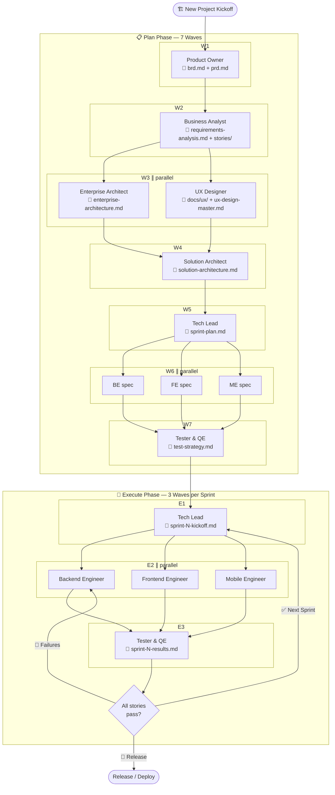
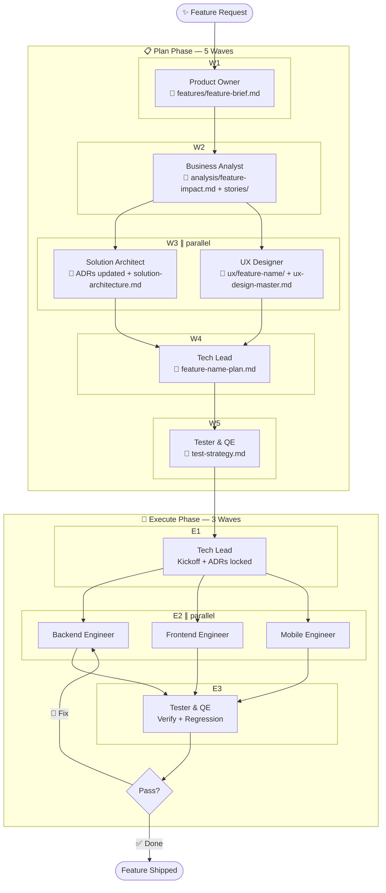
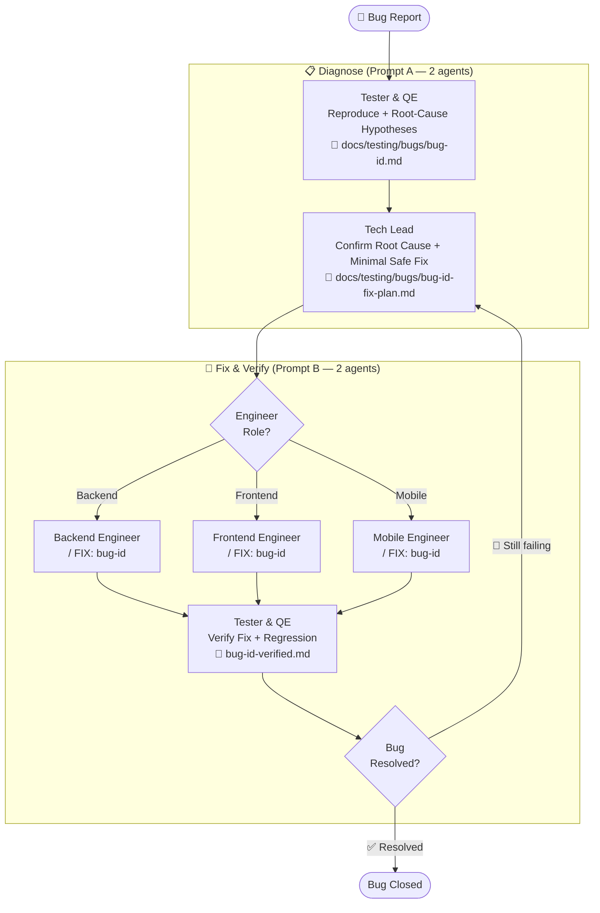
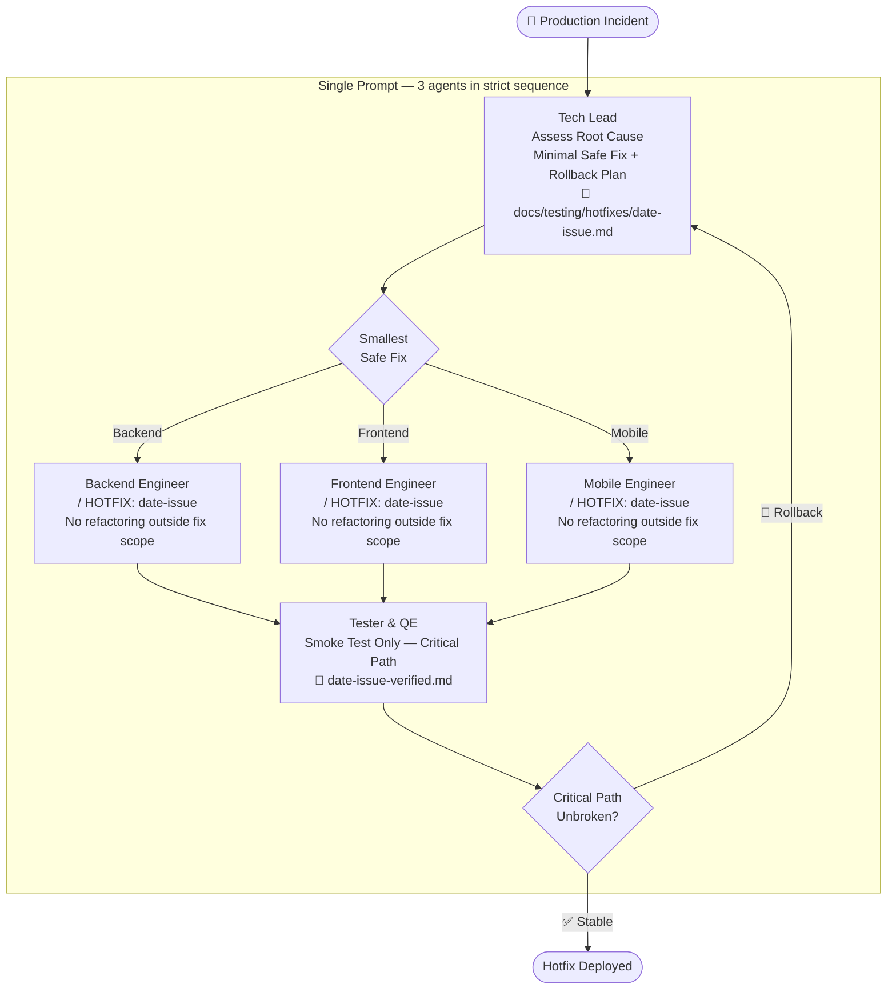
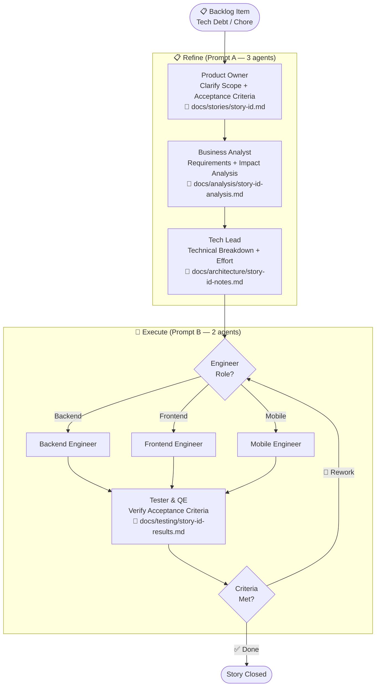

# Workflows & Protocols

Visual workflow diagrams for all five work types, the design tool integration matrix, the Google Stitch design system protocol, the worktree close-out protocol for multi-agent merges, and the conversational brainstorm protocol every agent runs.

## Table of Contents

- [Workflow Diagrams](#workflow-diagrams)
- [Design Tool Integration](#design-tool-integration)
- [Design System — `docs/ux/DESIGN.md` (Google Stitch Format)](#design-system--docsuxdesignmd-google-stitch-format)
- [Worktree Close-out & Multi-Agent Merge](#worktree-close-out--multi-agent-merge)
- [Conversational Brainstorm Protocol](#conversational-brainstorm-protocol)

---

## Workflow Diagrams

Visual reference for all five work types. Each diagram shows the agent chain, key artifact outputs, and decision points.

### 🏗 New Project

Full 10-agent flow from business requirements through multi-sprint execution.



---

### ✨ Feature Request / Enhancement

PO defines feature scope, BA performs impact analysis, then SA and UX run in parallel (using existing EA enterprise architecture). No full EA wave needed since enterprise architecture is already established.



---

### 🐛 Bug Fix

Diagnosis before fix. Two diagnosis agents confirm root cause before any code changes.



---

### 🚨 Hotfix (Production Emergency)

Assess, fix, smoke test in a single session. No planning docs, no refactoring.



---

### 📋 Backlog Item / Tech Debt / Chore

Lightweight two-agent refinement then direct execution. No architecture review needed.



---

## Design Tool Integration

BMAD supports **eleven** wireframing modes, selected once per project by the UX Designer on first invocation. The UX Designer **always asks the human** before doing any design work — and the question is presented with auto-detected MCP availability so the human can see the effort trade-off at a glance. The choice is recorded once in `.bmad/ux-design-master.md`; all subsequent invocations reuse the same tool and master file without re-prompting.

### Wireframe Modes

| Mode                          | When to choose                                                    | Master file                             | Integration ref                                                                                                              |
| ----------------------------- | ----------------------------------------------------------------- | --------------------------------------- | ---------------------------------------------------------------------------------------------------------------------------- |
| **A) ASCII / Text**           | No tool available, speed over fidelity, docs-heavy projects       | `docs/ux/wireframes/*.md`               | (built-in)                                                                                                                   |
| **B) Mermaid**                | User flows, state diagrams, IA — _not_ pixel mocks                | `docs/ux/flows/*.mmd`                   | [`agents/ux-designer/references/mermaid-integration.md`](agents/ux-designer/references/mermaid-integration.md)               |
| **C) Excalidraw**             | Hand-drawn / whiteboard feel; early exploration                   | `docs/ux/wireframes/master.excalidraw`  | [`agents/ux-designer/references/excalidraw-integration.md`](agents/ux-designer/references/excalidraw-integration.md)         |
| **D) tldraw**                 | Infinite-canvas with strong AI-agent integration                  | `docs/ux/wireframes/master.tldr`        | [`agents/ux-designer/references/tldraw-integration.md`](agents/ux-designer/references/tldraw-integration.md)                 |
| **E) Pencil**                 | Open-source desktop wireframing (Pencil MCP)                      | `docs/ux/wireframes/master.pencil`      | [`agents/ux-designer/references/pencil-mcp-integration.md`](agents/ux-designer/references/pencil-mcp-integration.md)         |
| **F) Figma**                  | Industry-standard collaborative design (Figma MCP)                | Figma file URL                          | [`agents/ux-designer/references/figma-mcp-integration.md`](agents/ux-designer/references/figma-mcp-integration.md)           |
| **G) Penpot**                 | Open-source Figma alternative; GDPR / on-prem                     | Penpot project URL                      | (manual export)                                                                                                              |
| **H) HTML / React prototype** | Highest fidelity; design-to-code handoff via shadcn/ui + Tailwind | `docs/ux/wireframes/<feature>/page.tsx` | [`agents/ux-designer/references/html-prototype-integration.md`](agents/ux-designer/references/html-prototype-integration.md) |
| **I) Google Stitch**          | AI-generated UIs driven by `docs/ux/DESIGN.md`                    | Stitch project URL                      | [`agents/ux-designer/references/stitch-integration.md`](agents/ux-designer/references/stitch-integration.md)                 |
| **J) Miro**                   | Flows, journey maps, affinity diagrams (not pixel mocks)          | Miro board URL                          | (pair with another mode for pixel work)                                                                                      |
| **K) None / defer**           | Skip the visual layer for now; text-only specs                    | n/a                                     | n/a                                                                                                                          |

The selection prompt highlights connected MCPs with `✓` and unconnected options as `manual / external`. Default if no answer is given: the first of `E → F → C → D → A` that has a connected MCP. If none, default to ASCII.

> **Master file principle:** ONE master file per project — never fork per feature. Every new feature/epic adds a new page to the same master. For tools where "master" is naturally a folder (HTML/React, Mermaid, ASCII), treat the folder as the master.

### Master File Principle

One master file per project — not one file per feature. Every feature or epic adds a **new page or frame** to the same file. This means the entire team can open one file to see all UX work, past and present.

`.bmad/ux-design-master.md` records:

- Design tool choice
- Path or file ID of the master file
- Page/frame naming convention and page index

### Read-Only Access for All Other Agents

Every non-UX agent (PO, BA, EA, SA, TL, BE, FE, ME, TQE) has **read-only** access to the design tool via MCP:

| Agent               | Can read                                                                                                                                              | Cannot modify                                                                                             |
| ------------------- | ----------------------------------------------------------------------------------------------------------------------------------------------------- | --------------------------------------------------------------------------------------------------------- |
| All 9 non-UX agents | `mcp__pencil__open_document`, `mcp__pencil__get_screenshot`, `mcp__pencil__batch_get`, `mcp__figma__get_figma_data`, + 9 other read-only Pencil tools | `mcp__pencil__batch_design`, `mcp__pencil__set_variables`, `mcp__pencil__replace_all_matching_properties` |

Agents load `.bmad/ux-design-master.md` in **Project Context Loading step 6** and use it to navigate directly to the relevant page/frame for their work area — e.g. the Frontend Engineer opens the master Pencil file and reads only the page for the current sprint feature.

> **Rule:** Only the UX Designer writes to the master design file. All other agents have read-only access and must never modify UX artifacts.

### MCP Configuration

Pencil and Figma MCP config files are included in `mcp-configs/global/`:

- `mcp-configs/global/pencil.json` — Pencil desktop MCP
- `mcp-configs/global/figma.json` — Figma MCP

Merge the config for your chosen design tool into your AI tool's MCP settings. See `mcp-configs/README.md` for merge instructions.

---

## Design System — `docs/ux/DESIGN.md` (Google Stitch Format)

The UX Designer maintains a **single, authoritative design system file** at `docs/ux/DESIGN.md` in the [**Google Stitch `DESIGN.md` format**](https://github.com/google-labs-code/design.md). It is the cross-agent contract that keeps UI/UX from drifting across features.

### Why the Stitch format

Stitch's `DESIGN.md` is an open-source (Apache 2.0) spec that combines:

- **YAML front matter** — machine-readable tokens (`colors`, `typography`, `spacing`, `rounded`, `components`) with `{path.to.token}` reference syntax. Any Stitch-aware agent (Claude Code, Cursor, Kiro, Windsurf, Trae, Gemini CLI, and Stitch itself) can consume the file and apply the exact brand values instead of guessing.
- **Markdown prose** — canonical sections in a fixed order (Overview → Colors → Typography → Layout → Elevation & Depth → Shapes → Components → Do's and Don'ts) giving humans the rationale, usage rules, and accessibility notes.
- **A linter** — `npx @google/design.md lint docs/ux/DESIGN.md` validates structure, catches `broken-ref` errors, flags `contrast-ratio` warnings (WCAG AA, 4.5:1), and surfaces orphaned tokens / missing sections.

### Lifecycle

1. **Bootstrap.** On its first invocation on a project, the UX Designer runs the **Design System Bootstrap** protocol — if `docs/ux/DESIGN.md` doesn't exist, it copies [`agents/ux-designer/templates/design-system-template.md`](agents/ux-designer/templates/design-system-template.md) (pre-conformed to the Stitch spec), patches the YAML with project-specific brand values from `.bmad/PROJECT-CONTEXT.md` + `docs/prd.md`, seeds the Changelog, and announces `🎨 Created docs/ux/DESIGN.md (Stitch DESIGN.md v<version>)`.
2. **Conform.** On every subsequent invocation (feature request, revision, audit), the agent reads the full file before sketching any screen and references tokens by `{path.to.token}` — never hex/px/ms literals.
3. **Extend in place.** A feature that needs a new token, component, or pattern **updates this file** — never forks into a per-feature copy. Additions go in the right YAML block (for tokens/components) or Do's and Don'ts section (for rules), with a version bump (patch = additive, minor = new pattern, major = breaking) and a Changelog row referencing the feature story / PRD ID.
4. **Resolve conflicts explicitly.** If a feature's need contradicts an existing entry, the agent stops and surfaces the conflict to the human — it never silently overrides.
5. **Validate.** Every edit ends with `npx @google/design.md lint docs/ux/DESIGN.md`. Zero `broken-ref` errors before handing off to engineering.

### Cross-agent contract

| Agent                          | Responsibility                                                                                                                                                                                                                                                             |
| ------------------------------ | -------------------------------------------------------------------------------------------------------------------------------------------------------------------------------------------------------------------------------------------------------------------------- |
| **UX Designer**                | Creates, reads, and extends `docs/ux/DESIGN.md`. Owns token/component/pattern decisions. Runs the linter before handoff.                                                                                                                                                   |
| **Frontend / Mobile Engineer** | Reads the file in full before writing a screen. **Refuses** to implement specs that reference tokens/components not declared in the YAML — sends the story back to UX Designer to update DESIGN.md first. Resolves tokens via `{path.to.token}` refs, never inline values. |
| **Tech Lead**                  | Verifies `docs/ux/DESIGN.md` version is current before opening the sprint kickoff; blocks stories whose UI spec cites undeclared tokens.                                                                                                                                   |
| **Tester & QE**                | Cross-checks implemented UI against the tokens in DESIGN.md during the quality gate.                                                                                                                                                                                       |

If a UI spec and `docs/ux/DESIGN.md` disagree, **the DESIGN.md wins.** Engineering sends the story back to UX.

### The `/ux-designer:design-system` command

A dedicated cross-tool command manages the file in every supported AI tool. It supports six modes via `$ARGUMENTS` (auto-detected if empty):

| Argument                | Action                                                                                                                                |
| ----------------------- | ------------------------------------------------------------------------------------------------------------------------------------- |
| `create`                | Bootstrap a new `docs/ux/DESIGN.md` from the Stitch-compliant template **and** regenerate `docs/ux/DESIGN.html`.                      |
| `audit`                 | Read the existing file, check Stitch spec compliance, list issues. Refreshes `docs/ux/DESIGN.html` so the audit reflects live tokens. |
| `extend <thing>`        | Add a new token / component / pattern, bump version, add Changelog row **and** regenerate `docs/ux/DESIGN.html`.                      |
| `validate`              | Run `npx @google/design.md lint docs/ux/DESIGN.md` and report.                                                                        |
| `sync`                  | Reconcile the file against the latest wireframes, UI spec, and PRD. Regenerates HTML after changes.                                   |
| `render` (alias `html`) | Regenerate `docs/ux/DESIGN.html` from the existing `docs/ux/DESIGN.md` — no markdown edits.                                           |
| _(empty)_               | Auto-detect: `create` if missing, `audit` if it exists.                                                                               |

The command ships to all 11 tools via the installer walker with zero per-tool configuration:

| Tool           | Invocation                                    | Destination                                                                 |
| -------------- | --------------------------------------------- | --------------------------------------------------------------------------- |
| Claude Code    | `/ux-designer:design-system`                  | `~/.claude/commands/ux-designer/design-system.md` (native YAML frontmatter) |
| Cowork         | `/ux-designer:design-system`                  | `~/.skills/commands/ux-designer/design-system.md`                           |
| Codex CLI      | `$ux-designer-design-system` (skill)          | `~/.codex/skills/ux-designer-design-system/SKILL.md` (flat)                 |
| Kiro           | `/ux-designer-design-system` (skill)          | `~/.kiro/skills/ux-designer-design-system/SKILL.md` (flat)                  |
| Cursor         | `/ux-designer:design-system`                  | `~/.cursor/commands/ux-designer/design-system.md` (adapted header)          |
| Windsurf       | prompt-triggered rule                         | `~/.windsurf/rules/bmad-commands/ux-designer/design-system.md`              |
| Trae IDE       | prompt-triggered rule                         | `~/.trae/rules/bmad-commands/ux-designer/design-system.md`                  |
| GitHub Copilot | `/ux-designer:design-system`                  | `~/.github/bmad-commands/ux-designer/design-system.md`                      |
| Gemini CLI     | `/bmad-ux-designer:design-system`             | `~/.gemini/extensions/bmad-ux-designer/skills/design-system/SKILL.md`       |
| OpenCode       | `/ux-designer:design-system`                  | `~/.opencode/commands/ux-designer/design-system.md`                         |
| Aider          | "Workflow: ux-designer:design-system" section | appended to `~/.aider.conventions.md`                                       |

### Browser-viewable HTML visualization (`docs/ux/DESIGN.html`)

Alongside the markdown source, the UX Designer maintains a **self-contained HTML visualization** at `docs/ux/DESIGN.html` that renders the design system in a browser. The file **always stays in lockstep with `DESIGN.md`** — enforced at two layers:

1. **Claude Code / Kiro PostToolUse hook (automatic).** [`hooks/global/scripts/render-design-md.sh`](hooks/global/scripts/render-design-md.sh) is registered as a `Write|Edit|MultiEdit` PostToolUse hook in `hooks/global/settings.json`. Whenever any tool call writes to `docs/ux/DESIGN.md` — whether it's a UX Designer turn, a Frontend Engineer making a quick token tweak, or a manual human edit — the hook fires, detects the path, and auto-invokes the renderer. Zero agent coordination required. The hook no-ops silently on any other path and on hosts without python3.
2. **Agent-level completion rule (every tool).** The UX Designer SKILL.md opens with a non-negotiable `🔒 Non-negotiable: DESIGN.html stays in lockstep with DESIGN.md` section that applies to every invocation — `/ux-designer:design-system`, `/ux-designer:create-wireframe`, `/ux-designer:accessibility-audit`, and any plain address-by-role prompt. Before the agent prints its ✅ summary, it verifies that `DESIGN.html` mtime ≥ `DESIGN.md` mtime; if not, it regenerates. This covers Cursor / Windsurf / Trae / Gemini CLI / Aider / etc. where session-hook automation isn't available.

The command also regenerates the HTML explicitly on every `create` / `extend` / `sync` / `render` invocation. The HTML page uses a **dual-column layout** — fixed left sidebar + scrollable main — and contains:

- **Brand sidebar** — sticky left nav with the project's name, version, and a brand-gradient mark. Navigation is grouped into **Foundations** (Colors, Typography, Spacing, Radius, Shadows, Motion), **Components** (one jumpable link per component), **Patterns** (auto-extracted from `## Patterns` subheadings in the markdown body), and **Principles** (Design principles, Accessibility). A scroll-spy highlights the active section as you scroll.
- **Dark-mode toggle** — explicit button in the page header; persists choice to `localStorage` and respects system preference on first visit.
- **Page header** — project name, description, version, source path, generation timestamp.
- **Brand gradient hero** — if the YAML has a `gradients:` block, the first gradient is rendered as a full-width hero with the CSS gradient string shown inline. Otherwise, a gradient is synthesized from the first three palette colors.
- **Color palette, auto-grouped by scale** — the renderer detects `primary-50…primary-900` or nested `primary: {50: …}` patterns and emits them as cohesive ramps ("Brand — Primary", "Brand — Neutral", etc.), with flat non-scale tokens collected into a "Tokens" group. Each swatch card shows the chip, label, hex, click-to-copy token path, and WCAG AA grade vs. a detected background.
- **Typography specimens** — each `typography:` entry rendered at its declared font/size/weight/line-height with the pangram.
- **Spacing scale** — proportional bars for each `spacing:` value with token path and measurement.
- **Radius scale** — live corner previews for each `rounded:` token.
- **Shadows ramp** — four elevation levels (0–3) rendered as sample cards.
- **Motion tokens** — if the YAML has a `motion:` block, each easing/duration is shown as a card; otherwise a placeholder prompt to add the block.
- **Component gallery** — every `components:` entry renders with its declared tokens _applied_ (buttons render as buttons, inputs as inputs, cards as cards); variants appear inline as pills; a full props table shows raw reference (`{colors.primary-500}`) + resolved value (`#E31B8E`) side-by-side. Each component gets its own `<section id="{component-name}">` so the sidebar links jump directly to it.
- **Patterns** — each `### <name>` under a `## Patterns` markdown section is rendered as a standalone card with its own anchor id.
- **Accessibility contrast report** — auto-computed WCAG 2.2 ratios for every `backgroundColor`/`textColor` pair, with AAA / AA / AA-Large / Fail badges.
- **Design principles** — rendered prose from the §Do's and Don'ts section (Do / Don't bullets + Changelog table).

The renderer ships as [`scripts/render-design-md.py`](scripts/render-design-md.py) — stdlib-only Python (no PyYAML, no build step), works on Windows 11 / macOS / Linux with any Python 3.8+. Invoke directly:

```bash
# From project root (after install-global.*)
python3 ~/.bmad/scripts/render-design-md.py --input docs/ux/DESIGN.md
# or from the repo source
python3 /path/to/bmad-sdlc-agents/scripts/render-design-md.py --input docs/ux/DESIGN.md
```

Output summary: `✓ Rendered docs/ux/DESIGN.md -> docs/ux/DESIGN.html — 12 colors · 6 type tokens · 6 components`.

Commit `docs/ux/DESIGN.html` alongside `DESIGN.md` — GitHub/GitLab/Bitbucket all render HTML previews directly in the repo browser, so reviewers can jump straight to the visualization without a build step.

### Validator and exporters

Because the file conforms to the Stitch spec, downstream tools consume it directly:

```bash
# Lint — run after every edit; zero broken-ref errors required
npx @google/design.md lint docs/ux/DESIGN.md

# Export tokens to Tailwind
npx @google/design.md export tailwind docs/ux/DESIGN.md

# Print the spec (useful for prompt injection into other agents)
npx @google/design.md spec
```

The same `docs/ux/DESIGN.md` can be imported into [Google Stitch](https://stitch.withgoogle.com/) directly, which will generate Gemini-designed UIs from prompts that respect the file's tokens and constraints.

### Single file, not per-feature copies

One `docs/ux/DESIGN.md` per project — never fork it per feature. Every feature reads and appends to the same file. This is how the system stays coherent as the product grows.

---

## Worktree Close-out & Multi-Agent Merge

Every BMAD agent that writes code or artefacts works inside an **isolated git worktree** at `../bmad-<role>-work/` on a dedicated branch (`<role>/<sprint-or-feature>`). When the work is done, the agent runs the canonical close-out protocol — **request human review → merge to main → resolve concurrent conflicts cooperatively → clean up the worktree** — before handing off to the next agent.

The full protocol with bash recipes lives at [`shared/references/worktree-close-out.md`](shared/references/worktree-close-out.md). Every agent's SKILL.md links to it from a `## Worktree Close-out & Merge` section, and Step 7 of every Completion Protocol invokes it before the next-agent handoff.

### The four stages

| Stage                                                                     | What happens                                                                                                                                                                                           |
| ------------------------------------------------------------------------- | ------------------------------------------------------------------------------------------------------------------------------------------------------------------------------------------------------ |
| **1. Request human review**                                               | Print a structured summary — branch, diffstat, top files changed, commits, test status. Human replies `approve` (proceed), `refine: <notes>` (revise), or `defer` (leave the worktree open).           |
| **2. Merge to main**                                                      | On approve: refresh main, detect concurrent-merge state. If main is unchanged → fast-forward merge. If main has moved (a peer agent already merged) → rebase the role branch onto the latest main.     |
| **3. Conflict Resolution Protocol** _(only if rebase produces conflicts)_ | Categorise every conflicting file: **my-domain** (resolve solo), **their-domain or shared / cross-domain** (request peer-agent review), or **sequenced** (DB migrations, IaC — escalate to Tech Lead). |
| **4. Clean up**                                                           | `git worktree remove ../bmad-<role>-work`, `git branch -d <my-branch>`, print the cleanup summary.                                                                                                     |

### The multi-agent invariant

When BE ∥ FE ∥ ME (or any other parallel-agent wave) run concurrently, they each work in their own worktree. **The first agent to merge always succeeds cleanly. The second and third are responsible for the rebase + conflict resolution** — that is the cost of running concurrently.

If the second/third agent isn't confident in a resolution that touches another role's scope, they:

1. Write a sentinel `.bmad/signals/conflict-<my-role>-needs-<peer-role>-review` listing the conflicting files and the proposed resolution.
2. Request peer review — via the Agent tool on Claude Code / Kiro autonomous mode (spawn the peer for an inline read-only review), or via a human prompt elsewhere ("run /backend-engineer to review my proposed conflict resolution").
3. **Wait** for peer or human sign-off. Do not complete the merge until they confirm.

No agent ever silently overwrites another agent's work. The role file-scope quick-reference table in `worktree-close-out.md` (mapping every BMAD role to its owned write paths) is the source of truth for "is this conflict in my domain or theirs?".

### Cross-domain hotspots and how to handle them

| File pattern                                           | Resolver                                                                                       |
| ------------------------------------------------------ | ---------------------------------------------------------------------------------------------- |
| `package-lock.json`, `pnpm-lock.yaml`, `Cargo.lock`, … | Don't hand-merge — delete the conflicted lockfile, regenerate via the package manager, commit. |
| `package.json`, `pyproject.toml`, `Cargo.toml`         | Combine all dependency entries; take the higher version on conflicts; reinstall + test.        |
| `docs/api-specs/openapi.yaml`                          | Hand to Solution Architect — SA owns the API contract.                                         |
| `docs/ux/DESIGN.md`                                    | Hand to UX Designer — single-author by design.                                                 |
| Database migrations with conflicting numbers           | Sequenced — escalate to Tech Lead; never auto-resolve.                                         |
| Integration tests touching both halves                 | Run the full integration suite after merging; if red, re-open as a `refine:` request.          |

---

## Conversational Brainstorm Protocol

Every agent's `brainstorm.md` sub-command — `/business-analyst:brainstorm`, `/ux-designer:brainstorm`, `/solution-architect:brainstorm`, etc. — runs as a **conversation, not a questionnaire**. The single rule: **ask one question per turn, wait for the human's answer, then ask the next.** No wall-of-questions, no stacked clarifications, no surveys.

The full protocol lives at [`shared/references/conversational-brainstorm.md`](shared/references/conversational-brainstorm.md). All 13 brainstorm sub-commands reference it and follow the same 7-step flow.

### Why one at a time

- A 12-question questionnaire gets 12 shallow answers. A 12-turn conversation gets 12 useful ones.
- Each answer **reshapes the rest of the question pool** — a good first answer often makes three later questions redundant. Never display them in the first place.
- The human can stop the brainstorm cleanly at any turn. Mid-questionnaire is awkward; mid-conversation is fine.

### The 7-step flow

1. **Build the question bank silently** — the categorical lists in each brainstorm.md are a _prioritised pool_, not a checklist. Skip questions already answered by `.bmad/PROJECT-CONTEXT.md`, `docs/prd.md`, or prior artefacts.
2. **Ask the single most-impactful question** — the one whose answer most-unlocks the next-step deliverable. Lead with 2–3 concrete options + a recommended default for bounded questions; open-ended only when truly unbounded.
3. **Wait** for the answer. Do not pre-stack the next question.
4. **Capture and re-prioritise** after each answer — many answers eliminate or reshape later questions.
5. **Stop early** when the next-step deliverable can be written with what you have, or when the user signals they're done. **3–7 turns** is the target, not draining the bank.
6. **Consolidate** — Phase 2.5 of every brainstorm.md. Read the answers back as a structured brief showing captured answers, skipped-already-on-disk items, inferred defaults, open / unaddressed items, and tensions / contradictions. Save the brief to `.bmad/brainstorms/<role>-<topic>.md` so it's auditable. The brief drives the rest of the protocol — not the raw turn-by-turn transcript.
7. **Confirm and act** — the existing Phase 4 (Confirm Understanding) restates the brief as a one-paragraph plan-of-record; on `ok` the agent invokes the suggested next BMAD command.

### Tool integration

- **Claude Code / Cowork** — use the AskUserQuestion tool for every multi-choice question (Options A/B/C). It renders a tappable picker, eliminates parsing ambiguity, and shows the recommended default visually.
- **Codex CLI / Cursor / Windsurf / Trae / Gemini CLI / Aider** — plain-text Option A/B/C format; the agent waits for the human's reply in chat.
- **Kiro** — uses Kiro's built-in multi-choice picker when available.

The scaffolders (`scripts/scaffold-project.sh` and `scripts/scaffold-project.ps1`) create `.bmad/brainstorms/` alongside `.bmad/handoffs/` and `.bmad/signals/` so the directory exists from project init and brief-saving never fails on a fresh project.

### Anti-patterns the protocol rules out

- ❌ The wall-of-questions opener ("Before we start, I have a few questions: 1. … 2. … 3. … 4. …")
- ❌ Stacked clarifications ("Question N + a follow-up to Question N − 1 in the same message — pick one")
- ❌ Asking what's already on disk (always read context files first; ~30% of bank questions disappear)
- ❌ Confirming the obvious ("So you want a login screen?" after the user said "build a login screen")
- ❌ Performative consolidation — the consolidation step must surface tensions / inferred defaults / open items, not just paraphrase back

---

[← Back to README](../README.md)  ·  [Agents](agents.md)  ·  [Architecture](architecture.md)  ·  [Workflows](workflows.md)  ·  [Tooling](tooling.md)  ·  [Adoption](adoption.md)
