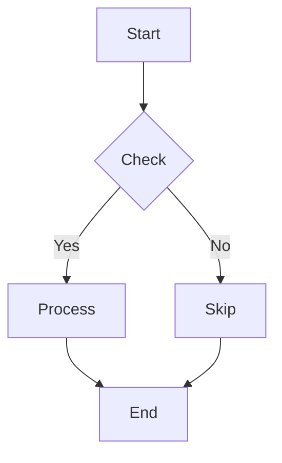
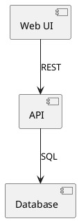

# Draw.io CLI Scripts - Quick Reference

## Quick Start

```bash
# List available commands
python validate.py --help
python convert.py --help
python auto_layout.py --help
python merge.py --help
python info.py --help
python create_from_csv.py --help
```

## One-Liners

### Create and validate an org chart
```bash
python create_from_csv.py org.csv --output org.drawio --type orgchart && \
python validate.py org.drawio
```

### Convert Mermaid to DrawIO with auto-layout
```bash
python convert.py diagram.mermaid diagram.drawio && \
python auto_layout.py diagram.drawio --layout tree
```

### Merge multiple diagrams into pages
```bash
python merge.py arch.drawio entities.drawio deployment.drawio \
  --output system.drawio --mode as-pages
```

### Get full diagram info
```bash
python info.py diagram.drawio | head -50
```

### Batch validate all DrawIO files
```bash
for f in *.drawio; do echo "Validating $f:"; python validate.py "$f"; done
```

## Common Tasks

### Task 1: Create Organization Chart from CSV

**Input file (org.csv):**
```csv
name,title,reports_to
Alice,CEO,
Bob,VP Engineering,Alice
Carol,Engineer,Bob
```

**Command:**
```bash
python create_from_csv.py org.csv --output org.drawio --type orgchart
```

---

### Task 2: Create Flowchart from CSV

**Input file (flow.csv):**
```csv
step,type,next_step,label
start,oval,step1,
step1,rect,decision,Process
decision,diamond,step2,Approved?
step2,rect,end,Yes
end,oval,,
```

**Command:**
```bash
python create_from_csv.py flow.csv --output flow.drawio --type flowchart
```

---

### Task 3: Create Entity-Relationship Diagram

**Input file (entities.csv):**
```csv
entity,attribute,type,relationship_to,cardinality
User,id,PK,,
User,email,string,,
Post,id,PK,User,N:1
Post,user_id,FK,User,N:1
```

**Command:**
```bash
python create_from_csv.py entities.csv --output erd.drawio --type erd
```

---

### Task 4: Create Network Diagram

**Input file (network.csv):**
```csv
device,type,connects_to,label
Router,device,Switch,1Gbps
Switch,device,PC1,100Mbps
PC1,device,Printer,100Mbps
```

**Command:**
```bash
python create_from_csv.py network.csv --output network.drawio --type network
```

---

### Task 5: Convert Mermaid Diagram

**Input file (diagram.mermaid):**


**Command:**
```bash
python convert.py diagram.mermaid diagram.drawio
```

---

### Task 6: Convert PlantUML Diagram

**Input file (diagram.puml):**


**Command:**
```bash
python convert.py diagram.puml diagram.drawio
```

---

### Task 7: Export DrawIO to SVG

```bash
python convert.py diagram.drawio diagram.svg
```

---

### Task 8: Export DrawIO to Mermaid

```bash
python convert.py diagram.drawio diagram.mermaid
```

---

### Task 9: Auto-Layout Diagram

**Tree layout (default, top-to-bottom):**
```bash
python auto_layout.py diagram.drawio --layout tree
```

**Grid layout:**
```bash
python auto_layout.py diagram.drawio --layout grid --spacing 100
```

**Left-to-right layout:**
```bash
python auto_layout.py diagram.drawio --layout lr --spacing 120
```

**Radial layout (circular):**
```bash
python auto_layout.py diagram.drawio --layout radial --output circular.drawio
```

---

### Task 10: Merge Diagrams

**As separate pages:**
```bash
python merge.py page1.drawio page2.drawio page3.drawio \
  --output combined.drawio --mode as-pages
```

**Side-by-side on one page:**
```bash
python merge.py left.drawio right.drawio \
  --output combined.drawio --mode side-by-side
```

**Stacked vertically:**
```bash
python merge.py top.drawio bottom.drawio \
  --output combined.drawio --mode stack
```

---

### Task 11: Validate Diagram

```bash
python validate.py diagram.drawio
```

---

### Task 12: Get Diagram Info

```bash
python info.py diagram.drawio
```

---

## Advanced Workflows

### Complete Pipeline: CSV → Layout → Validate → Info

```bash
# Create from CSV
python create_from_csv.py data.csv --output diagram.drawio --type orgchart

# Auto-layout
python auto_layout.py diagram.drawio --layout tree --output diagram_laid.drawio

# Validate
python validate.py diagram_laid.drawio

# Get info
python info.py diagram_laid.drawio
```

### Convert and Transform

```bash
# Mermaid → DrawIO → SVG
python convert.py workflow.mermaid workflow.drawio && \
python convert.py workflow.drawio workflow.svg

# PlantUML → DrawIO → Mermaid
python convert.py architecture.puml arch.drawio && \
python convert.py arch.drawio arch.mermaid
```

### Merge and Batch Process

```bash
# Merge all CSV-generated diagrams
for f in *.csv; do
    python create_from_csv.py "$f" --output "${f%.csv}.drawio" --type orgchart
done

# Merge all created diagrams
python merge.py *.drawio --output all_diagrams.drawio --mode as-pages

# Validate the combined result
python validate.py all_diagrams.drawio
```

---

## Exit Codes

- `0` = Success
- `1` = Error (file not found, parse error, validation failed, etc.)

Use in scripts:
```bash
python validate.py diagram.drawio
if [ $? -eq 0 ]; then
    echo "Validation passed"
else
    echo "Validation failed"
fi
```

---

## Performance Tips

1. **Large diagrams?** Use `--layout grid` for faster layout
2. **Many files?** Batch convert with shell loops
3. **Memory issues?** Break diagrams into smaller pieces and merge later
4. **Need SVG?** Convert directly from DrawIO without intermediate formats

---

## Troubleshooting

| Issue | Solution |
|-------|----------|
| `No module named 'lxml'` | `pip install lxml` |
| `File not found` | Check file path and verify file exists |
| XML parsing error | Validate input CSV format |
| Overlapping shapes | Use `auto_layout.py` to reposition |
| Large file slow | Consider breaking into multiple smaller diagrams |

---

## Tips

- All scripts support `--help` for detailed documentation
- Colored output is automatically disabled if piped to a file
- Scripts work on all platforms: Linux, macOS, Windows
- Generate quick diagrams with `create_from_csv.py`, then refine in draw.io
- Use `info.py` to understand diagram structure before making edits
- Always validate after major changes: `python validate.py diagram.drawio`
